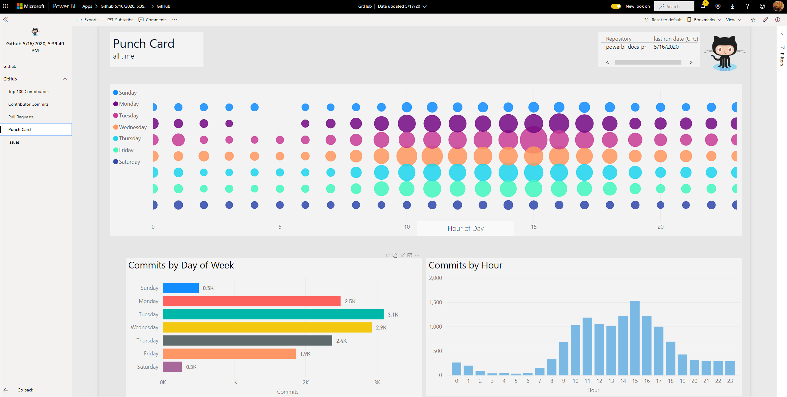
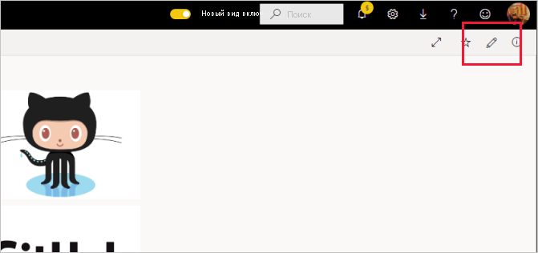

# Подключение к GitHub с помощью Power BI
Эта статья описывает извлечение данных из учетной записи GitHub с помощью приложения-шаблона Power BI. Приложение-шаблон создает рабочую область с панелью мониторинга, набор отчетов и набор данных, которые позволяют анализировать ваши данные GitHub. Приложение GitHub для Power BI позволяет анализировать данные в репозитории GitHub, используя информацию о вкладах пользователей, проблемах, запросах на вытягивание и активных пользователях.

После установки приложения-шаблона можно изменить панель мониторинга и отчет. Затем его можно распространить в виде приложения среди коллег в организации.

Подключитесь к [приложению-шаблону GitHub](https://app.powerbi.com/groups/me/getapps/services/pbi-contentpacks.pbiapps-github) или прочтите дополнительные сведения об [интеграции GitHub](https://powerbi.microsoft.com/integrations/github) с Power BI.

Вы также можете ознакомиться с [руководством по GitHub](service-tutorial-connect-to-github.md). Оно содержит реальные данные GitHub о общедоступном репозитории для документации по Power BI.

>[!NOTE]
>Для этого приложения-шаблона требуется учетная запись GitHub для доступа к репозиторию. Дополнительные сведения о требованиях см. ниже.
>
>Это приложение-шаблон не поддерживает GitHub Enterprise.

## Установка приложения

1. Щелкните следующую ссылку, чтобы перейти к приложению: [Приложение-шаблон GitHub](https://app.powerbi.com/groups/me/getapps/services/pbi-contentpacks.pbiapps-github)

1. На странице приложения в AppSource нажмите кнопку [**Получить**](https://app.powerbi.com/groups/me/getapps/services/pbi-contentpacks.pbiapps-github).

    

1. Нажмите кнопку **Установить**. 

    

    После установки приложения оно появится на странице "Приложения".

   

## подключение к источникам данных.

1. Чтобы открыть приложение, щелкните его значок на странице "Приложения".

1. На экране-заставке нажмите кнопку **Исследовать приложение**.

   

   Приложение откроется с образцом данных.

1. Щелкните ссылку **Подключите свои данные** в баннере в верхней части страницы.

   

1. В появившемся диалоговом окне введите имя репозитория и владельца репозитория. Сведения о том, как найти необходимые параметры, см. [ниже](#FindingParams). По завершении нажмите кнопку **Далее**.

   

1. В следующем диалоговом окне выберите метод проверки подлинности **OAuth2**. Параметры конфиденциальности изменять не нужно. Когда все будет готово, нажмите **Войти**.

   

1. Введите учетные данные GitHub и пройдите проверку подлинности GitHub (этот шаг можно пропустить, если вы уже выполнили вход в браузере).

   

После входа отчет подключится к источникам данных и заполнится актуальными данными. В течение этого времени вращается индикатор активности.

Данные отчета будут автоматически обновляться раз в день, если только вы не отключили это во время входа в систему. Также можно [настроить собственное расписание обновления](./refresh-scheduled-refresh.md), чтобы в отчете всегда отражались актуальные данные.

## Настройка и общий доступ

Чтобы настроить приложение и предоставить к нему общий доступ, щелкните значок карандаша в правом верхнем углу страницы.

Сведения об изменении артефактов в рабочей области см. в следующих разделах.
* [Обзор редактора отчетов в Power BI](../create-reports/service-the-report-editor-take-a-tour.md)
* [Основные понятия для разработчиков в службе Power BI](../fundamentals/service-basic-concepts.md)

После внесения изменений в артефакты в рабочей области можно приступать к публикации приложения и предоставлению общего доступа к нему. Сведения о том, как это сделать, см. в разделе [Публикация приложения](../collaborate-share/service-create-distribute-apps.md#publish-your-app).

## Что входит в состав приложения
В GitHub для Power BI доступны следующие данные:     

| Имя таблицы | Описание |
| --- | --- |
| Активность |В таблице вкладов представлены общие дополнения, удаления и фиксации автора за неделю. Первые 100 участников включены. |
| Проблемы |Список всех проблем для выбранного репозитория и вычисления, например общее и среднее время закрытия проблемы, общее число открытых проблем и общее число закрытых проблем. При отсутствии проблем в репозитории эта таблица будет пустой. |
| Запросы на получение |В этой таблице содержатся все запросы на получение для репозитория и отправители запросов. Он также содержит вычисления, связанные с тем, сколько запросов на вытягивание открыто и закрыто, а также каково их общее количество, продолжительность выполнения и средняя продолжительность. При отсутствии проблем в репозиторий эта таблица будет пустой. |
| Пользователи |Эта таблица предоставляет список пользователей или участников GitHub, которые вносили свой вклад, заявляли о проблемах или обрабатывали запросы на вытягивание для выбранного репозитория. |
| Вехи |Эта таблица содержит все вехи выбранного репозитория. |
| DateTable |Эта таблица содержит даты от сегодняшнего дня до нескольких лет в прошлом, позволяющие анализировать данные GitHub по дате. |
| ContributionPunchCard |Эту таблицу можно использовать как карточку отметки вкладов для выбранного репозитория. Здесь отображаются фиксации по дням недели и времени. Таблица не связана с другими таблицами в модели. |
| RepoDetails |Эта таблица содержит сведения о выбранном репозитории. |

## Требования к системе
* Учетная запись GitHub с доступом к репозиторию.  
* Разрешения, предоставленные приложению Power BI для GitHub во время первого входа в систему. Подробные сведения об отзыве доступа см. ниже.  
* Наличие достаточного числа вызовов API для извлечения и обновления данных.
>[!NOTE]
>Это приложение-шаблон не поддерживает GitHub Enterprise.

### Отмена авторизации Power BI
Для отмены авторизации Power BI для подключения к репозиторию GitHub может отозвать доступ в GitHub. Дополнительные сведения см. в этом разделе [справки по GitHub](https://help.github.com/articles/keeping-your-ssh-keys-and-application-access-tokens-safe/#reviewing-your-authorized-applications-oauth).

## Поиск параметров
Владельца и имя репозитория можно определить, просмотрев репозиторий на портале GitHub:

Первая часть, "Azure", — это владелец, а вторая часть, "azure-sdk-for-php", — это сам репозиторий.  Эти же два элемента можно увидеть в URL-адресе репозитория:

    <https://github.com/Azure/azure-sdk-for-php> .

## Устранение неполадок
При необходимости вы можете проверить учетные данные GitHub.  

1. В другом окне браузера перейдите на веб-сайт GitHub и войдите в GitHub. Состояние входа можно увидеть в правом верхнем углу сайта GitHub.    
2. На портале GitHub перейдите по URL-адресу репозитория, к которому вы планируете получать доступ к Power BI. Например: https://github.com/dotnet/corefx  
3. Вернувшись в Power BI, попытайтесь подключиться к GitHub. В диалоговом окне настройки GitHub укажите название репозитория и имя его владельца.  

## Дальнейшие действия

* [Руководство. Подключение к репозиторию в GitHub с помощью Power BI](service-tutorial-connect-to-github.md)
* [Create the new workspaces in Power BI](../collaborate-share/service-create-the-new-workspaces.md) (Создание рабочих областей новой версии в Power BI)
* [Установка и использование приложений с информационными панелями и отчетами в Power BI](../consumer/end-user-apps.md)
* [Подключение к приложениям Power BI для внешних служб](service-connect-to-services.md)
* У вас появились вопросы? [Попробуйте задать вопрос в сообществе Power BI.](https://community.powerbi.com/)
