# Подключение к панели поддержки принятия решений по неотложной медицинской помощи
Шаблон приложения "Панель поддержки принятия решений по неотложной медицинской помощи" — это компонент для создания отчетов в составе [решения Microsoft Power Platform для реагирования на чрезвычайные медицинские ситуации](https://powerapps.microsoft.com/blog/emergency-response-solution-a-microsoft-power-platform-solution-for-healthcare-emergency-response/). На панели мониторинга приводятся сводные данные по системе здравоохранения, которые помогают специалистам по управлению в чрезвычайных ситуациях своевременно принимать правильные решения.

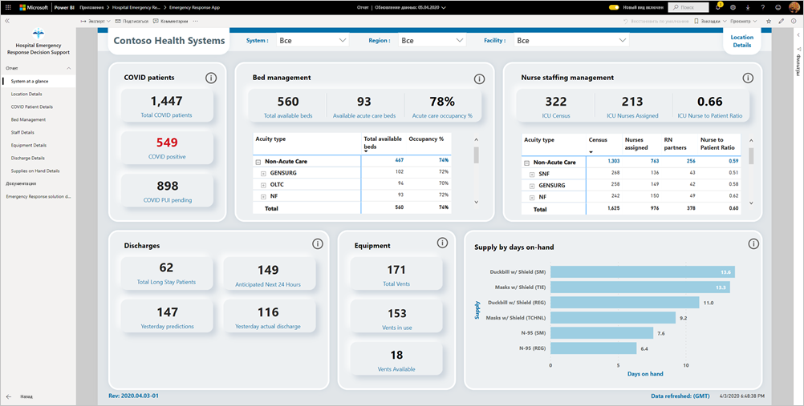

В этой статье рассказывается, как установить приложение и как подключиться к источникам данных. Сведения об использовании отчета в этом приложении см. в [документации по панели поддержки принятия решений по неотложной медицинской помощи](https://docs.microsoft.com/powerapps/sample-apps/emergency-response/deploy-configure#view-the-power-bi-dashboard).

После установки шаблона приложения и подключения к источникам данных можно настроить отчет в соответствии с вашими потребностями. Затем его можно распространить в виде приложения среди коллег в организации.

## Предварительные требования

Перед установкой этого шаблона приложения необходимо установить и настроить [решение Power Platform для реагирования на чрезвычайные медицинские ситуации](https://docs.microsoft.com/powerapps/sample-apps/emergency-response/deploy-configure). При установке этого решения создаются ссылки на источники данных, необходимые для заполнения приложения данными.

При установке решения Power Platform для реагирования на чрезвычайные медицинские ситуации запишите [URL-адрес экземпляра среды Common Data Service](https://docs.microsoft.com/powerapps/sample-apps/emergency-response/deploy-configure#publish-the-power-bi-dashboard). Он понадобится для подключения шаблона приложения к данным.

## Установка приложения

1. Щелкните следующую ссылку, чтобы перейти к приложению: [шаблон приложения "Панель поддержки принятия решений по неотложной медицинской помощи"](https://aka.ms/AppSource_Hospital_offer)

1. На странице приложения в AppSource нажмите кнопку [**Получить**](https://aka.ms/AppSource_Hospital_offer).

    [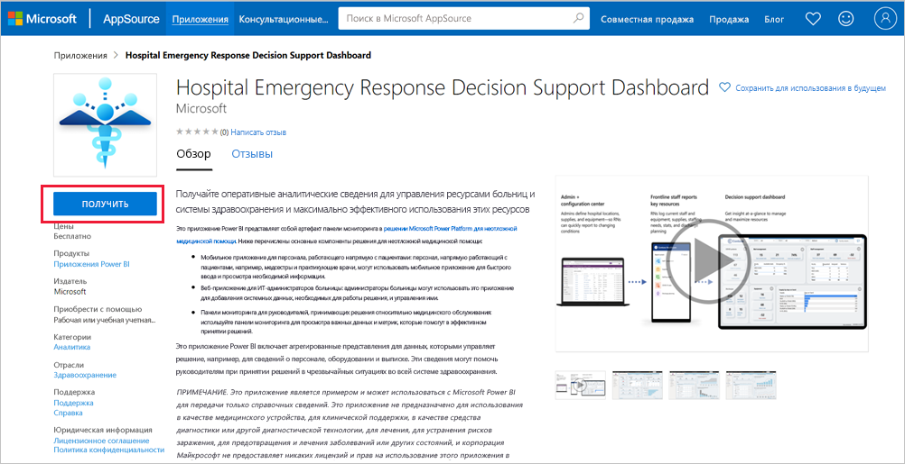](https://aka.ms/AppSource_Hospital_offer)

1. Ознакомьтесь с информацией в окне **Дополнительно** и нажмите кнопку **Продолжить**.

    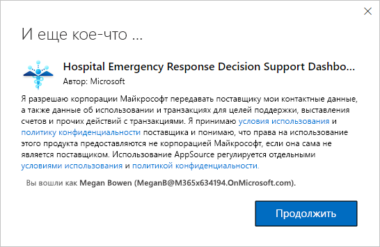

1. Нажмите кнопку **Установить**. 

    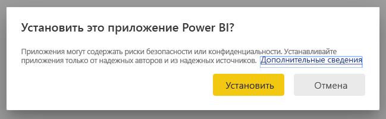

    После установки приложения оно появится на странице "Приложения".

   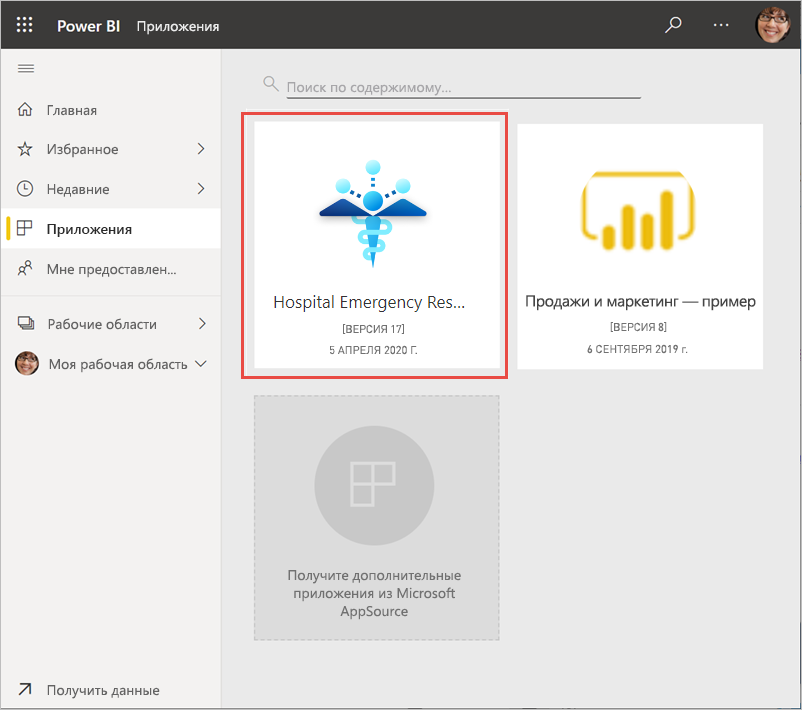

## подключение к источникам данных.

1. Чтобы открыть приложение, щелкните его значок на странице "Приложения".

1. На экране-заставке нажмите кнопку **Исследовать**.

   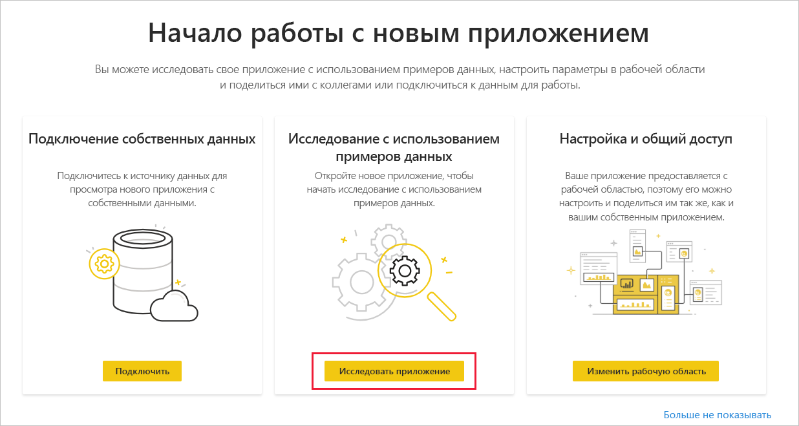

   Приложение откроется с образцом данных.

1. Щелкните ссылку **Подключите свои данные** в баннере в верхней части страницы.

   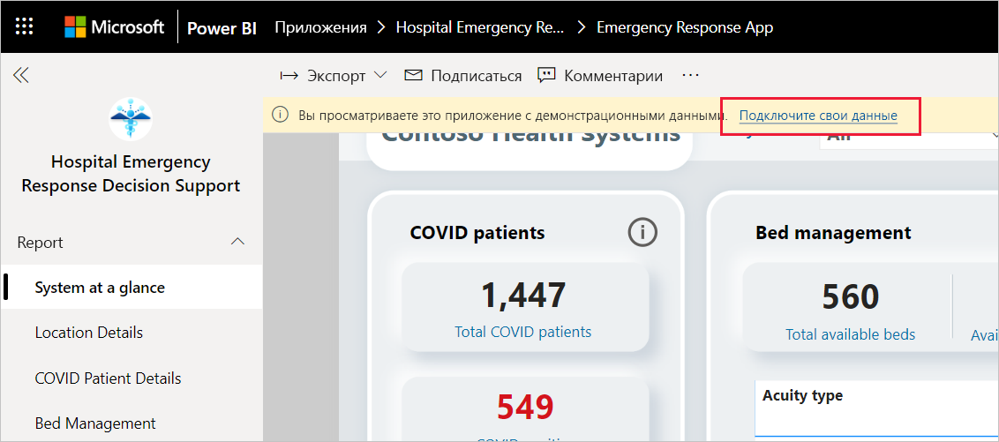

1. В диалоговом окне выполните указанные ниже действия.
   1. В поле названия организации введите название вашей организации, например "Системы здравоохранения Contoso". Это поле является необязательным. Это имя отображается в левом верхнем углу панели мониторинга.
   1. В поле CDS_base_solution введите [URL-адрес экземпляра среды Common Data Service](https://docs.microsoft.com/powerapps/sample-apps/emergency-response/deploy-configure#publish-the-power-bi-dashboard). Пример: https://[myenv].crm.dynamics.com. По завершении нажмите кнопку **Далее**.

   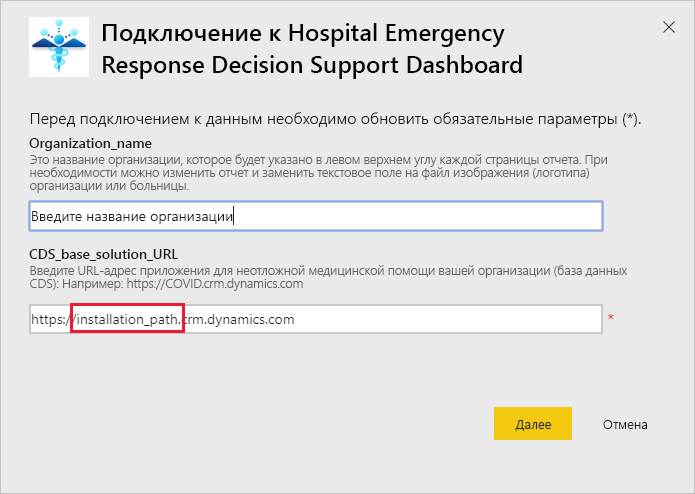

1. В следующем диалоговом окне выберите метод проверки подлинности **OAuth2**. Уровень конфиденциальности менять не нужно.

   Выберите **Войти**.

   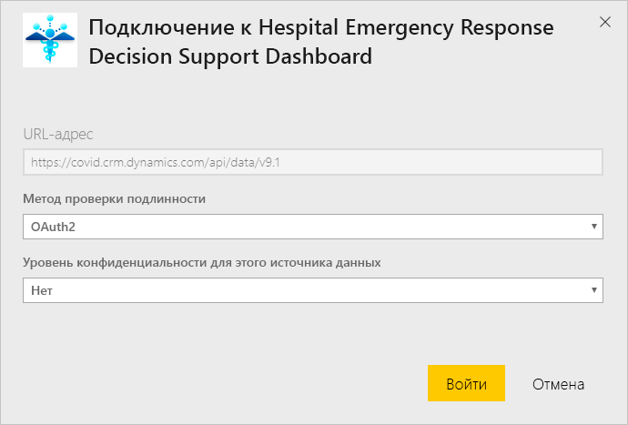

1. На экране входа Майкрософт войдите в Power BI.

   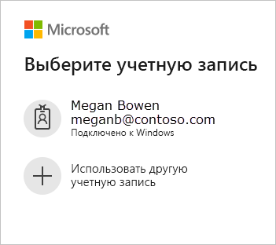

   После входа отчет подключится к источникам данных и заполнится актуальными данными. В течение этого времени вращается индикатор активности.

   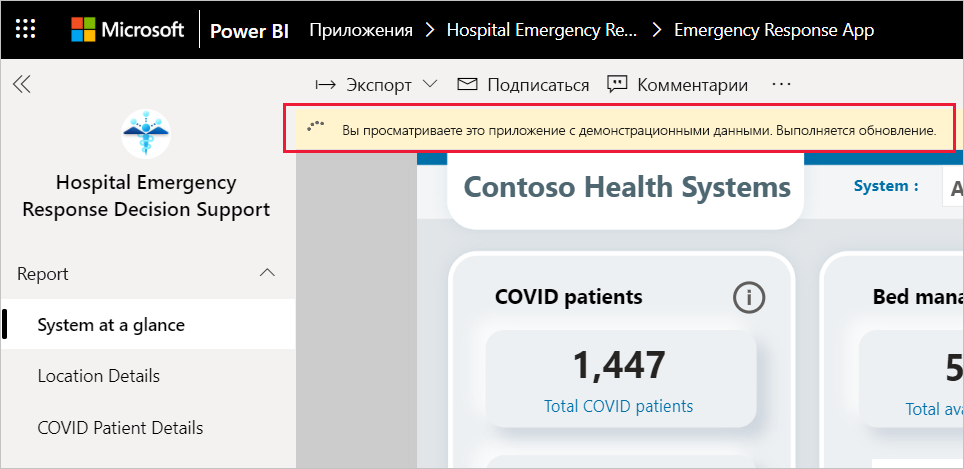

## Планирование обновления отчета

Когда обновление данных завершится, [настройте расписание обновления](../connect-data/refresh-scheduled-refresh.md), чтобы поддерживать данные отчета в актуальном состоянии.

1. В верхней строке заголовка выберите **Power BI**.

   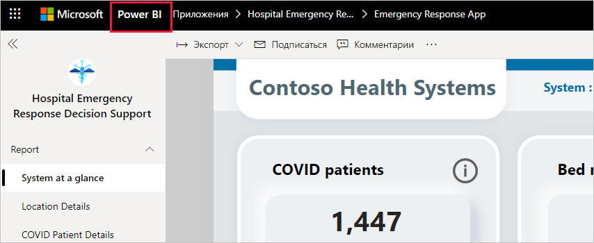

1. В области навигации слева найдите рабочую область "Панель поддержки принятия решений по неотложной медицинской помощи" в разделе **Рабочие области** и следуйте инструкциям, приведенным в статье [Настройка запланированного обновления](../connect-data/refresh-scheduled-refresh.md).

## Настройка и общий доступ

Подробные сведения см. в статье [Настройка приложения и общий доступ к нему](../connect-data/service-template-apps-install-distribute.md#customize-and-share-the-app). Перед публикацией или распространением приложения обязательно ознакомьтесь с [предостережениями](../create-reports/sample-covid-19-us.md#disclaimers).

## Дальнейшие действия
* [Сведения об отчете "Реагирование на чрезвычайные медицинские ситуации"](https://docs.microsoft.com/powerapps/sample-apps/emergency-response/deploy-configure#view-the-power-bi-dashboard)
* [Настройка и дополнительные сведения о шаблоне "Антикризисные коммуникации" в Power Apps](https://docs.microsoft.com/powerapps/maker/canvas-apps/sample-crisis-communication-app)
* У вас появились вопросы? [Попробуйте задать вопрос в сообществе Power BI.](https://community.powerbi.com/)
* [Что такое приложения-шаблоны Power BI?](../connect-data/service-template-apps-overview.md)
* [Установка и распространение приложений-шаблонов в организации](../connect-data/service-template-apps-install-distribute.md)
