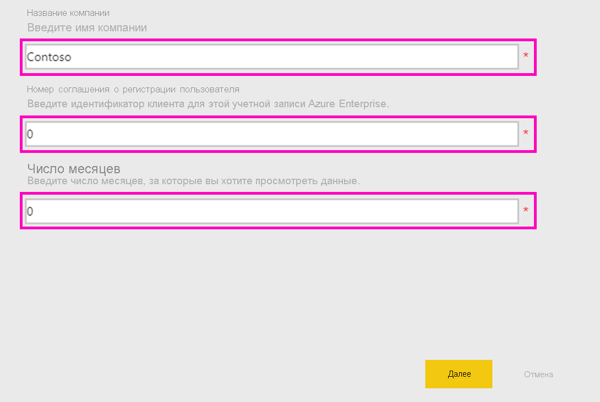
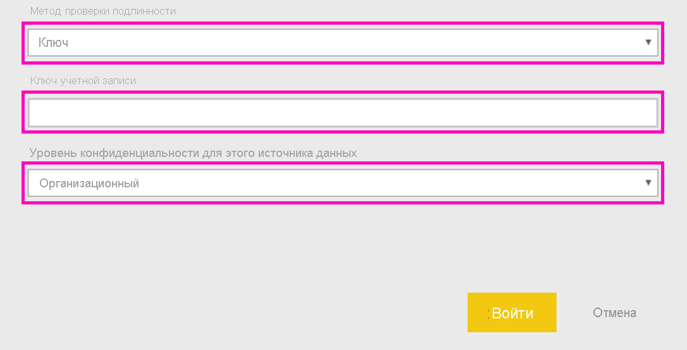

# Подключение к Microsoft Sustainability Calculator
Получите представление о выбросах углерода в вашей ИТ-инфраструктуре, чтобы принять более рациональные решения для вычислительных ресурсов

Microsoft Sustainability Calculator предоставляет новые аналитические сведения о выбросах углерода, связанных со службами Azure. Лица, ответственные за отчетность и обеспечение стабильного развития в своих организациях, теперь имеют возможность количественно оценить влияние на углеродный вклад каждой подписки Azure, а также предполагаемое сокращение выбросов углерода от выполнения этих рабочих нагрузок в Azure по сравнению с локальными центрами обработки данных. Эти данные можно использовать для создания отчетов о газе, создающем парниковый эффект, для области 3 по выбросам. Для доступа к Microsoft Sustainability Calculator потребуется ваш идентификатор клиента и ключ доступа, который можно получить в администратора Azure вашей организации.

Чтобы использовать это приложение, вам потребуется информация из Microsoft Azure Enterprise Portal. Системные администраторы предприятия могут помочь вам получить эти сведения. Ознакомьтесь с этими инструкциями и получите необходимые сведения перед установкой приложения. 

Эта версия соединителя поддерживает только корпоративные регистрации с [https://ea.azure.com](https://ea.azure.com/). Регистрации из Китая в настоящее время не поддерживаются.

## Способы подключения
[!INCLUDE [powerbi-service-apps-get-more-apps](../includes/powerbi-service-apps-get-more-apps.md)]

1. Выберите **Microsoft Sustainability Calculator** \> **Получить**.
1. В окне **Установить это приложение Power BI?** выберите **Установить**.
1. Выберите элемент **Microsoft Sustainability Calculator** в области **Приложения**.
1. На экране **Начало работы с новым приложением** выберите **Подключиться**.

    

1. Введите **название компании, номер регистрации пользователя,** и **число месяцев \> выполните вход.** Сведения о том, как найти необходимые параметры, см. [ниже](#finding-parameters).

    

1. Для параметра **Метод проверки подлинности**установите значение**Ключ**, а для **Уровень конфиденциальности** — **Организационный**.
1. В пункте **Ключ**введите **ключ доступа \> и выполните вход**.

    

1. Процесс импорта начинается автоматически. После завершения в **области навигации** появится новая панель мониторинга, отчет и модель. Выберите отчет, чтобы просмотреть импортированные данные.

## Поиск параметров

Чтобы найти сведения о **идентификаторе регистрации** и **ключе доступа** организации, обратитесь к администратору Azure. Ваш администратор

1. Войдите на [корпоративный портал Azure](https://ea.azure.com), щелкните **Управление** на левой ленте и получите **номер регистрации**, как показано ниже.
2. В [Azure Enterprise Portal](https://ea.azure.com)щелкните **Отчеты**, а затем — ключ доступа для API, как показано ниже, чтобы получить ключ учетной записи основной регистрации.

## Использование приложения

Чтобы обновить параметры в любой момент, перейдите к параметрам **набора данных** и получите доступ к соответствующему рабочему пространству приложения, а также обновите идентификатор арендатора, название компании или данные за месяцы. После применения параметров нажмите кнопку **Обновить**, чтобы перезагрузить данные с применением новых параметров.