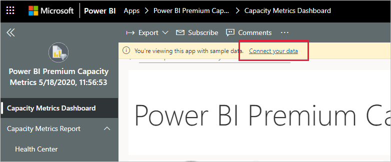

# Подключение к Power BI Premium Capacity Metrics
Отслеживание емкостей очень важно для принятия обоснованных решений в отношении оптимального использования ресурсов емкости Premium. Приложение Power BI Premium Capacity Metrics предоставляет наиболее полные сведения об эффективности использования емкостей.

В этой статье рассказывается, как установить приложение и подключиться к источникам данных. Сведения о содержимом отчета и его использовании см. в разделе [Мониторинг емкостей Premium в приложении](../admin/service-admin-premium-monitor-capacity.md), а также в [записи блога о приложении Premium Capacity Metrics](https://powerbi.microsoft.com/blog/premium-capacity-metrics-app-new-health-center-with-kpis-to-explore-relevant-metrics-and-steps-to-mitigate-issues/).

После установки приложения и подключения к источникам данных можно настроить отчет в соответствии с вашими потребностями. Затем им можно поделиться с коллегами в организации.

> [!NOTE]
> Для установки приложений-шаблонов требуются определенные [разрешения](./service-template-apps-install-distribute.md#prerequisites). Обратитесь к администратору клиента, если вы обнаружите, что у вас нет необходимых разрешений.

## Установка приложения

1. Щелкните следующую ссылку, чтобы перейти к приложению: [Приложение-шаблон Power BI Premium Capacity Metrics](https://app.powerbi.com/groups/me/getapps/services/pbi_pcmm.capacity-metrics-dxt)

1. На странице приложения в AppSource нажмите кнопку [**Получить**](https://app.powerbi.com/groups/me/getapps/services/pbi_pcmm.capacity-metrics-dxt).

    

1. Нажмите кнопку **Установить**. 

    

    > [!NOTE]
    > Если приложение было установлено ранее, появится запрос на [перезапись этой установки](./service-template-apps-install-distribute.md#update-a-template-app) или установку в новой рабочей области.

    После установки приложения оно появится на странице "Приложения".

   

## подключение к источникам данных.

1. Чтобы открыть приложение, щелкните его значок на странице "Приложения".

1. На экране-заставке нажмите кнопку **Исследовать**.

   

   Приложение откроется с образцом данных.

1. Щелкните ссылку **Подключите свои данные** в баннере в верхней части страницы.

   

1. В появившемся диалоговом окне задайте смещение от UTC, то есть разницу в часах между временем в формате UTC и временем в вашем расположении. Нажмите кнопку **Next** (Далее).
  
   
   **Примечание. Для указания половины часа следует использовать десятичные числа (например, 5,5, 2,5 и т. д.).**

1. В следующем появившемся диалоговом окне не требуется выполнять никаких действий. Просто выберите **Войти**.

   

1. На экране входа Майкрософт войдите в Power BI.

   

   После входа отчет подключится к источникам данных и заполнится актуальными данными. В течение этого времени вращается индикатор активности.

   

   Данные отчета будут автоматически обновляться раз в день, если только вы не отключили это во время входа в систему. Также можно [настроить собственное расписание обновления](./refresh-scheduled-refresh.md), чтобы в отчете всегда отражались актуальные данные.

## Настройка и общий доступ

Чтобы приступить к настройке приложения, щелкните значок карандаша в правом верхнем углу.

 

Подробные сведения см. в статье [Настройка приложения и общий доступ к нему](./service-template-apps-install-distribute.md#customize-and-share-the-app).

## Дальнейшие действия
* [Мониторинг емкостей Premium в приложении](../admin/service-admin-premium-monitor-capacity.md)
* [Запись блога о приложении Premium Capacity Metrics](https://powerbi.microsoft.com/blog/premium-capacity-metrics-app-new-health-center-with-kpis-to-explore-relevant-metrics-and-steps-to-mitigate-issues/)
* [Что такое приложения-шаблоны Power BI?](./service-template-apps-overview.md)
* [Установка и распространение приложений-шаблонов в организации](./service-template-apps-install-distribute.md)
* У вас появились вопросы? [Попробуйте задать вопрос в сообществе Power BI.](https://community.powerbi.com/)