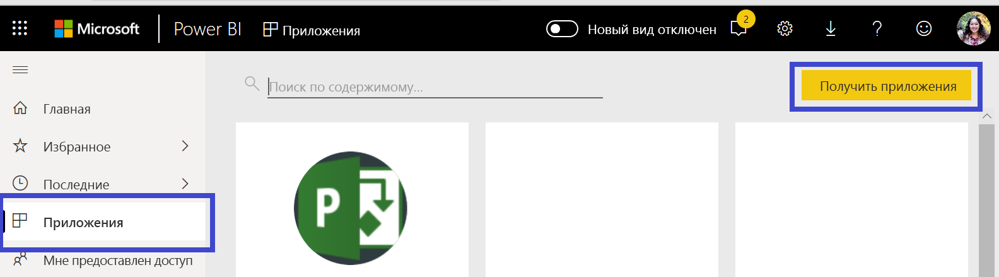
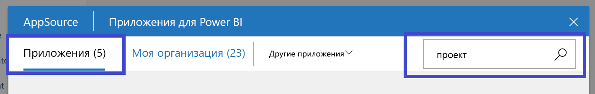
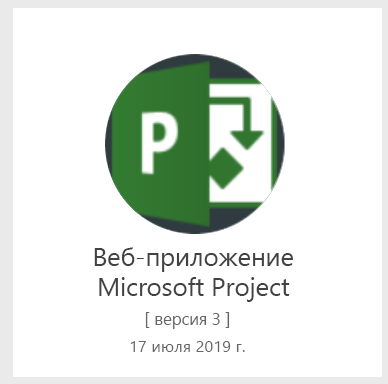
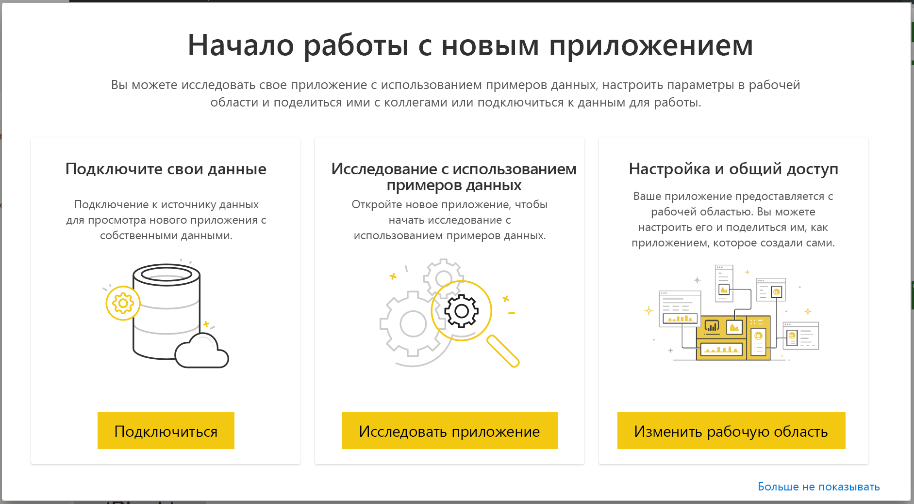
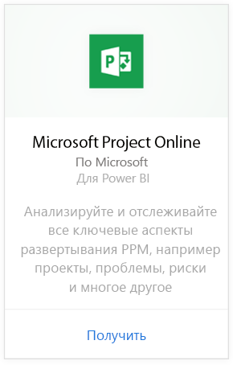
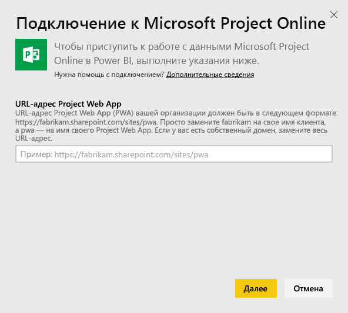
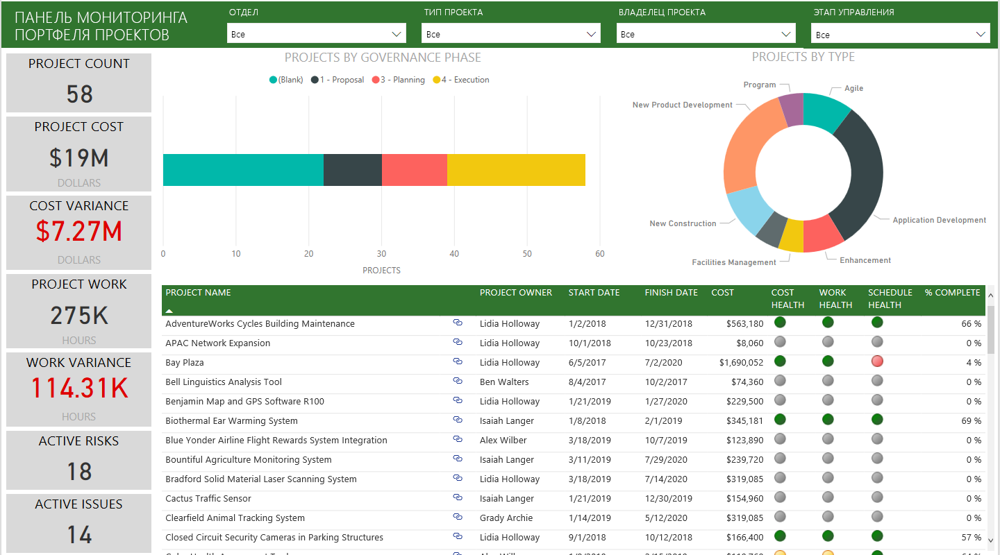
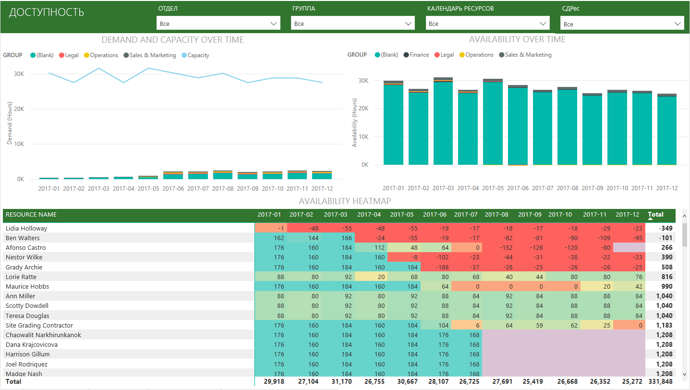
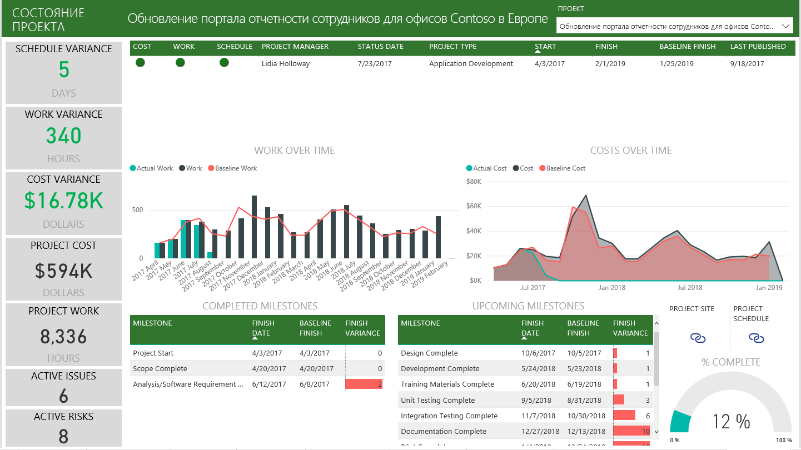

# Подключение к Project Web App с помощью Power BI
Microsoft Project Web App — это гибкое решение для управления портфелями проектов (PPM) и повседневной работы. Project Web App позволяет организациям приступить к работе, расставить приоритеты по инвестициям в портфель проектов, а также добиться запланированного уровня ценности для бизнеса. Приложение-шаблон Project Web App для Power BI позволяет использовать функции аналитики Project Web App для управления проектами, портфелями и ресурсами.

Подключитесь к [приложению-шаблону Project Web App](https://appsource.microsoft.com/product/power-bi/pbi_msprojectonline.pbi-microsoftprojectwebapp) для Power BI.

## Способы подключения

1. Выберите **Приложения** в области навигации, а затем щелкните **Получить приложения** в правом верхнем углу.

    

2. В поле **Службы** выберите **Получить**.
   
   
3. В AppSource на вкладке **Приложения** выполните поиск **приложения Microsoft Project Web**.
   
4. Вы получите сообщение **Установить это приложение Power BI?** , выберите **Установить**. 

   
5. В области **Приложения** выберите заголовок **приложения-шаблона Microsoft Project**. 
   
   
6. На экране **Начало работы с новым приложением** выберите **Подключиться к данным**.
   
   
7. В текстовом поле **URL-адрес Project Web App** введите URL-адрес для приложения Project Web App (PWA), к которому необходимо подключиться.  Обратите внимание, что в личном домене ситуация может отличаться от приведенной в примере. В текстовом поле **Язык сайта PWA** введите номер, который соответствует нужному языку сайта PWA. Введите одну цифру "1" для английского языка, "2" для французского языка, "3" для немецкого языка, "4" для португальского (Бразилия), "5" для португальского (Португалия) и "6" для испанского языка. 
   
   
8. В качестве метода проверки подлинности выберите **oAuth2** \> **Вход**. При появлении запроса введите учетные данные Project Web App и пройдите проверку подлинности.

    > [!NOTE]
    > Вам требуются разрешения на уровне средства просмотра портфеля проектов, диспетчера портфелей или администратора для приложения Project Web App, к которому вы подключаетесь.

9. Вы увидите уведомление, указывающее на загрузку данных. В зависимости от размера вашей учетной записи это может занять некоторое время. После импорта данных в Power BI появится содержимое новой рабочей области. Возможно, вам потребуется обновить набор данных, чтобы получить последние обновления. 

    После импорта данных в Power BI в области навигации появится отчет из 13 страниц и набор данных. 

10. После подготовки отчетов вы можете приступить к изучению данных Project Web App. Приложение-шаблон включает 13 удобных и подробных отчетов по обзору портфеля (6 страниц отчетов), обзору ресурсов (5 страниц отчетов) и состоянию проекта (2 страницы отчетов). 

    
   
    
   
    

**Дальнейшие действия**

* Хотя набор данных будет обновляться ежедневно по расписанию, вы можете изменить график обновлений или попытаться выполнить обновление по запросу с помощью кнопки **Обновить сейчас**.

**Расширение приложения-шаблона**

Скачайте [PBIT-файла из GitHub](https://github.com/OfficeDev/Project-Power-BI-Content-Packs) для дальнейшей настройки и обновления пакета содержимого.

## Дальнейшие действия
[Приступая к работе с Power BI](../fundamentals/service-get-started.md)

[Получение данных в Power BI](service-get-data.md)
