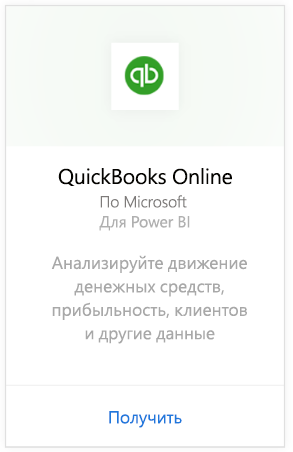
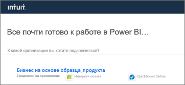
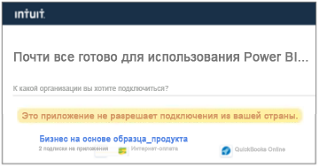

# Подключение к QuickBooks Online с помощью Power BI
При подключении к данным QuickBooks Online из Power BI вы немедленно получаете панель мониторинга и отчеты Power BI, предоставляющие информацию о денежном потоке, прибыльности, клиентах и многом другом. Используйте стандартные панели мониторинга и отчеты или настройте их так, чтобы выделить информацию, которая наиболее важна для вас. Данные автоматически обновляются раз в день.

Подключитесь к [приложению-шаблону QuickBooks Online](https://dxt.powerbi.com/getdata/services/quickbooks-online) для Power BI.

>[!NOTE]
>Для импорта данных QuickBooks Online в Power BI необходимо быть администратором учетной записи QuickBooks Online и выполнить вход с использованием учетных данных администратора. Этот соединитель нельзя использовать с программным обеспечением QuickBooks Desktop. 

## Способы подключения

[!INCLUDE [powerbi-service-apps-get-more-apps](../includes/powerbi-service-apps-get-more-apps.md)]

3. Выберите **QuickBooks Online**, а затем **Получить**.
   
   

4. В окне **Установить это приложение Power BI?** выберите **Установить**.

    

4. В области **Приложения** выберите плитку **QuickBooks**.

   

6. На экране **Начало работы с новым приложением** выберите **Подключиться**.

    

4. В качестве метода аутентификации выберите **oAuth2** и щелкните **Войти**. 
5. При появлении запроса введите учетные данные QuickBooks Online и пройдите проверку подлинности QuickBooks Online. Если вы уже выполнил вход в QuickBooks Online в браузере, учетные данные могут не запрашиваться.
   >[!NOTE]
   >Вам необходимы учетные данные администратора для учетной записи QuickBooks Online.
6. Выберите компанию, которые требуется подключить к Power BI, на следующем экране.
   
   

7. Выберите **Авторизовать** на следующем экране, чтобы начать импорт. Этот процесс может занять несколько минут в зависимости от размера данных компании. 
   
   
   
8. После импорта данных Power BI появится список содержимого приложения QuickBooks: новая панель мониторинга, отчет и набор данных.
9. Выберите панель мониторинга QuickBooks, чтобы начать процесс исследования. Служба Power BI создает ее автоматически для отображения импортированных данных.

    

**Дальнейшие действия**

* Попробуйте [задать вопрос в поле "Вопросы и ответы"](../consumer/end-user-q-and-a.md) в верхней части информационной панели.
* [Измените плитки](../create-reports/service-dashboard-edit-tile.md) на информационной панели.
* [Выберите плитку](../consumer/end-user-tiles.md), чтобы открыть соответствующий отчет.
* Хотя набор данных будет обновляться ежедневно по расписанию, вы можете изменить график обновлений или попытаться выполнять обновления по запросу с помощью кнопки **Обновить сейчас**

## Устранение неполадок
**Ой! Произошла ошибка".**

Если это сообщение отображается после того, как вы выбрали команду **Авторизовать**:

"Ой. Произошла ошибка". Закройте это окно и повторите попытку.

Другой пользователь уже подписался на это приложение для этой компании. Обратитесь по адресу [электронный адрес администратора] для изменения этой подписки".

... она означает, что другой администратор в вашей компании уже подключился к данным компании с помощью Power BI. Попросите этого администратору предоставить вам доступ к панели мониторинга. В настоящее время только один администратор может подключить набор данных QuickBooks Online определенной компании к Power BI. Когда Power BI создаст панель мониторинга, администратор может предоставить к ней общий доступ для нескольких сотрудников в тех же клиентах Power BI.

**"Это приложение не разрешает подключения из вашей страны".**

В настоящее время Power BI поддерживает только выпуски QuickBooks Online для США. 

## Дальнейшие действия
[Что такое Power BI?](../fundamentals/power-bi-overview.md)

[Основные понятия для разработчиков в службе Power BI](../fundamentals/service-basic-concepts.md)
