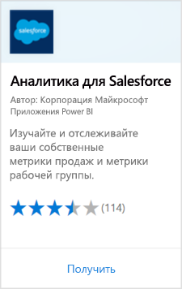
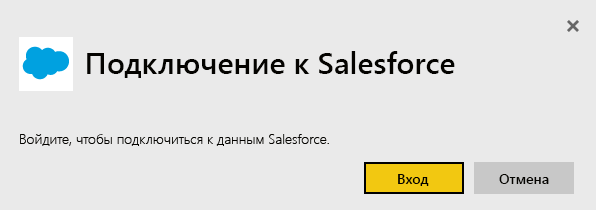
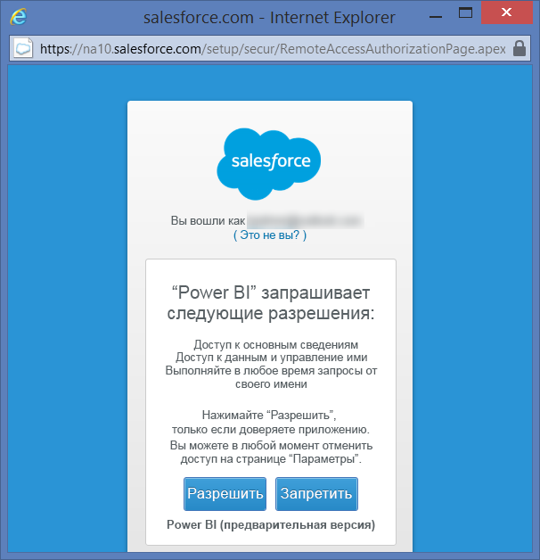
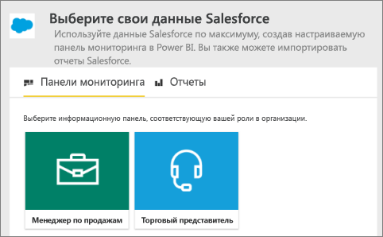
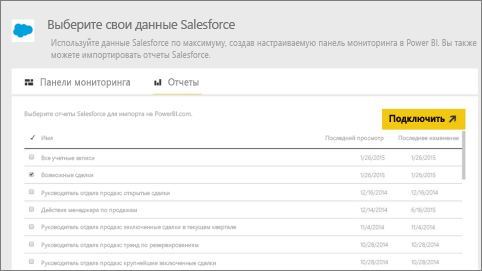
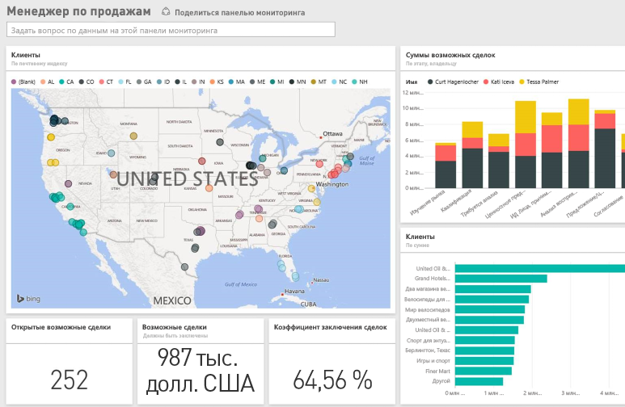

# Подключение к Salesforce с помощью Power BI
С помощью Power BI вы легко можете подключаться к учетной записи Salesforce.com. Это подключение позволяет извлечь данные Salesforce и обеспечить автоматическое предоставление панели мониторинга и отчетов.

См. дополнительные сведения об [интеграции Salesforce](https://powerbi.microsoft.com/integrations/salesforce) с Power BI.

## Способы подключения
1. В Power BI в нижней части области навигации выберите **Получить данные**.
   
    
2. В поле **Службы** выберите **Получить**.
   
    
3. Выберите **Аналитика для Salesforce** и **Получить**.  
   
   
4. Выберите **Вход** для запуска потока входа в систему.
   
    
5. При появлении запроса введите учетные данные Salesforce. Выберите **Разрешить**, чтобы служба Power BI получила доступ к базовым сведениям и данным Salesforce.
   
   
6. Выберите данные, которые вы хотите импортировать в Power BI, в раскрывающемся списке:
   
   * **Панель мониторинга**
     
     Выберите стандартную панель мониторинга в зависимости от пользователя (например, **Менеджер по продажам**). Эти панели мониторинга извлекают определенный набор из стандартных данных Salesforce, который не содержит настраиваемые поля.
     
     
   * **Отчеты**
     
     Выберите один или несколько пользовательских отчетов из вашей учетной записи Salesforce. Эти отчеты соответствуют вашим представлениям в Salesforce и могут содержать данные из пользовательских полей или объектов.
     
     
     
     Если вы не видите все отчеты, добавьте или создайте их в вашей учетной записи Salesforce и повторите попытку подключения.

7. Выберите **Подключить**, чтобы начать импорт. Во время операции появится уведомление о том, что выполняется импорт. После завершения импорта вы увидите панель мониторинга, отчет и набор данных Salesforce в области навигации.
   
   

Вы можете изменить эту панель мониторинга для отображения данных любым нужным образом. Вы можете задавать вопросы в поле "Вопросы и ответы" или [выбрать плитку](../consumer/end-user-tiles.md), чтобы открыть соответствующий отчет и [изменить или удалить плитки на панели мониторинга](../create-reports/service-dashboard-edit-tile.md).

**Дальнейшие действия**

* Попробуйте [задать вопрос в поле "Вопросы и ответы"](../consumer/end-user-q-and-a.md) в верхней части информационной панели.
* [Изменение и удаление плитки](../create-reports/service-dashboard-edit-tile.md) на панели мониторинга
* [Выберите плитку](../create-reports/service-dashboard-tiles.md), чтобы открыть соответствующий отчет.
* Хотя набор данных ежедневно обновляется по расписанию, вы можете изменить график обновлений или попытаться выполнять обновления по запросу с помощью кнопки **Обновить сейчас**

## Системные требования и рекомендации

- Подключение к рабочей учетной записи Salesforce, для которой включен доступ к API

- Разрешения, предоставляемые приложению Power BI во время входа

- Учетная запись предоставляет достаточно вызовов API для извлечения и обновления данных.

- Для обновления необходим маркер аутентификации. Убедитесь, что вы импортировали не более пяти наборов данных Salesforce, так как Salesforce разрешает использовать не более пяти токенов проверки подлинности для каждого приложения.

- В API отчетов Salesforce есть ограничение на количество строк данных: не более 2000 строк.

## Устранение неполадок

При возникновении ошибок ознакомьтесь с требованиями выше. 

Возможность входа в личный домен или домен песочницы сейчас не поддерживается.

### Сообщение "Не удалось подключиться к удаленному серверу"

Если при попытке подключиться к учетной записи Salesforce появляется сообщение "Не удалось подключиться к удаленному серверу", см. описание решения на следующем форуме: [Сообщение об ошибке входа в соединитель Salesforce: "Не удалось подключиться к удаленному серверу"](https://www.outsystems.com/forums/Forum_TopicView.aspx?TopicId=17674&TopicName=log-in-error-message-unable-to-connect-to-the-remote-server&).

## Дальнейшие действия
[Что такое Power BI?](../fundamentals/power-bi-overview.md)

[Источники данных для службы Power BI](service-get-data.md)
