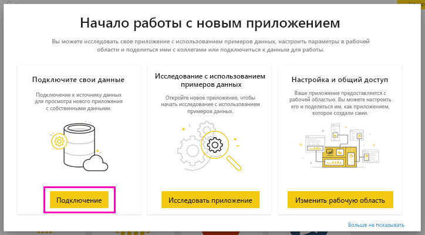
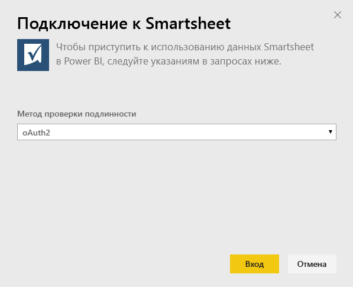
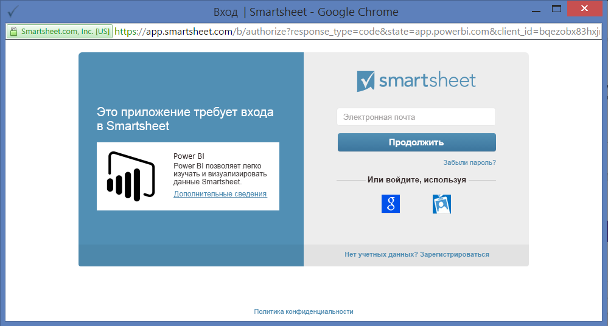
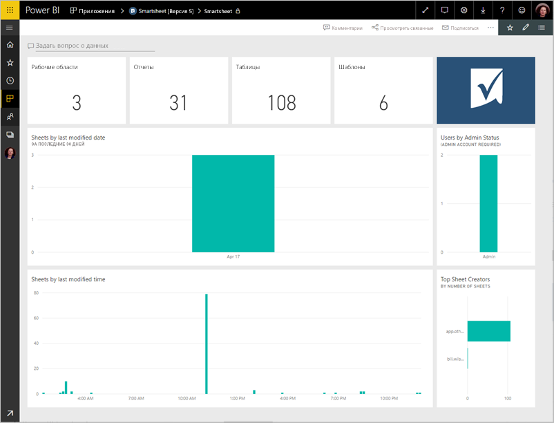
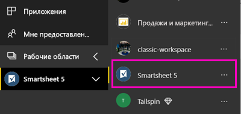
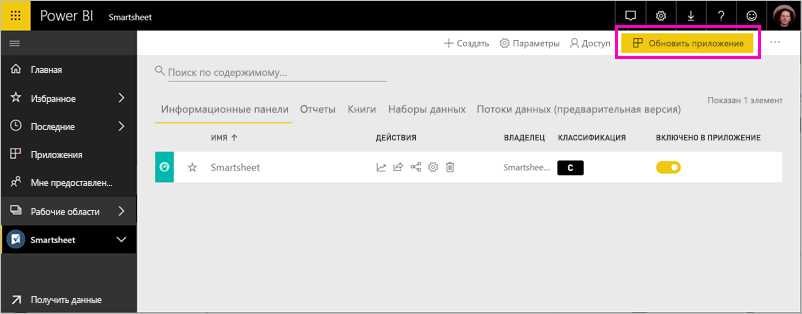

# Подключение к Smartsheet с помощью Power BI
Эта статья описывает извлечение данных из учетной записи Smartsheet с помощью приложения-шаблона Power BI. Smartsheet — это удобная платформа для совместной работы и обмена файлами. Приложение-шаблон Smartsheet для Power BI включает панель мониторинга, отчеты и набор данных с обзором вашей учетной записи Smartsheet. Вы можете также использовать [Power BI Desktop](desktop-connect-to-data.md) для подключения напрямую к отдельным листам в учетной записи. 

После установки приложения-шаблона можно изменить панель мониторинга и отчет. Затем его можно распространить в виде приложения среди коллег в организации.

Подключите [приложение-шаблон Smartsheet](https://app.powerbi.com/groups/me/getapps/services/pbi-contentpacks.pbiapps-smartsheet) для Power BI.

>[!NOTE]
>Для подключения и загрузки приложения-шаблона для Power BI рекомендуется использовать учетную запись администратора Smartsheet, так как она обеспечивает доступ к дополнительным возможностям.

## Способы подключения

[!INCLUDE [powerbi-service-apps-get-more-apps](../includes/powerbi-service-apps-get-more-apps.md)]

3. Выберите **Smartsheet** \> **Получить сейчас**.
4. В окне **Установить это приложение Power BI?** выберите **Установить**.
4. В области **Приложения** выберите плитку **Smartsheet**.

    

6. На экране **Начало работы с новым приложением** выберите **Подключиться**.

    

4. В качестве метода проверки подлинности выберите **oAuth2 \> Войти**.
   
   При появлении запроса введите учетные данные Smartsheet и пройдите проверку подлинности.
   
   
   
   

5. После того, как Power BI импортирует данные, откроется панель мониторинга Smartsheet.
   
   

## Изменение и распространение приложения

Вы установили приложение-шаблон Smartsheet. Это означает, что вы также создали рабочую область приложения Smartsheet. В этой рабочей области вы можете изменить отчет и панель мониторинга, а затем распространить их в виде *приложения* среди коллег в организации. 

1. Чтобы просмотреть все содержимое новой рабочей области Smartsheet, в области навигации выберите **Рабочие области** > **Smartsheet**. 

    

    Это представление представляет собой список содержимого для рабочей области. В правом верхнем углу отображается элемент **Обновить приложение**. Используйте его, когда будете готовы к распространению приложения коллегам. 

    

2. Выберите **Отчеты** и **Наборы данных**, чтобы просмотреть другие элементы в рабочей области.

    Ознакомьтесь с [распространением приложений](../collaborate-share/service-create-distribute-apps.md) для коллег.

## Содержимое
Приложение-шаблон Smartsheet для Power BI содержит общие сведения о вашей учетной записи Smartsheet, например число рабочих областей, отчеты и листы, в которые вносятся изменения, и т. д. Пользователи с правами администратора могут также видеть некоторые сведения о пользователях в системе, например создателей верхних листов.  

Вы можете использовать соединитель Smartsheet в [Power BI Desktop](desktop-connect-to-data.md) для подключения напрямую к отдельным листам в учетной записи.  

## Дальнейшие действия

* [Create the new workspaces in Power BI](../collaborate-share/service-create-the-new-workspaces.md) (Создание рабочих областей новой версии в Power BI)
* [Установка и использование приложений с информационными панелями и отчетами в Power BI](../consumer/end-user-apps.md)
* [Подключение к приложениям Power BI для внешних служб](service-connect-to-services.md)
* У вас появились вопросы? [Попробуйте задать вопрос в сообществе Power BI.](https://community.powerbi.com/)