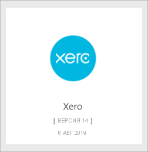
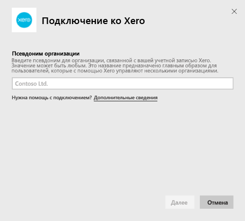
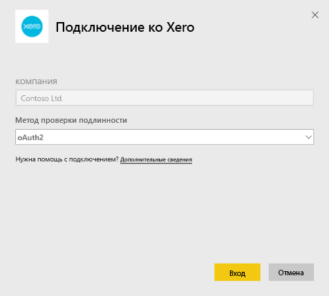
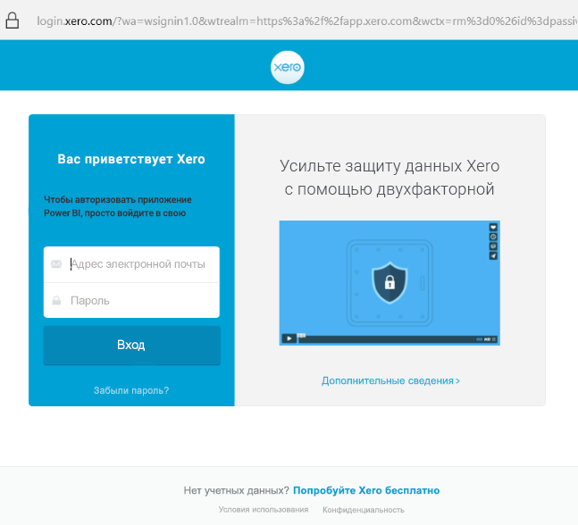

# Подключение к Xero с помощью Power BI
Xero — простое и удобное программное обеспечение для онлайн-бухгалтерии, предназначенное специально для небольших предприятий. Шаблон приложение Xero для Power BI позволит вам создавать интересные визуализации на основе своих финансовых данных. Панель мониторинга по умолчанию содержит множество метрик, характерных для малого бизнеса. Они предназначены для отслеживания таких показателей, как состояние денежной наличности, доходы и расходы, динамика доходов и расходов, срок покрытия дебиторской задолженности и рентабельность инвестиций.

Подключитесь к [шаблону приложения Xero](https://app.powerbi.com/getdata/services/xero) для Power BI или ознакомьтесь с дополнительными сведениями об интеграции [Xero с Power BI](https://help.xero.com/Power-BI).

## Способы подключения

[!INCLUDE [powerbi-service-apps-get-more-apps](../includes/powerbi-service-apps-get-more-apps.md)]

3. Выберите **Xero** \> **Получить сейчас**.
4. В окне **Установить это приложение Power BI?** выберите **Установить**.

    

4. В области **Приложения** выберите плитку **Xero**.

   

6. На экране **Начало работы с новым приложением** выберите **Подключиться**.

    

4. Введите псевдоним для организации, связанной с вашей учетной записью Xero. Вы можете ввести любое значение (это название предназначено главным образом для пользователей, которые с помощью Xero управляют несколькими организациями). См. дополнительные сведения о [поиске параметров](#FindingParams) далее в этой статье.

    

5. Для **метода проверки подлинности**выберите **OAuth**. При появлении запроса войдите и выберите организацию, к данным которой хотите подключиться. После завершения входа выберите **Войти**, чтобы начать загрузку.
   
    
   
    
6. После утверждения процесс импорта начнется автоматически. По завершении в области навигации появится новая панель мониторинга, отчет и модель. Выберите панель мониторинга, чтобы просмотреть импортированные данные.
   
     

**Дальнейшие действия**

* Попробуйте [задать вопрос в поле "Вопросы и ответы"](../consumer/end-user-q-and-a.md) в верхней части информационной панели.
* [Измените плитки](../create-reports/service-dashboard-edit-tile.md) на информационной панели.
* [Выберите плитку](../consumer/end-user-tiles.md), чтобы открыть соответствующий отчет.
* Хотя набор данных будет обновляться ежедневно по расписанию, вы можете изменить график обновлений или попытаться выполнять обновления по запросу с помощью кнопки **Обновить сейчас**

## Содержимое
На панели мониторинга данного шаблона приложения представлены плитки и метрики для различных сфер деятельности, которым соответствуют отчеты.  

| С областями | Плитки панели мониторинга | Отчет |
| --- | --- | --- |
| Наличность |Поток денежных средств за сутки  Поступления  Траты  Итоговое сальдо по счету  Итоговое сальдо сегодня |Банковские счета |
| Клиент |Фактурные продажи  Фактурные продажи по клиентам  Динамика роста фактурных продаж  Счета к оплате  Дебиторская задолженность  Просроченная дебиторская задолженность |Клиент  Запасы |
| Поставщик |Покупки, по которым выставлен счет  Покупки, по которым выставлен счет, по поставщикам  Динамика роста покупок, по которым выставлен счет   Просроченные счета  Кредиторская задолженность  Просроченная кредиторская задолженность |Поставщики  Запасы |
| Запасы |Сумма продаж за месяц по товарам |Запасы |
| Прибыль и убытки |Прибыль и убытки за месяц  Чистая прибыль за текущий фискальный год  Чистая прибыль за текущий месяц  Основные счета по расходам |Прибыль и убытки |
| Сводный баланс |Суммарные активы  Суммарные обязательства  Собственный капитал |Сводный баланс |
| Здравоохранение |Текущее соотношение  Доля валовой прибыли   Доходность суммарных активов  Отношение суммарных обязательств к собственному капиталу |Здоровье  Глоссарий и технические примечания |

Этот набор данных также содержит перечисленные ниже таблицы для настройки отчетов и панелей мониторинга.  

* Адреса  
* Оповещения  
* Ежедневный баланс по банковской выписке  
* Банковские выписки  
* Контакты  
* Заявки на компенсацию расходов  
* Позиции в счете-фактуре  
* Счета-фактуры  
* Позиции  
* Конец месяца  
* Организация  
* Предварительный баланс  
* Счета Xero

## Требования к системе
Для доступа к шаблону приложения Xero необходимы следующие роли: "Стандартная + Отчеты" или "Консультант".

## Поиск параметров
Укажите название организации, данные которой хотите отслеживать в Power BI. Конкретное имя позволяет подключаться к данным нескольких организаций. Подключиться к данным одной организации несколько раз нельзя, так как это затронет автоматическое обновление.   

## Устранение неполадок
* Для доступа к шаблону приложения Xero для Power BI пользователям Xero необходимы следующие роли: "Стандартная + Отчеты" или "Консультант". Для доступа к данным для отчетов через Power BI шаблон приложения применяет систему разрешений пользователей.
* Во время загрузки плитки на панели мониторинга в состоянии универсальной загрузки. Они остаются такими же до завершения полной загрузки. Если отобразится уведомление о завершении загрузки, но плитки будут продолжать загружаться, попробуйте обновить плитки панели мониторинга с помощью элемента "..." в верхней правой части панели мониторинга.
* Если шаблон приложения не обновляется, убедитесь, что вы не подключались в Power BI к данным одной организации несколько раз. Xero позволяет использовать только по одному активному соединению с каждой организацией, и при попытке подключиться еще раз может появиться сообщение о неправильных учетных данных.  
* В случае возникновения проблем при подключении к шаблону приложения Xero из Power BI (например, сообщений об ошибках или медленной загрузке) сначала очистите кэш, удалите файлы cookie и перезапустите браузер, а затем снова подключитесь к Power BI.  

Если у вас возникнут другие проблемы, устранить которые не удастся, отправьте запрос на сайте https://support.powerbi.com.

## Дальнейшие действия
[Приступая к работе с Power BI](../fundamentals/service-get-started.md)

[Получение данных в Power BI](service-get-data.md)
