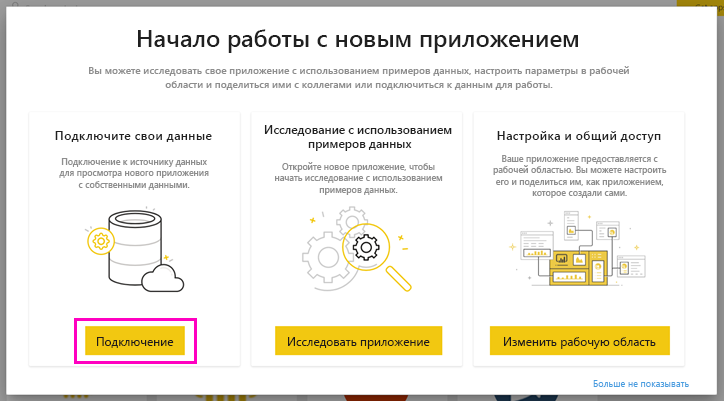

# Подключение к Zendesk с помощью Power BI

Эта статья описывает извлечение данных из учетной записи Zendesk с помощью приложения-шаблона Power BI. Приложение Zendesk включает панель мониторинга Power BI с отчетами, с помощью которых можно получить представление об объемах заявок и производительности операторов. Данные автоматически обновляются раз в день. 

После установки приложения-шаблона можно настроить панель мониторинга и отчет, чтобы выделить наиболее важные сведения. Затем его можно распространить в виде приложения среди коллег в организации.

Подключитесь к [приложению-шаблону Zendesk](https://app.powerbi.com/getdata/services/zendesk) или прочтите дополнительные сведения об [интеграции Zendesk](https://powerbi.microsoft.com/integrations/zendesk) с Power BI.

После установки приложения-шаблона можно изменить панель мониторинга и отчет. Затем его можно распространить в виде приложения среди коллег в организации.

>[!NOTE]
>Для подключения вам понадобится учетная запись администратора Zendesk. Дополнительные сведения о [требованиях](#system-requirements) см. ниже.

>[!WARNING]
>До 15 октября 2019 г. API поиска в службе поддержки Zendesk позволял получать всего 200 000 результатов благодаря разбивке на страницы для больших запросов. Чтобы поиск использовался по назначению, максимальное число результатов в Zendesk теперь ограничено на уровне 1000, а максимальное число результатов на страницу равно 100. Однако текущий соединитель Power BI с Zendesk по-прежнему может создавать вызовы API, превышающие эти новые ограничения, что может приводить к неверным результатам.

## Способы подключения

[!INCLUDE [powerbi-service-apps-get-more-apps](../includes/powerbi-service-apps-get-more-apps.md)]

3. Выберите **Zendesk** \> **Получить сейчас**.
4. В окне **Установить это приложение Power BI?** выберите **Установить**.
4. В области **Приложения** выберите плитку **Zendesk**.

    

6. На экране **Начало работы с новым приложением** выберите **Подключиться**.

    

4. Укажите URL-адрес, связанный с вашей учетной записью. URL-адрес имеет форму **https://company.zendesk.com** . Сведения о том, как найти необходимые параметры, см. [ниже](#finding-parameters).
   
   

5. При появлении запроса введите учетные данные Zendesk.  Выберите механизм проверки подлинности **oAuth 2** и нажмите **Войти**. Следуйте инструкциям проверки подлинности Zendesk. (Если вы уже выполнили вход в Zendesk в браузере, учетные данные могут не запрашиваться.)
   
   > [!NOTE]
   > Для этого приложения-шаблона необходимо подключиться с помощью учетной записи администратора Zendesk. 
   > 
   
   
6. Нажмите кнопку **Разрешить** , чтобы предоставить Power BI доступ к данным Zendesk.
   
   
7. Нажмите кнопку **Подключить** , чтобы начать импорт. 
8. После импорта данных Power BI появится список содержимого приложения Zendesk: новая панель мониторинга, отчет и набор данных.
9. Выберите панель мониторинга, чтобы начать процесс исследования.

    
   
## Изменение и распространение приложения

Вы установили приложение-шаблон Zendesk. Это означает, что вы также создали рабочую область Zendesk. В этой рабочей области вы можете изменить отчет и панель мониторинга, а затем распространить их в виде *приложения* среди коллег в организации. 

1. Чтобы просмотреть все содержимое новой рабочей области Zendesk, в области навигации выберите **Рабочие области** > **Zendesk**. 

    

    Это представление представляет собой список содержимого для рабочей области. В правом верхнем углу отображается элемент **Обновить приложение**. Используйте его, когда будете готовы к распространению приложения коллегам. 

    

2. Выберите **Отчеты** и **Наборы данных**, чтобы просмотреть другие элементы в рабочей области.

    Ознакомьтесь с [распространением приложений](../collaborate-share/service-create-distribute-apps.md) для коллег.

## Требования к системе
Для доступа к приложению-шаблону Zendesk требуется учетная запись администратора Zendesk. Если вы являетесь агентом или пользователем, и хотите просмотреть данные Zendesk, добавьте предложение и проверьте соединитель Zendesk в [Power BI Desktop](desktop-connect-to-data.md).

## Поиск параметров
URL-адрес Zendesk будет совпадать с URL-адресом, который используется для входа в учетную запись Zendesk. Если вы не знаете URL-адрес Zendesk, можно использовать [справку по входу](https://www.zendesk.com/login/) Zendesk.

## Устранение неполадок
Если у вас возникли проблемы с подключением, проверьте URL-адрес Zendesk и убедитесь, что вы используете учетную запись администратора Zendesk.

## Дальнейшие действия

* [Create the new workspaces in Power BI](../collaborate-share/service-create-the-new-workspaces.md) (Создание рабочих областей новой версии в Power BI)
* [Установка и использование приложений с информационными панелями и отчетами в Power BI](../consumer/end-user-apps.md)
* [Подключение к приложениям Power BI для внешних служб](service-connect-to-services.md)
* У вас появились вопросы? [Попробуйте задать вопрос в сообществе Power BI.](https://community.powerbi.com/)
