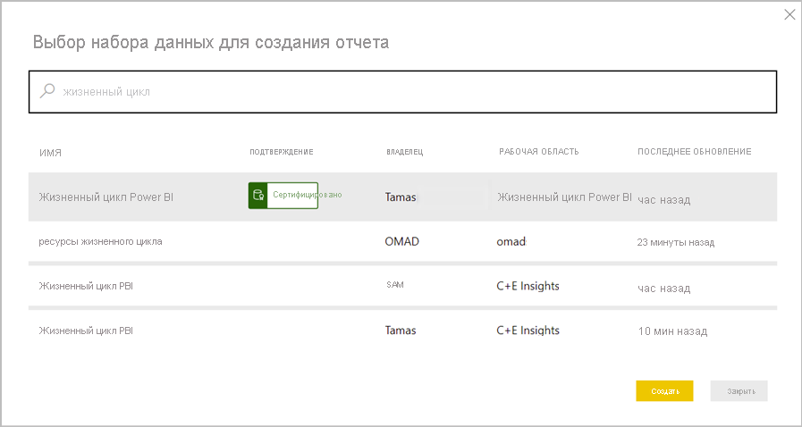

# Общие сведения об использовании наборов данных в рабочих областях

Бизнес-аналитика подразумевает совместную работу. Очень важно определить стандартизированные наборы данных, которые могут выступать к качестве "единого источника истины". После этого важно обеспечить обнаружение и повторное использование стандартизованных наборов данных. Когда профессиональные администраторы моделей данных в вашей организации создают оптимизированные наборы данных и предоставляют их для общего доступа, авторы отчетов могут использовать эти наборы для создания точных отчетов. После этого ваша организация получает в свое распоряжение согласованные данные для принятия решений и формирования продуктивной культуры на основе данных.

В Power BI создатели наборов данных могут управлять доступом к данным с помощью [разрешения на сборку](service-datasets-build-permissions.md). Создатели наборов данных могут также *сертифицировать* наборы данных или *повышать уровень* , чтобы другие пользователи могли их обнаружить. Благодаря этому авторы отчетов смогут определять качественные и официальные наборы данных, чтобы использовать именно их при создании отчетов в Power BI. Администраторам доступен новый параметр клиента, позволяющий [регулировать использование наборов данных в рабочих областях](service-datasets-admin-across-workspaces.md).

## Общий доступ к наборам данных и новый интерфейс рабочих областей

Создание отчетов на основе наборов данных в разных рабочих областях и копирование отчетов в разные рабочие области тесно связаны с [новым интерфейсом рабочих областей](../collaborate-share/service-create-the-new-workspaces.md).

- В службе при открытии каталога наборов данных из нового интерфейса рабочих областей в этом каталоге отображаются наборы данных, которые находятся в разделе "Моя рабочая область" и в других новых интерфейсах для рабочих областей. 
- При открытии каталога наборов данных каталога из классической рабочей области вы видите только наборы данных из этой рабочей области, но не из других.
- В Power BI Desktop вы можете публиковать отчеты Live Connect в разных рабочих областях при условии, что их наборы данных находятся в рабочих областях с новым интерфейсом.
- При копировании отчетов между рабочими областями целевая область должна иметь новый интерфейс.

## Обнаружение наборов данных

При создании отчета на основе существующего набора данных прежде всего нужно подключиться к набору данных в службе Power BI либо в Power BI Desktop. Ознакомьтесь с [обнаружением наборов данных из разных рабочих областей](service-datasets-discover-across-workspaces.md).

## Копирование отчета

Найдя понравившийся отчет в рабочей области или приложении, можно создать его копию и изменить ее в соответствии со своими потребностями. Вам не нужно беспокоиться о создании модели данных. Она уже создана автоматически. И гораздо проще изменить имеющийся отчет, чем создавать его с нуля. Дополнительные сведения о [копировании отчетов](service-datasets-copy-reports.md).

## Разрешение на сборку для наборов данных

С помощью разрешения на сборку создатель набора данных может определить, кто в организации может создавать содержимое на основе его набора данных. Пользователи с разрешением на сборку могут также создавать содержимое на основе набора данных за пределами Power BI, например на листах Excel, с помощью функции "Анализ в Excel", XMLA и экспорта. См. дополнительные сведения о [разрешении на сборку](service-datasets-build-permissions.md).

## Повышение уровня и сертификация

Создав набор данных, который может пригодиться другим пользователям, можно упростить поиск этого набора, [повысив его уровень](../collaborate-share/service-endorse-content.md#promote-content). Можно также попросить экспертов в вашей организации [сертифицировать ваш набор данных](../collaborate-share/service-endorse-content.md#request-content-certification).

## Лицензирование

Конкретные функции и процедуры, основанные на возможностях общего набора данных, лицензируются в соответствии с предусмотренными для них сценариями. Например:

- Как правило, обнаружение общих наборов данных и подключение к ним доступны любому пользователю. Это не только функция Premium.
- Пользователи без лицензии Pro могут использовать наборы данных в рабочих областях для создания отчетов, только если эти наборы данных находятся в личной рабочей области пользователя или в рабочей области с поддержкой Premium. Одни и те же ограничения лицензирования применяются независимо от того, создаются ли отчеты в Power BI Desktop или в службе Power BI.
- Для копирования отчетов между рабочими областями требуется лицензия Pro.
- Для копирования отчетов из приложения требуется лицензия Pro, так как она необходима для пакетов содержимого организации.
- Для повышения уровня наборов данных и их сертификации требуется лицензия Pro.

## Рекомендации и ограничения

- Как издателю приложения вам необходимо убедиться в том, что у аудитории есть доступ к наборам данных за пределами рабочей области. В противном случае при взаимодействии с приложением пользователи сталкиваются с проблемами: отчеты не будут открываться без доступа к набору данных, а плитки панели мониторинга будут отображаться как заблокированные. Кроме того, пользователи не смогут открыть приложение, если первый элемент в его навигации является отчетом без доступа к набору данных.
- Чтобы создать отчет на основе набора данных в другой рабочей области, требуется, чтобы на обеих сторонах использовался новый интерфейс рабочих областей: как отчет, так и набор данных должны находиться в новом интерфейсе рабочих областей. Отчеты из нового интерфейса рабочих областей можно копировать только в новый интерфейс рабочих областей, но не в классические рабочие области и не в раздел "Моя рабочая область". 
- Для классической рабочей области интерфейс обнаружения набора данных отображает только наборы данных в этой рабочей области.
- Для функции "Опубликовать в Интернете" намеренно не реализована поддержка отчета, основанного на общем наборе данных.
- Если два пользователя являются членами рабочей области, которая обращается к общему набору данных, возможно, что только один из них может видеть соответствующий набор данных в рабочей области. Общий набор данных могут видеть только пользователи, имеющие по меньшей мере доступ на чтение к набору данных. 

## Дальнейшие действия

- [Повышение уровня наборов данных](../collaborate-share/service-endorse-content.md#promote-content)
- [Сертификация наборов данных](../collaborate-share/service-endorse-content.md#certify-content)
- [Запрос сертификации набора данных](../collaborate-share/service-endorse-content.md#request-content-certification)
- [Регулирование использования наборов данных в рабочих областях](service-datasets-admin-across-workspaces.md)
- У вас появились вопросы? [Попробуйте задать вопрос в сообществе Power BI.](https://community.powerbi.com/)
