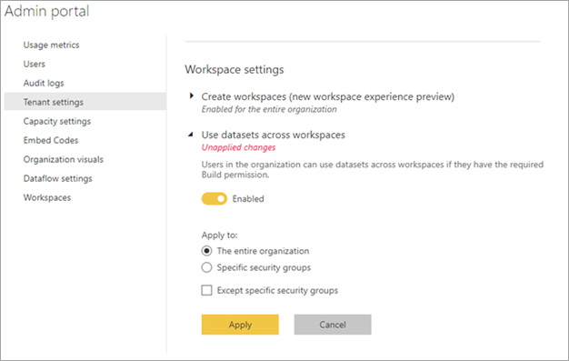

# Управление использованием наборов данных в рабочих областях

Использование наборов данных в рабочих областях позволяет эффективно стимулировать развитие культуры на основе данных и демократизацию данных внутри организации. Однако если вы являетесь администратором Power BI, иногда требуется ограничить поток информации в вашем клиенте Power BI. С помощью параметра клиента **Использование наборов данных в рабочих областях** можно полностью или частично ограничить повторное использование наборов данных для отдельных групп безопасности.

Если отключить этот параметр, это повлияет на составителей отчетов следующим образом.

- Кнопка для копирования отчетов между рабочими областями недоступна. 
- В отчете, основанном на общем наборе данных, кнопка **Изменить отчет** недоступна.
- В службе Power BI интерфейс обнаружения отображает только наборы данных в текущей рабочей области.
- В Power BI Desktop интерфейс обнаружения отображает только наборы данных из рабочих областей, членом которых вы являетесь.
- В Power BI Desktop, когда пользователи открывают файл PBIX с активным подключением к набору данных за пределами любой рабочей области, членами которой они являются, они видят сообщение об ошибке с запросом подключиться к другому набору данных.

## Указание ссылки для процесса сертификации

Администратор Power BI может предоставить URL-адрес для ссылки **Подробнее** на странице параметров **Подтверждение**.  Эта ссылка может указывать на документацию о процессе сертификации. Если не задать назначение для ссылки **Подробнее**, по умолчанию она указывает на статью о [сертификации набора данных](service-datasets-certify.md).

## Дальнейшие действия

- [Использование наборов данных в рабочих областях](service-datasets-across-workspaces.md)
- У вас появились вопросы? [Попробуйте задать вопрос в сообществе Power BI.](https://community.powerbi.com/)
