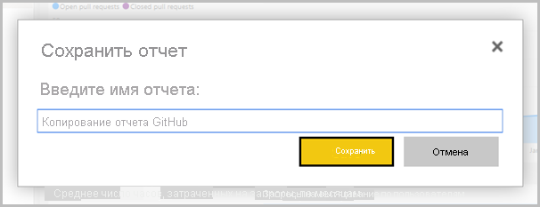
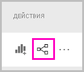
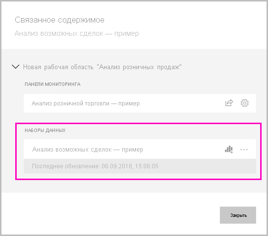

# Копирование отчетов из других рабочих областей

Когда найдете понравившийся отчет в рабочей области или приложении, вы можете создать его копию и сохранить ее в другой рабочей области. Затем вы можете изменить копию отчета, добавив или удалив визуальные и другие элементы. Вам не нужно беспокоиться о создании модели данных. Она уже создана автоматически. И гораздо проще изменить имеющийся отчет, чем создавать его с нуля. Однако при создании приложения из вашей рабочей области иногда невозможно опубликовать копию отчета в приложении. Подробные сведения см. в разделе [Рекомендации и ограничения](service-datasets-across-workspaces.md#considerations-and-limitations) в статье "Использование наборов данных в рабочих областях".

> [!NOTE]
> Для создания копии вам требуется лицензия Pro, даже если исходный отчет находится в рабочей области в емкости Premium.

## Сохранение копии отчета в рабочей области

1. В рабочей области перейдите к представлению списка "Отчеты".

    

1. В разделе **Действия** выберите **Сохранить копию**.

    

    Значок **Сохранить копию** отображается только в том случае, если отчет находится в новом интерфейсе рабочей области и у вас есть [разрешения на сборку](service-datasets-build-permissions.md). Даже если у вас есть доступ к рабочей области, необходимо иметь разрешения на сборку для набора данных.

3. В области **Сохранение копии отчета** присвойте отчету имя и выберите целевую рабочую область.

    

    Отчет можно сохранить в текущей или другой рабочей области в службе Power BI. Вы видите только рабочие области, относящиеся к новому интерфейсу рабочей области, членом которых вы являетесь. 
  
4. Нажмите кнопку **Сохранить**.

    Power BI автоматически создает копию отчета и запись в списке наборов данных, если отчет основан на наборе данных, находящемся за пределами рабочей области. Значок для этого набора данных отличается от значка для наборов данных в рабочей области. 
    
    Таким образом, члены рабочей области могут узнать, какие отчеты и панели мониторинга используют наборы данных, которые находятся за пределами рабочей области. Эта запись содержит сведения о наборе данных и нескольких выбранных действиях.

    

    Дополнительные сведения об отчете и связанном наборе данных см. раздел [Ваша копия отчета](#your-copy-of-the-report) в этой статье.

## Копирование отчета в приложение

1. В приложении откройте отчет, который необходимо скопировать.
2. В панели меню выберите **Дополнительные параметры** ( **...** ) > **Сохранить копию**.

    

    Параметр **Сохранить копию** отображается только в том случае, если отчет находится в новом интерфейсе рабочей области и у вас есть [разрешения на сборку](service-datasets-build-permissions.md).

3. Введите имя отчета и нажмите кнопку > **Сохранить**.

    

    Копия будет автоматически сохранена в "Моя рабочая область."

4. Выберите **Перейти к отчету**, чтобы открыть копию.

## Ваша копия отчета

При сохранении копии отчета вы создаете активное подключение к набору данных и можете открыть процедуру создания отчета с полным доступным набором данных. 

Вы еще не создали копию набора данных. Набор данных по-прежнему находится в исходном расположении. Вы можете использовать все таблицы и меры из набора данных в своем отчете. Для набора данных действуют ограничения безопасности на уровне строк (RLS), поэтому вы видите только те данные, на которые предусмотрены соответствующие разрешения в вашей роли RLS.

## Просмотр связанных наборов данных

Когда у вас есть отчет в одной рабочей области, основанный на наборе данных из другой рабочей области, может понадобиться узнать дополнительные сведения о наборе данных, на котором он основан.

1. В представлении списка отчетов выберите **Просмотреть похожие**.

    

1. В диалоговом окне **Связанное содержимое** отображаются все связанные элементы. В этом списке набор данных выглядит подобно любому другому. Вы не можете определить, что он находится в другой рабочей области. Это известная проблема.
 
    

## Удаление отчета и совместно используемого набора данных

Может случиться так, что отчет и его набор данных не будут больше нужны в рабочей области.

1. Удалите такой отчет. Для этого щелкните значок **удаления** в списке отчетов рабочей области.

    

2. В списке наборов данных видно, что для общих наборов данных не доступны значки **удаления**. Обновите страницу или перейдите на другую, а затем вернитесь. Теперь набор данных исчез. Если это не так, проверьте раздел **Просмотреть похожие**. Возможно, он связан с другой таблицей в рабочей области.

    

    > [!NOTE]
    > При удалении общего набора данных в этой рабочей области не удаляется сам набор данных. Здесь удаляется только ссылка на него.

## Дальнейшие действия

- [Использование наборов данных в рабочих областях](service-datasets-across-workspaces.md)
- У вас появились вопросы? [Попробуйте задать вопрос в сообществе Power BI.](https://community.powerbi.com/)
