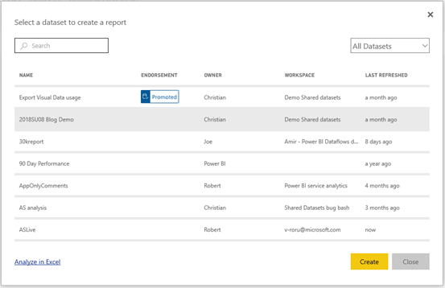
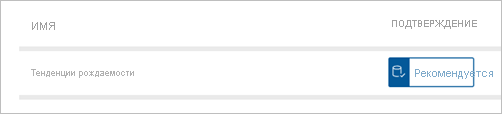

# Создание отчетов на основе наборов данных из разных рабочих областей

Вы можете узнать, как создавать отчеты в ваших собственных рабочих областях на основе наборов в других рабочих областях. Чтобы создать отчет на основе существующего набора данных, можно начать с Power BI Desktop или со службы Power BI в разделе "Моя рабочая область" или в [новом интерфейсе рабочей области](../collaborate-share/service-create-the-new-workspaces.md).

- В службе Power BI: **Получение данных** > **Опубликованные наборы данных**.
- В Power BI Desktop: **Получение данных** > **Наборы данных Power BI**.

    
   
В обоих случаях процесс обнаружения набора данных начинается в этом диалоговом окне — **Выбор набора данных для создания отчета**. Вы видите все наборы данных, к которым у вас есть доступ, независимо от того, где они находятся.

Обратите внимание, что первый из них помечен как **Рекомендуется**. Мы рассмотрим это подробнее в разделе [Поиск подтвержденного набора данных](#find-an-endorsed-dataset) ниже.

Наборы данных, которые вы видите в этом списке, удовлетворяют по меньшей мере одному из следующих условий.

- Набор данных относится к одной из рабочих областей с новым интерфейсом, и вы являетесь членом этой рабочей области. См. раздел [Рекомендации и ограничения](service-datasets-across-workspaces.md#considerations-and-limitations).
- У вас есть разрешение на сборку для набора данных, который находится в новом интерфейсе рабочей области.
- Набор данных находится в вашем разделе "Моя рабочая область".

> [!NOTE]
> Если вы являетесь пользователем категории "Бесплатный", то увидите только наборы данных в вашем разделе "Моя рабочая область" или наборы данных, для которых у вас есть разрешение сборки и которые находятся в рабочих областях емкости Premium.

При нажатии кнопки **Создать** вы создаете активное подключение к набору данных и процедура создания отчета открывается с полным доступным набором данных. Вы еще не создали копию набора данных. Набор данных по-прежнему находится в исходном расположении. Вы можете использовать все таблицы и меры из набора данных для создания своих отчетов. Для набора данных действуют ограничения безопасности на уровне строк (RLS), поэтому вы видите только те данные, на которые предусмотрены соответствующие разрешения в вашей роли RLS.

Отчет можно сохранить в текущей рабочей области в службе Power BI или опубликовать в рабочей области из Power BI Desktop. Power BI автоматически создает запись в списке наборов данных, если отчет основан на наборе данных, находящемся за пределами рабочей области. Значок для этого набора данных отличается от значка для наборов данных в рабочей области. 

Таким образом, члены рабочей области могут узнать, какие отчеты и панели мониторинга используют наборы данных, которые находятся за пределами рабочей области. Эта запись содержит сведения о наборе данных и нескольких выбранных действиях.

## Поиск подтвержденного набора данных

Существует два типа подтвержденных наборов данных. Владельцы наборов данных могут *повысить уровень* набора данных, который они рекомендуют вам. Также администратор клиента Power BI может назначить экспертов в вашей организации, которым разрешено *сертифицировать* наборы данных для использования другими пользователями. Наборы данных с повышенным уровнем и сертификацией отображают *эмблемы*, которые видны как при поиске набора данных, так и в списке наборов данных в рабочей области. Имя пользователя, который сертифицировал набор данных, отображается в подсказке при обнаружении набора данных. Чтобы увидеть его, наведите указатель мыши на метку **Сертифицировано**.

- В службе Power BI: **Получение данных** > **Опубликованные наборы данных**.
- В Power BI Desktop: **Получение данных** > **Наборы данных Power BI**.

    В диалоговом окне **Выбор набора данных** подтвержденные наборы данных по умолчанию находятся в начале списка. 

    

## Дальнейшие действия

- [Использование наборов данных в рабочих областях](service-datasets-across-workspaces.md)
- У вас появились вопросы? [Попробуйте задать вопрос в сообществе Power BI.](https://community.powerbi.com/)
