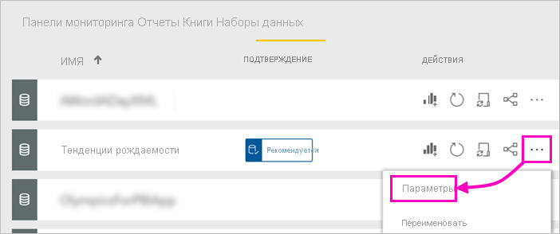
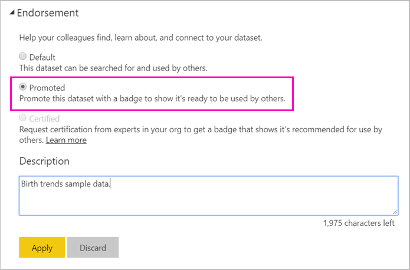

# Повышение уровня набора данных — Power BI

Теперь составители отчетов Power BI могут получить доступ к множеству разных наборов данных, поэтому предприятиям требуется направить их к надежным и высококачественным наборам данных. Power BI предоставляет два способа *подтверждения* наборов данных.

- **Повышение уровня**. Как владелец набора данных, вы можете повысить уровень собственных наборов данных, когда они будут готовы для широкомасштабного применения. Любой член рабочей области с разрешениями на запись может повысить уровень набора данных. Нет никаких ограничений на то, кто может повышать уровень набора данных. Повышение уровня способствует распространению наборов данных в организации в рамках совместной работы. Эта статья посвящена повышению уровня набора данных.
- **Сертификация**. Вы можете запросить сертификацию для набора данных с повышенным уровнем. Группа пользователей, указанная в параметре **Сертификация набора данных** администратора клиента, решает, какие наборы данных сертифицировать. Дополнительные сведения см. в разделе [Сертификация наборов данных](service-datasets-certify.md).

## Повышение уровня набора данных

Перед повышением уровня набор данных должен находиться в рабочей области с новым интерфейсом в службе Power BI.

1. Перейдите к списку наборов данных в рабочей области.
 
1. Нажмите кнопку **Дополнительные параметры** (...) и выберите пункт **Параметры**.

    

1. Разверните пункт **Подтверждение** и выберите **Рекомендуется**.

    

1. Нажмите кнопку **Применить**.

## Запрос сертификации набора данных

Ваш администратор клиента определил людей в организации, которые могут сертифицировать наборы данных. Вы можете попросить их сертифицировать ваш набор данных.

1. Предоставьте лицу, осуществляющему сертификацию, разрешения участника на рабочую область, где находится набор данных.

1. Элемент **Сертифицировано** в разделе **Подтверждение** области **Параметры** становится неактивным.

1. Выберите ссылку **Подробнее**.

    Администратор клиента Power BI может настроить ссылку **Подробнее** для перехода в указанное расположение со сведениями о процессе сертификации в вашем клиенте.   Если он еще не настроил ссылку **Подробнее**, по умолчанию она указывает на статью о [сертификации набора данных](service-datasets-certify.md).

## Дальнейшие действия

* Ознакомление с [использованием наборов данных в рабочих областях](service-datasets-across-workspaces.md)
* У вас появились вопросы? [Попробуйте задать вопрос в сообществе Power BI.](https://community.powerbi.com/)
