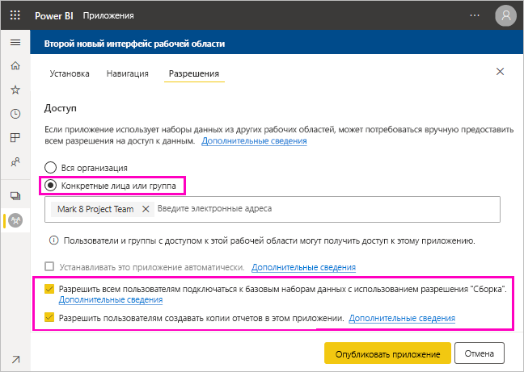
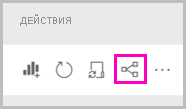
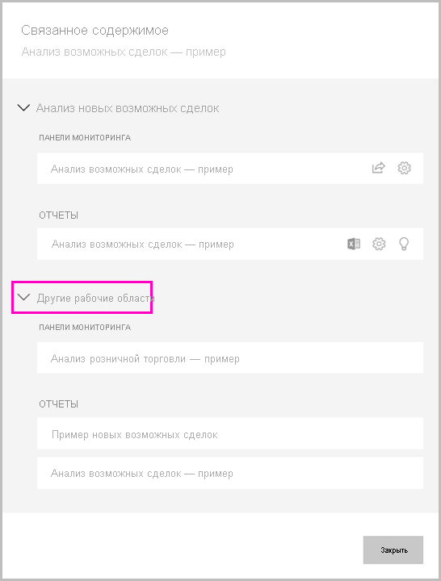

# Общий доступ к набору данных

Как автор *моделей данных* в Power BI Desktop, вы создаете *наборы данных*, которые можно распространять в службе Power BI. Затем другие создатели отчетов могут использовать эти наборы данных в качестве базиса для собственных отчетов. В этой статье вы узнаете, как предоставлять общий доступ к наборам данных. Чтобы узнать, как предоставить и удалить доступ к общим наборам данных, ознакомьтесь с [разрешениями на сборку](service-datasets-build-permissions.md).

## Процедура по предоставлению набора данных для общего доступа

1. Начните с создания PBIX-файла с моделью данных в Power BI Desktop. Если вы планируете предоставить этот набор данных другим пользователям для создания отчетов, можете даже не проектировать отчет в виде PBIX-файла.

    Рекомендуется сохранить этот PBIX-файл в группе Microsoft 365.

1. Опубликуйте PBIX-файл в [новом интерфейсе рабочей области](../collaborate-share/service-create-the-new-workspaces.md) в службе Power BI.
    
    Уже после этого другие члены этой рабочей области могут создавать отчеты в других рабочих областях на основе этого набора данных. Используйте параметр управления разрешениями для набора данных в списке содержимого рабочей области, чтобы предоставить доступ к набору данных дополнительным пользователям. 

1. Вы также можете [опубликовать приложение](../collaborate-share/service-create-distribute-apps.md) из этой рабочей области. При этом на странице **Разрешения** нужно указать разрешения и возможности пользователей.

    > [!NOTE]
    > Если выбрать значение **Вся организация**, никто в организации не будет иметь разрешения на сборку. Это известная проблема. Вместо этого укажите адреса электронной почты в поле **Конкретные лица или группы**.  Если требуется, чтобы разрешения на сборку были у всей организации, укажите псевдоним электронной почты для всей организации.

    

1. Выберите **Публикация приложения** или **Обновить приложение**, если оно уже опубликовано.

## Отслеживание использования набора данных

При наличии общего набора данных в рабочей области вам может потребоваться узнать, какие отчеты в других рабочих областях основаны на нем.

1. В представлении списка наборов данных выберите **Просмотреть похожие**.

    

1. В диалоговом окне **Связанное содержимое** отображаются все связанные элементы. В этом списке отображаются связанные элементы в этой рабочей области и в **других рабочих областях**.
 
    

## Рекомендации и ограничения
Ниже приведены важные замечания о совместном доступе к наборам данных.

* Предоставляя кому-то доступ к набору данных путем управления разрешениями, совместного использования отчетов или панелей мониторинга либо публикации приложения, вы предоставляете доступ ко всему набору данных, если только доступ к этому набору данных не ограничивает [безопасность на уровне строк (RLS)](../admin/service-admin-rls.md). Авторы отчетов могут использовать возможности настройки пользовательского интерфейса при просмотре отчетов или взаимодействии с ними, например скрывать столбцы, ограничивать действия с визуальными элементами и т. д. Эти настраиваемые возможности не ограничивают данные, которые могут быть доступны пользователям. Используйте [безопасность на уровне строк (RLS)](../admin/service-admin-rls.md) в наборе данных, чтобы учетные данные каждого пользователя могли определять, к каким данным они имеют доступ.

## Дальнейшие действия

- [Использование наборов данных в рабочих областях](service-datasets-across-workspaces.md)
- У вас появились вопросы? [Попробуйте задать вопрос в сообществе Power BI.](https://community.powerbi.com/)
