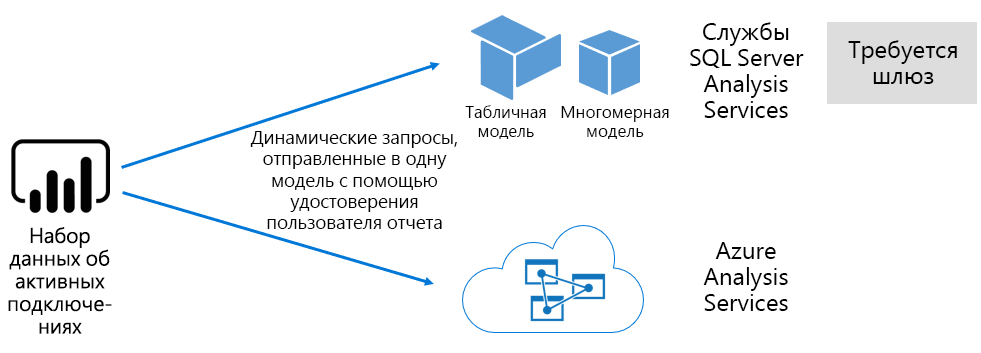

# Наборы данных в службе Power BI

В этой статье содержится техническое описание наборов данных Power BI.

## Типы наборов данных

Наборы данных Power BI представляют собой источник данных, подготовленных для создания отчетов и визуализации. Существует пять различных типов наборов данных, созданных способами, перечисленными далее.

- Подключение к имеющейся модели данных, которая не размещена на мощностях Power BI.
- Передача файла Power BI Desktop, содержащего модель.
- Передача книги Excel (содержащей одну или несколько таблиц Excel и (или) модель данных книги) или CSV-файла (с запятыми-разделителями).
- Использование службы Power BI для создания [набора данных для отправки](../developer/automation/walkthrough-push-data.md)
- Использование службы Power BI для создания [набора данных для принудительной, потоковой или гибридной передачи](service-real-time-streaming.md)

За исключением наборов данных потоковой передачи, остальные наборы данных представляют собой модель данных, в которой используются технологии моделирования служб [Analysis Services](/analysis-services/analysis-services-overview).

> [!NOTE]
> В нашей документации термины _наборы данных_ и _модели_ иногда являются взаимозаменяемыми. Как правило, в контексте службы Power BI используется термин **набор данных**, а в контексте разработки — **модель**. В контексте нашей документации они имеют примерно одинаковое значение.

### Модели с внешним размещением

Существует два типа моделей с внешним размещением: SQL Server Analysis Services и [Azure Analysis Services](/azure/analysis-services/analysis-services-overview).

Подключение к модели SQL Server Analysis Services предусматривает установку [локального шлюза данных](service-gateway-onprem.md), будь то локальная среда или инфраструктура как услуга (IaaS), размещенная на виртуальной машине. Службам Azure Analysis Services наличие шлюза не требуется.

Подключение к Analysis Services часто имеет смысл при наличии инвестиций в существующую модель, которая обычно образует часть хранилища данных предприятия (EDW). Power BI может активировать _динамическое подключение_ к Analysis Services, обеспечивая разрешения для данных с помощью удостоверения пользователя отчета Power BI. Для служб SQL Server Analysis Services поддерживаются как многомерные модели (кубы), так и табличные модели. Набор данных динамического подключения отправляет запросы ко внешним моделям, как показано на следующем рисунке.

### Модели, разработанные для Power BI Desktop

Power BI Desktop — клиентское приложение, предназначенное для разработки Power BI, может использоваться для разработки моделей. Модель фактически является по сути табличной моделью Analysis Services. Разработать модели можно путем импорта данных из потоков данных, которые затем можно интегрировать с внешними источниками данных. Несмотря на то что подробные сведения о моделировании не приведены в этой статье, важно знать, что с помощью Power BI Desktop можно разработать три различных типа (или _режима_) моделей. Эти режимы определяют, импортируются ли данные в модель или же они остаются в источнике данных. К этим типам относятся: режим импорта, режим DirectQuery и составной режим. Дополнительные сведения о каждом режиме см. в статье [Режимы наборов данных в службе Power BI](service-dataset-modes-understand.md).

Модели с внешним размещением и модели Power BI Desktop могут применять безопасность на уровне строк (RLS) для ограничения данных, получаемых определенным пользователем. Например, пользователи, назначенные в группу безопасности **Менеджеры**, могут просматривать данные отчета только для тех регионов продаж, которые им назначены. Роли RLS могут быть _динамическими_ или _статическими_. Динамические роли можно отфильтровать по пользователям отчета, тогда как статические роли применяют одинаковые фильтры для всех пользователей, которым назначена роль. Дополнительные сведения см. в статье [Безопасность на уровне строк (RLS) в Power BI](../admin/service-admin-rls.md).

### Модели книги Excel

Создание наборов данных на основе [книг Excel](service-excel-workbook-files.md) или [CSV-файлов](service-comma-separated-value-files.md) приведет к автоматическому созданию модели. Таблицы Excel и данные CSV импортируются для создания таблиц модели, а модель данных книги Excel транспонируется для создания модели Power BI. Во всех случаях данные файла будут импортированы в модель.

## Сводка

Различить наборы данных Power BI, которые представляют модели, можно следующим образом:

- Они размещены либо в службе Power BI, либо в службах Analysis Services.
- Они могут хранить импортированные данные или (и) отправлять сквозные запросы к базовым источникам данных, или использовать сочетание обоих методов.

Ниже приведены важные факты о наборах данных Power BI, которые представляют модели:

- Для моделей, размещенных в службах SQL Server Analysis Services, требуется шлюз для выполнения запросов к динамическому подключению.
- Модели, размещенные в службе Power BI, которые импортируют данные:
  - должны быть полностью загружены в память, чтобы к ним можно было отправлять запросы;
  - требуют обновления, чтобы поддерживать актуальность данных, и должны использовать шлюзы в случае, если исходные данные недоступны напрямую через Интернет.
- Модели, размещенные в службе Power BI и использующие режим хранения [DirectQuery](desktop-directquery-about.md), требуют подключения к исходным данным. При запросе модели Power BI отправляет запросы к исходным данным для получения текущих данных. Этот режим должен использовать шлюзы в случае, если исходные данные недоступны напрямую через Интернет.
- Модели могут применять правила RLS с помощью фильтров для предоставления доступа к данным только для определенных пользователей.

## Ограничения

Для успешного выполнения развертывания и управления Power BI важно иметь представление о расположении моделей, их режиме хранения, каких-либо зависимостях от шлюзов, размере импортируемых данных, а также типе и частоте обновления. Все эти конфигурации могут оказать значительное влияние на мощностные ресурсы Power BI. Кроме того, к приведенному выше перечню можно добавить саму разработку модели, включая запросы на подготовку данных, их вычисления и связи.

Важно также знать, что модели импорта, размещенные в Power BI, могут обновляться в соответствии с расписанием или запускаться по требованию пользователем в службе Power BI.

## Дальнейшие действия

- [Режимы наборов данных в службе Power BI](service-dataset-modes-understand.md)
- Появились дополнительные вопросы? [Попробуйте задать вопрос в сообществе Power BI.](https://community.powerbi.com/)
