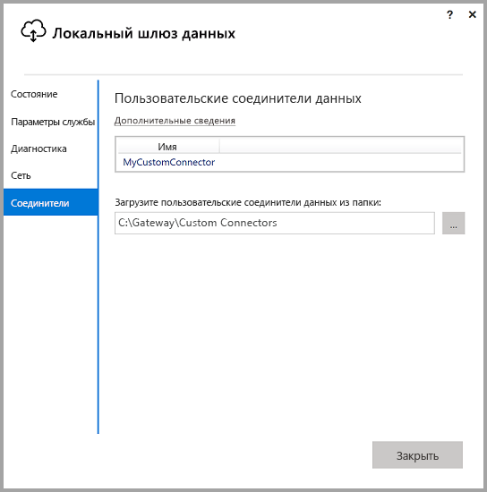
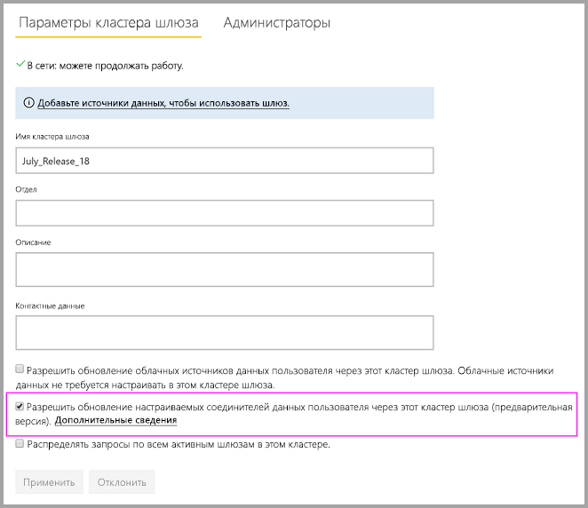
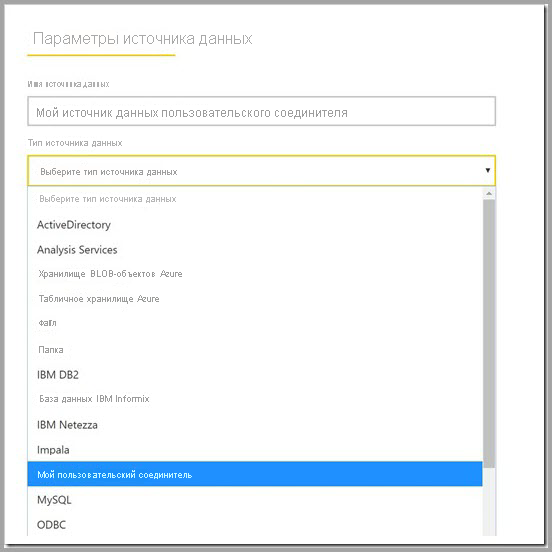

# Использование пользовательских соединителей данных с локальным шлюзом данных

[!INCLUDE [gateway-rewrite](../includes/gateway-rewrite.md)]

Соединители данных для Power BI позволяют подключаться и получать доступ к данным приложения, службы или источника данных. Вы можете разработать пользовательские соединители данных и использовать их в Power BI Desktop.

Дополнительные сведения о разработке пользовательских соединителей данных для Power BI см. на [странице GitHub о пакете SDK для соединителей данных](https://aka.ms/dataconnectors). Этот сайт содержит сведения о начале работы, а также примеры для Power BI и Power Query.

При создании отчетов, которые используют пользовательские соединители данных, в Power BI Desktop можно использовать локальный шлюз данных для обновления отчетов из службы Power BI.

## Включение и использование этой возможности

В версии локального шлюза данных за июль 2018 г. или более поздней версии вы увидите вкладку **Соединители** в приложении локального шлюза данных. В поле **Загрузить пользовательские соединители данных из папки** выберите папку, к которой может получить доступ пользователь, запускающий службу шлюза. Пользователь по умолчанию — *NT SERVICE\PBIEgwService*. Шлюз автоматически загружает файлы настраиваемого соединителя, расположенные в этой папке. Они отображаются в списке соединителей данных.

Если вы используете локальный шлюз данных (персональный режим), то сможете отправить отчет Power BI в службу Power BI и использовать шлюз для его обновления.

Для локального шлюза данных необходимо создать источник данных для пользовательского соединителя. На странице параметров шлюза в службе Power BI при выборе кластера шлюзов вы увидите параметр, позволяющий использовать пользовательские соединители с этим кластером. Чтобы этот параметр был доступен, убедитесь, что на всех шлюзах в кластере установлено обновление за июль 2018 г. или более поздней версии. Выберите этот параметр, чтобы разрешить использование пользовательских соединителей с этим кластером.

Если этот параметр включен, пользовательские соединители будут отображаться как доступные источники данных, которые можно создать в этом кластере шлюза. После создания источника данных, которые использует новый пользовательский соединитель, вы можете обновлять отчеты Power BI, используя этот соединитель в службе Power BI.

## Рекомендации и ограничения

* Убедитесь, что созданная папка доступна в фоновой службе шлюза. Обычно папки, расположенные в пользовательской папке Windows, а также системные папки недоступны. Если папка недоступна, в приложении локального шлюза данных отображается сообщение. Эта инструкция не применяется для локального шлюза данных (персональный режим).
* Для использования пользовательских соединителей с локальным шлюзом данных необходима реализация ими раздела "TestConnection" в коде пользовательского соединителя. Это раздел не обязателен при использовании пользовательских соединителей с Power BI Desktop. По этой причине необходимо использовать соединители с Power BI Desktop, а не со шлюзом. Дополнительные сведения о реализации раздела TestConnection см. в [этой документации](https://github.com/Microsoft/DataConnectors/blob/master/docs/m-extensions.md#implementing-testconnection-for-gateway-support).
* Сейчас использовать OAuth для настраиваемых соединителей через шлюзы могут только администраторов шлюзов, но не другие пользователи источника данных.

## Дальнейшие действия

* [Управление своим источником данных — службы Analysis Services](service-gateway-enterprise-manage-ssas.md)  
* [Управление своим источником данных — SAP HANA](service-gateway-enterprise-manage-sap.md)  
* [Управление своим источником данных — SQL Server](service-gateway-enterprise-manage-sql.md)  
* [Управление своим источником данных — Oracle](service-gateway-onprem-manage-oracle.md)  
* [Управление источником данных — импорт или запланированное обновление](service-gateway-enterprise-manage-scheduled-refresh.md)
* [Настройка параметров прокси-сервера для локального шлюза данных](/data-integration/gateway/service-gateway-proxy)
* [Использование Kerberos для единого входа из Power BI в локальные источники данных](service-gateway-sso-kerberos.md)  

У вас имеются и другие вопросы? Попробуйте задать вопрос в [сообществе Power BI](https://community.powerbi.com/).
