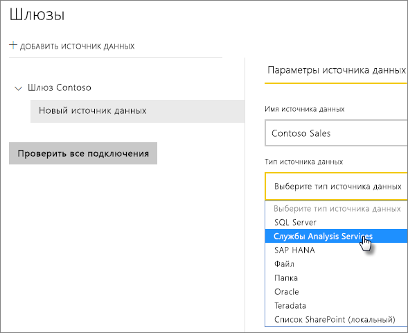
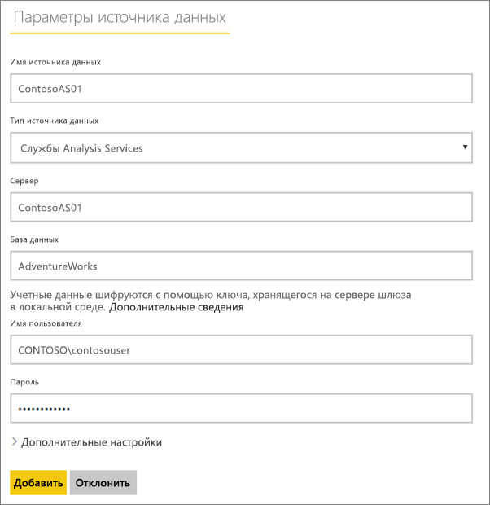
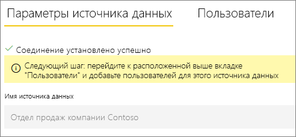
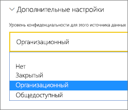
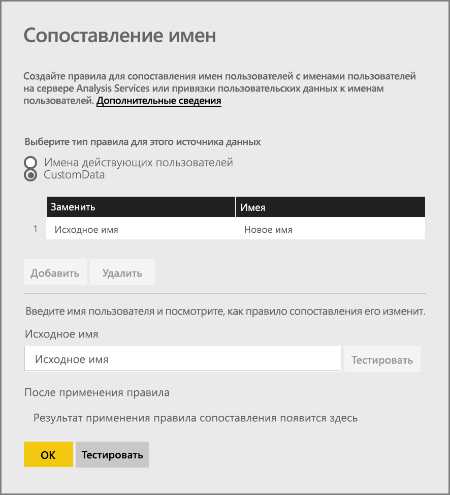
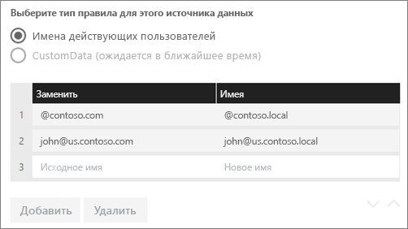
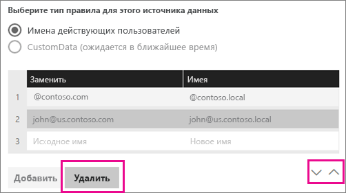
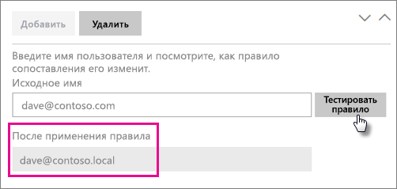
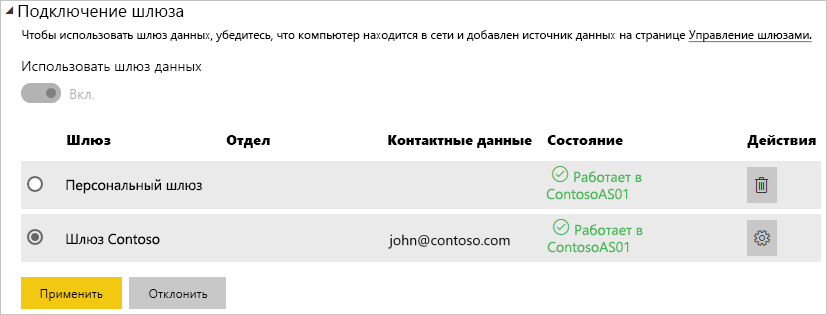

# <a name="manage-your-data-source---analysis-services"></a>Управление своим источником данных — службы Analysis Services

[!INCLUDE [gateway-rewrite](../includes/gateway-rewrite.md)]

После [установки локального шлюза данных](/data-integration/gateway/service-gateway-install) нужно [добавить источники данных](service-gateway-data-sources.md#add-a-data-source), которые можно будет с ним использовать. В этой статье рассмотрены способы работы со шлюзами и источниками данных SQL Server Analysis Services (SSAS), которые используются для запланированного обновления или динамических подключений.

Дополнительные сведения о настройке динамического подключения к Analysis Services см. в [этом видео](https://www.youtube.com/watch?v=GPf0YS-Xbyo&feature=youtu.be).

> [!NOTE]
> Если у вас есть источник данных Analysis Services, необходимо установить шлюз на компьютере, присоединенном к тому же лесу или домену, что и сервер служб Analysis Services.

## <a name="add-a-data-source"></a>Добавление источника данных

Сведения о том, как добавить источник данных, см. в статье [Добавление источника данных](service-gateway-data-sources.md#add-a-data-source). Выберите **Analysis Services** в поле **Тип источника данных**, если подключаетесь к серверу с табличными или многомерными моделями.



Заполните сведения об источнике данных, включая значения **Сервер** и **База данных**. Указанные вами **имя пользователя** и **пароль** будут использоваться шлюзом для подключения к экземпляру служб Analysis Services.

> [!NOTE]
> Введенная учетная запись Windows должна быть членом роли администратора сервера на экземпляре Analysis Services, к которому вы подключаетесь. Если для пароля задано истечение срока действия и он не был обновлен для источника данных, у пользователей может возникнуть ошибка подключения. Дополнительные сведения о хранении учетных данных см. в статье [Хранение зашифрованных учетных данных в облаке](service-gateway-data-sources.md#store-encrypted-credentials-in-the-cloud).



После заполнения всех полей нажмите кнопку **Добавить**. Теперь этот источник данных можно использовать для запланированного обновления или активных подключений для локального экземпляра служб Analysis Services. В случае успеха появится сообщение *Подключение установлено*.



### <a name="advanced-settings"></a>Дополнительные настройки

Для источника данных также можно настроить уровень конфиденциальности. Этот параметр определяет, каким образом можно комбинировать данные. Он используется только для запланированного обновления. Параметр уровня конфиденциальности не применяется к активным подключениям. Дополнительные сведения об уровнях конфиденциальности для источника данных см. в статье [Уровни конфиденциальности (Power Query)](https://support.office.com/article/Privacy-levels-Power-Query-CC3EDE4D-359E-4B28-BC72-9BEE7900B540).



## <a name="user-names-with-analysis-services"></a>Имена пользователей в службах Analysis Services

<iframe width="560" height="315" src="https://www.youtube.com/embed/Qb5EEjkHoLg" frameborder="0" allowfullscreen></iframe>

Каждый раз, когда пользователь взаимодействует с отчетом, подключенным к службам Analysis Services, действующее имя пользователя передается в шлюз, а затем на локальный сервер служб Analysis Services. В качестве имени пользователя в службы Analysis Services передается адрес электронной почты, с которым вы вошли в Power BI. Для его передачи используется свойство подключения [EffectiveUserName](/analysis-services/instances/connection-string-properties-analysis-services#bkmk_auth). 

Этот адрес электронной почты должен совпадать с именем участника-пользователя, определенным в локальном домене Active Directory. Имя участника-пользователя является свойством учетной записи Active Directory. Соответствующая учетная запись Windows должна присутствовать в роли Analysis Services. Если совпадение в Active Directory не обнаружено, выполнить вход не удастся. Дополнительные сведения об Active Directory и именовании пользователей см. в статье [Атрибуты именования пользователей](/windows/win32/ad/naming-properties).

Также можно [сопоставить имя для входа Power BI с именем участника-пользователя локального каталога](service-gateway-enterprise-manage-ssas.md#map-user-names-for-analysis-services-data-sources).

## <a name="map-user-names-for-analysis-services-data-sources"></a>Сопоставление имен пользователей для источников данных Analysis Services

<iframe width="560" height="315" src="https://www.youtube.com/embed/eATPS-c7YRU" frameborder="0" allowfullscreen></iframe>

В Power BI можно сопоставлять имена пользователей для источников данных Analysis Services. Вы можете настроить правила сопоставления имени пользователя, выполнившего вход в Power BI, с именем, которое передается в свойстве EffectiveUserName для подключения служб Analysis Services. Это удобный способ в ситуации, когда имя пользователя в Azure Active Directory (Azure AD) не соответствует имени участника-пользователя (UPN) в локальном экземпляре Active Directory. Например, адрес электронной почты nancy@contoso.onmicrsoft.com можно сопоставить с адресом nancy@contoso.com, и это значение будет передано шлюзу.

Сопоставить имена пользователей для Analysis Services можно двумя разными способами:

* Повторное сопоставление пользователей вручную
* Поиск свойства в локальном каталоге Active Directory для повторного сопоставления имен участников-пользователей Azure AD с именами пользователей Active Directory (сопоставление поиска в Active Directory)

Хотя сопоставление можно выполнить вручную на основе второго подхода, это трудно реализовать и занимает много времени. Это особенно трудно, если сопоставления шаблонов недостаточно. Например, это может быть, если имена доменов отличаются в Azure AD и локальном каталоге Active Directory или имена учетных записей пользователей разные в Azure AD и Active Directory. Поэтому мы не советуем выполнять сопоставление вручную на основе второго подхода.

Мы описали эти подходы в следующих двух разделах.

### <a name="manual-user-name-remapping"></a>Повторное сопоставление имен пользователей вручную

Для источников данных служб Analysis Services можно настроить пользовательские правила имени участника-пользователя (UPN). Это поможет вам при несоответствии имен входа службы Power BI и имени участника-пользователя локального каталога. Например, если вход в Power BI выполняется с именем john@contoso.com, а имя участника-пользователя локального каталога — john@contoso.local, можно настроить правило сопоставления для передачи john@contoso.local в службы Analysis Services.

Чтобы открыть экран сопоставления имени участника-пользователя, выполните приведенные ниже действия.

1. Щелкните значок шестеренки и выберите **Управление шлюзами**.
2. Разверните шлюз, содержащий источник данных служб Analysis Services. Если вы еще не создали источник данных служб Analysis Services, это можно сделать на этом этапе.
3. Выберите источник данных и откройте вкладку **Пользователи**.
4. Выберите **Сопоставление имен пользователей**.

    

Отображаются параметры для добавления правил, а также тестирования для заданного пользователя.

> [!NOTE]
> Вы можете случайно изменить не того пользователя, которого намеревались. Например, если параметр **Replace (original value)** (Заменить: исходное значение) имеет значение contoso.com, а параметр **With (New name)** (На: новое значение) — значение @contoso.local, для всех пользователей, имя для входа которых содержит @contoso.com, будет выполнена замена на @contoso.local. Кроме того, если параметр **Replace (Original name)** (Заменить: исходное имя) имеет значение dave@contoso.com, а параметр **With (New name)** (На: новое значение) — значение dave@contoso.local, пользователь, имя для входа которого содержит v-dave@contoso.com, будет обработан как v-dave@contoso.local.

### <a name="active-directory-lookup-mapping"></a>Сопоставление поиска в Active Directory

Чтобы выполнить поиск свойства в локальном каталоге Active Directory для повторного сопоставления имен участников-пользователей Azure AD с именами пользователей Active Directory, выполните действия в этом разделе. Вначале рассмотрим принцип работы.

В службе Power BI происходит следующее:

* Вместе с каждым запросом, отправленным пользователем Power BI Azure AD локальному серверу SSAS, передается также строка имени участника-пользователя, например firstName.lastName@contoso.com.

> [!NOTE]
> Все ручные сопоставления имен участника-пользователя, определенные в конфигурации источника данных Power BI, по-прежнему применяются *перед* отправкой строки с именем пользователя в локальный шлюз данных.

В локальном шлюзе данных с настраиваемым сопоставлением имен пользователей выполните следующие действия.

1. Найдите каталог Active Directory для поиска. Вы можете использовать как автоматический, так и настраиваемый каталог.
2. Найдите атрибут пользователя Active Directory, например адрес электронной почты, из службы Power BI. Этот атрибут основывается на входящей строке имени участника-пользователя, например firstName.lastName@contoso.com.
3. Если поиск в Active Directory завершается сбоем, в качестве имени действующего пользователя SSAS используется переданное имя участника-пользователя.
4. Если поиск в Active Directory происходит успешно, возвращается атрибут UserPrincipalName пользователя Active Directory.
5. Он передает на сервер SSAS адрес электронной почты пользователя UserPrincipalName в качестве EffectiveUser, например Alias@corp.on-prem.contoso.

Порядок настройки шлюза для выполнения поиска в Active Directory:

1. [Скачайте и установите последнюю версию шлюза](/data-integration/gateway/service-gateway-install).

2. Измените службу локального шлюза данных, чтобы поиск выполнялся с помощью учетной записи домена, а не учетной записи локальной службы. Иначе функция поиска в AD не будет правильно работать в среде выполнения. Откройте [приложение локального шлюза данных](/data-integration/gateway/service-gateway-app) на компьютере, а затем выберите **Параметры службы** > **Изменить учетную запись службы**. Запишите ключ восстановления этого шлюза, так как вам потребуется восстановить его на том же компьютере, если вы не планируете создать другой шлюз. Чтобы изменения вступили в силу, перезапустите службу шлюза.

3. Перейдите в папку установки шлюза (*C:\Program Files\On-premises* data gateway) с правами администратора, чтобы иметь разрешения на запись. Откройте файл *Microsoft.PowerBI.DataMovement.Pipeline.GatewayCore.dll.config*.

4. Измените два приведенных ниже значения конфигурации в соответствии с *вашей* конфигурацией атрибута Active Directory для пользователей Active Directory. Показанные ниже значения конфигурации приведены для примера. Задайте эти значения в соответствии с вашей конфигурацией Active Directory. Эти конфигурации чувствительны к регистру, поэтому убедитесь, что они соответствуют значениям в Active Directory.

    

    Если значение для конфигурации ADServerPath не указано, шлюз использует глобальный каталог по умолчанию. Вы также можете указать несколько значений для ADServerPath. Значения должны разделяться точкой с запятой, как показано в следующем примере:

    ```xml
    <setting name="ADServerPath" serializeAs="String">
        <value> >GC://serverpath1; GC://serverpath2;GC://serverpath3</value>
    </setting>
    ```

    Шлюз анализирует значения для ADServerPath слева направо, пока не находит соответствие. Если совпадений не найдено, используется исходное имя участника-пользователя-пользователя. Убедитесь, что учетная запись для службы шлюза (PBIEgwService) имеет разрешения на запрос во всех серверах Active Directory, указанных в ADServerPath.

    Шлюз поддерживает два типа ADServerPath, как показано в следующих примерах:

    **WinNT**

    ```xml
    <value="WinNT://usa.domain.corp.contoso.com,computer"/>
    ```

    **GC**

    ```xml
    <value> GC://USA.domain.com </value>
    ```

5. Чтобы изменения вступили в силу, перезапустите службу локального шлюза данных.

### <a name="work-with-mapping-rules"></a>Работа с правилами сопоставления

Чтобы создать правило сопоставления, введите значение для параметра **Исходное имя** и **Новое имя**, а затем выберите **Добавить**.

| Поле | Описание |
| --- | --- |
| Заменить: исходное имя |Адрес электронной почты, который вы использовали для входа в Power BI. |
| With (New Name) (На: новое имя) |Значение, на которое требуется заменить предыдущее. Результат замены заключается в том, что именно будет передаваться в свойство EffectiveUserName для подключения к службам Analysis Services. |



При выборе элемента в списке можно изменить его порядок, используя значки со стрелками. Также можно удалить запись.



### <a name="use-a-wildcard"></a>Использование подстановочного знака

Для строки **Replace (Original name)** (Заменить: исходное имя) можно использовать подстановочный знак (*). Его можно использовать только самостоятельно, а не с какой-либо другой частью строки. Это позволит использовать всех пользователей и передавать единое значение в источник данных. Это полезно, когда необходимо, чтобы все пользователи в организации использовали в локальной среде одного и того же пользователя.

### <a name="test-a-mapping-rule"></a>Проверка правила сопоставления

Чтобы проверить, чем было заменено исходное имя, введите значение в поле **Исходное имя**. Выберите **Тестировать правило**.



> [!NOTE]
> Когда правила сохранены, потребуется несколько минут, чтобы служба начала их использовать. Правило в браузере начинает работать немедленно.

### <a name="limitations-for-mapping-rules"></a>Ограничения для правил сопоставления

Сопоставление предназначено для конкретного настраиваемого источника данных. Это не глобальный параметр. Если имеется несколько источников данных Analysis Services, нужно сопоставить пользователей с каждым из них.

## <a name="authentication-to-a-live-analysis-services-data-source"></a>Проверка подлинности на динамическом источнике данных Analysis Services

Каждый раз, когда пользователь взаимодействует со службами Analysis Services, действующее имя пользователя передается в шлюз, а затем на локальный сервер служб Analysis Services. В качестве действующего имени пользователя в службы Analysis Services передается имя участника-пользователя (обычно это адрес электронной почты, с которым вы вошли в облако). Для его передачи используется свойство подключения EffectiveUserName. 

Этот адрес электронной почты должен совпадать с именем участника-пользователя, определенным в локальном домене Active Directory. Имя участника-пользователя является свойством учетной записи Active Directory. Для доступа к серверу соответствующая учетная запись Windows должна присутствовать в роли Analysis Services. Если совпадение в Active Directory не обнаруживается, выполнить вход не удается.

Службы Analysis Services также могут выполнять фильтрацию на основе данной учетной записи. Фильтрация выполняется на уровне роли или на уровне строк.

## <a name="role-based-security"></a>Безопасность на основе ролей

Модели обеспечивают безопасность на основе ролей пользователей. Роли задаются для конкретного проекта модели на этапе разработки в средствах бизнес-аналитики SQL Server Data Tools или после развертывания модели с помощью SQL Server Management Studio. Членами ролей могут быть имена пользователей Windows или группы Windows. Роли определяют разрешения, которые имеются у пользователя для выполнения запросов или действий в модели. Большинство пользователей принадлежит роли с разрешениями на чтение. Другие роли предназначены для администраторов и имеют разрешения на обработку элементов, управление функциями базы данных и управление другими ролями.

## <a name="row-level-security"></a>Защита на уровне строк

Безопасность на уровне строк — это функция Analysis Services. Модели могут обеспечивать динамическую безопасность на уровне строк. Пользователь должен принадлежать хотя бы одной роли; в отличие от этого, динамическая безопасность не является обязательной для любой табличной модели. На высоком уровне динамическая безопасность определяет доступ пользователей на чтение данных непосредственно в определенной строке в определенной таблице. Аналогично ролям, динамическая безопасность на уровне строк основывается на имени пользователя Windows.

Возможность пользователя запрашивать и просматривать данные модели определяется:

- ролями, к которым относится его учетная запись пользователя Windows;
- параметрами динамической безопасности на уровне строк, если они настроены.

Реализация безопасности на основе ролей и динамической безопасности на уровне строк в моделях в этой статье не рассматривается. Дополнительные сведения см. в статьях [Роли (табличные службы SSAS)](/analysis-services/tabular-models/roles-ssas-tabular) и [Роли безопасности (службы Analysis Services — многомерные данные)](/analysis-services/multidimensional-models/olap-logical/security-roles-analysis-services-multidimensional-data) на сайте MSDN. Чтобы максимально полно разобраться в безопасности табличной модели, скачайте и прочтите технический документ [Безопасность в табличной семантической модели бизнес-аналитики](https://download.microsoft.com/download/D/2/0/D20E1C5F-72EA-4505-9F26-FEF9550EFD44/Securing%20the%20Tabular%20BI%20Semantic%20Model.docx).

## <a name="what-about-azure-ad"></a>Что насчет Azure AD?

В облачных службах Майкрософт для проверки подлинности пользователей применяется каталог [Azure AD](/azure/active-directory/fundamentals/active-directory-whatis). Azure AD — это клиент, содержащий имена пользователей и сведения о группах безопасности. Как правило, адрес электронной почты, с которым пользователь выполняет вход, совпадает с именем участника-пользователя учетной записи.

## <a name="what-is-the-role-of-my-local-active-directory-instance"></a>Какова роль локального экземпляра Active Directory?

Чтобы службы Analysis Services могли определить, относится ли подключившийся к ним пользователь к роли с разрешениями на чтение данных, сервер должен преобразовать действующее имя пользователя, переданное из Azure AD в шлюз, а затем на сервер служб Analysis Services. Сервер Analysis Services передает действующее имя пользователя на контроллер домена Windows Active Directory. После этого контроллер домена Active Directory проверяет, является ли действующее имя пользователя допустимым именем участника-пользователя для локальной учетной записи. Затем это имя пользователя Windows возвращается серверу Analysis Services.

Параметр EffectiveUserName нельзя использовать на сервере Analysis Services, который не присоединен к домену. Чтобы избежать ошибок при входе, локальный сервер Analysis Services должен входить в домен.

## <a name="how-do-i-tell-what-my-upn-is"></a>Как узнать свое имя участника-пользователя?

Вы можете не знать свое имя участника-пользователя и не являться администратором домена. Чтобы узнать имя участника-пользователя для учетной записи, можно использовать следующую команду на рабочей станции.

    whoami /upn

Имя участника-пользователя для учетной записи домена будет похоже на адрес электронной почты. Если для динамических подключений используется источник данных Analysis Services, но это имя участника-пользователя не соответствует адресу электронной почты, с помощью которого вы входите в Power BI, ознакомьтесь с [сопоставлением имен пользователей](#map-user-names-for-analysis-services-data-sources).

## <a name="synchronize-an-on-premises-active-directory-with-azure-ad"></a>Синхронизация локального каталога Active Directory с Azure AD

Если вы планируете использовать динамические подключения Analysis Services, локальные учетные записи Active Directory должны быть сопоставлены с Azure AD. В частности, должны совпадать имена участников-пользователей.

Облачным службам известно только об учетных записях, которые хранятся в каталоге Azure AD. При этом неважно, добавили ли вы соответствующую запись в локальную службу Active Directory. Если ее нет в Azure AD, использовать ее нельзя. Синхронизировать учетные записи в локальном каталоге Active Directory со службой Azure AD можно разными способами:

- Вы можете вручную добавить учетные записи в Azure AD.

   Вы можете создать учетную запись, имя которой будет совпадать с именем участника-пользователя учетной записи в локальном каталоге Active Directory, на портале Azure или на портале администрирования Microsoft 365.

- Вы можете синхронизировать локальные учетные записи со своим клиентом Azure AD с помощью средства [Azure AD Connect](/azure/active-directory/hybrid/how-to-connect-sync-whatis).

   Приложение Azure AD Connect позволяет настроить параметры синхронизации каталогов и проверки подлинности. Поддерживаются такие варианты, как синхронизация хэшей паролей, сквозная аутентификация и федерация. Если вы не являетесь администратором клиента или локального домена, для их настройки вам потребуется обратиться к своему ИТ-администратору.

   Приложение Azure AD Connect помогает обеспечить соответствие между именами участников-пользователей в Azure AD и локальном экземпляре Active Directory.

> [!NOTE]
> При синхронизации учетных записей с помощью Azure AD Connect создаются новые учетные записи в клиенте Azure AD.

## <a name="use-the-data-source"></a>Использование источника данных

После создания источника данных он будет доступен для использования с динамическими подключениями или через функцию запланированного обновления.

> [!NOTE]
> Имена сервера и базы данных в Power BI Desktop и источнике данных в конфигурации локального шлюза должны совпадать.

Связь между набором и источником данных в пределах шлюза основана на именах сервера и базы данных. Эти имена должны совпадать. Например, если вы указали IP-адрес в качестве имени сервера в Power BI Desktop, необходимо будет использовать такой IP-адрес и для источника данных в конфигурации шлюза. Если вы используете формат *СЕРВЕР\ЭКЗЕМПЛЯР* в Power BI Desktop, нужно использовать тот же формат и в источнике данных, настроенном для шлюза.

Это требование справедливо и для динамических подключений, и для запланированного обновления.

### <a name="use-the-data-source-with-live-connections"></a>Использование источника данных с динамическими подключениями

Убедитесь, что имена сервера и базы данных совпадают в Power BI Desktop и источнике данных для шлюза. Кроме того, для публикации наборов данных динамических подключений ваша учетная запись должна быть указана на вкладке **Пользователи** источника данных. Выбор для динамических подключений выполняется в Power BI Desktop при импорте данных.

После публикации (из Power BI Desktop или окна **Получить данные**) ваши отчеты должны начать работать. Установление подключения после создания источника данных в рамках шлюза может занять несколько минут.

### <a name="use-the-data-source-with-scheduled-refresh"></a>Использование источника данных с запланированным обновлением

Если вы указаны на вкладке **Пользователи** источника данных, настроенного в шлюзе, а имена сервера и базы данных совпадают, вы увидите шлюз в списке вариантов, доступных для использования с запланированным обновлением.



### <a name="limitations-of-analysis-services-live-connections"></a>Ограничения для динамических подключений к службам Analysis Services

С помощью динамического подключения можно работать с табличными и с многомерными экземплярами.

| **Версия сервера** | **Требуемый номер SKU** |
| --- | --- |
| 2012 SP1 CU4 или более поздняя версия |Бизнес-аналитика и SKU категории "корпоративный" |
| 2014 |Бизнес-аналитика и SKU категории "корпоративный" |
| 2016 |SKU категории "стандартный" или старшая версия |

* Функции форматирования на уровне ячеек и перевода не поддерживаются.
* Из Power BI недоступны действия и именованные наборы. Тем не менее вы можете подключаться к многомерным кубам, которые их содержат, и создавать визуальные элементы и отчеты.

## <a name="next-steps"></a>Дальнейшие действия

* [Устранение неполадок локального шлюза данных](/data-integration/gateway/service-gateway-tshoot)
* [Устранение неполадок со шлюзами — Power BI](service-gateway-onprem-tshoot.md)

У вас имеются и другие вопросы? Ответы на них см. в [сообществе Power BI](https://community.powerbi.com/).
