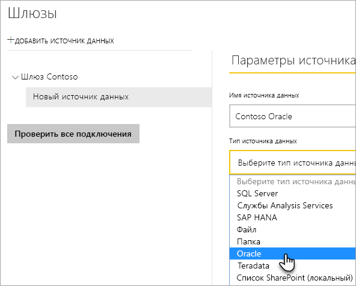
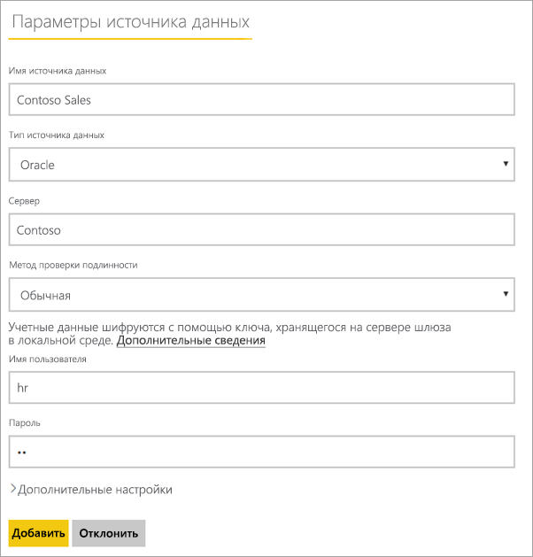
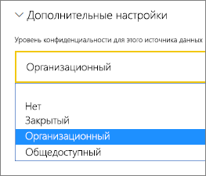
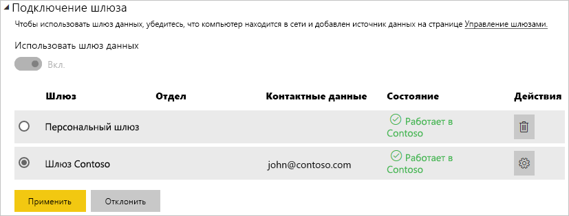

# Управление своим источником данных — Oracle

[!INCLUDE [gateway-rewrite](../includes/gateway-rewrite.md)]

После [установки локального шлюза данных](/data-integration/gateway/service-gateway-install) нужно [добавить источники данных](service-gateway-data-sources.md#add-a-data-source), которые можно будет с ним использовать. В этой статье рассмотрены способы работы со шлюзами и источниками данных Oracle, которые используются для запланированного обновления или DirectQuery.

## Подключение к базе данных Oracle
Для подключения к базе данных Oracle с помощью локального шлюза данных необходимо установить правильное клиентское программное обеспечение Oracle на компьютере, где выполняется шлюз. Используемое клиентское программное обеспечение Oracle зависит от версии сервера Oracle, но всегда будет соответствовать 64-разрядному шлюзу.

Поддерживаемые версии Oracle: 
- Oracle Server 9 и более поздних версий
- Клиент доступа к данным Oracle (ODAC) — программное обеспечение версии 11.2 и более поздней

## Установка клиента Oracle
- [Скачайте и установите 64-разрядную версию клиента Oracle](https://www.oracle.com/database/technologies/odac-downloads.html).

> [!NOTE]
> Выберите версию клиента доступа к данным Oracle (ODAC), совместимую с сервером Oracle. Например, ODAC 12.x не всегда поддерживает Oracle Server версии 9.
> Выберите установщик Windows для клиента Oracle.
> Во время установки клиента Oracle обязательно включите *Настройка поставщиков ODP.NET и Oracle для ASP.NET на уровне компьютера*, установив соответствующий флажок во время работы мастера установки. Некоторые версии мастера клиента Oracle по умолчанию выбирают флажок, а другие — нет. Убедитесь, что установлен флажок, чтобы Power BI мог подключаться к базе данных Oracle.
 
После установки клиента и настройки ODAC рекомендуется использовать Power BI Desktop или другой тестовый клиент для проверки правильности установки и настройки на шлюзе.

## Добавление источника данных

Дополнительные сведения о том, как добавить источник данных, см. в статье [Добавление источника данных](service-gateway-data-sources.md#add-a-data-source). В разделе **Тип источника данных** выберите **Oracle**.

Выбрав тип источника данных Oracle, укажите для него параметры, включая **Сервер** и **База данных**. 

В разделе **Метод проверки подлинности** выберите **Windows** или **Базовый**. Если планируется использовать учетную запись, созданную в Oracle, а проверку подлинности Windows, выберите вариант **Базовый**. Затем введите учетные данные, которые будут использоваться для этого источника данных.

> [!NOTE]
> Все запросы к источнику данных будут выполняться с использованием этих учетных данных. Дополнительные сведения о хранении учетных данных см. в статье [Хранение зашифрованных учетных данных в облаке](service-gateway-data-sources.md#store-encrypted-credentials-in-the-cloud).

После заполнения всех полей нажмите кнопку **Добавить**. Теперь этот источник данных можно использовать для запланированного обновления или для DirectQuery на сервере Oracle, расположенном на локальном компьютере. В случае успеха появится сообщение *Подключение установлено*.

### Дополнительные параметры

Для источника данных также можно настроить уровень конфиденциальности. Этот параметр определяет, каким образом можно комбинировать данные. Он используется только для запланированного обновления. Параметр уровня конфиденциальности не применяется к DirectQuery. Дополнительные сведения об уровнях конфиденциальности для источника данных см. в статье [Уровни конфиденциальности (Power Query)](https://support.office.com/article/Privacy-levels-Power-Query-CC3EDE4D-359E-4B28-BC72-9BEE7900B540).

## Использование источника данных

После создания источника данных он будет доступен для использования с подключениями DirectQuery или через функцию запланированного обновления.

> [!WARNING]
> Имена сервера и базы данных в Power BI Desktop и источнике данных в конфигурации локального шлюза должны совпадать.

Связь между набором и источником данных в пределах шлюза основана на именах сервера и базы данных. Эти имена должны совпадать. Например, если вы указали IP-адрес в качестве имени сервера в Power BI Desktop, необходимо будет использовать такой IP-адрес и для источника данных в конфигурации шлюза. Кроме того, это имя должно совпадать с псевдонимом, который указан в файле tnsnames.ora. Дополнительные сведения о файле tnsnames.ora см. в разделе [Установка клиента Oracle](#install-the-oracle-client).

Это требование справедливо и для DirectQuery, и для запланированного обновления.

### Использование источника данных с подключениями DirectQuery

Убедитесь, что имена сервера и базы данных совпадают в Power BI Desktop и источнике данных для шлюза. Кроме того, для публикации наборов данных DirectQuery ваша учетная запись должна быть указана на вкладке **Пользователи** источника данных. Выбор для DirectQuery выполняется в Power BI Desktop при импорте данных. Дополнительные сведения об использовании DirectQuery см. в статье [Использование DirectQuery в Power BI Desktop](desktop-use-directquery.md).

После публикации (из Power BI Desktop или окна **Получить данные**) ваши отчеты должны начать работать. Установление подключения после создания источника данных в рамках шлюза может занять несколько минут.

### Использование источника данных с запланированным обновлением

Если вы указаны на вкладке **Пользователи** источника данных, настроенного в шлюзе, а имена сервера и базы данных совпадают, вы увидите шлюз в списке вариантов, доступных для использования с запланированным обновлением.

## Устранение неполадок

В Oracle может возникнуть любая из нескольких ошибок, если синтаксис именования содержит ошибку или неправильно настроен:

* ORA-12154: TNS: не удалось разрешить указанный идентификатор подключения.
* ORA-12514: прослушивателю TNS неизвестна служба, запрошенная в дескрипторе подключения.
* ORA-12541: TNS: нет прослушивателя.
* ORA-12170: TNS: время ожидания подключения истекло.
* ORA-12504: TNS: прослушиватель не получил имя SERVICE_NAME в параметре CONNECT_DATA.

Эти ошибки могут произойти, если клиент Oracle не установлен или неправильно настроен. Если он установлен, нужно проверить, правильно ли настроен файл tnsnames.ora и используется ли нужное имя net_service_name. Кроме того, нужно задать одно и то же имя net_service_name на компьютере, на котором выполняется Power BI Desktop, и компьютере, на котором запущен шлюз. Дополнительные сведения см. в статье [Установка клиента Oracle](#install-the-oracle-client).

Ошибка может также возникать из-за несовместимости между версиями сервера и клиента ODAC. Как правило, необходимо, чтобы эти версии совпадали, так как некоторые сочетания несовместимы. Например, ODAC 12.x не поддерживает Oracle Server версии 9.

Для диагностики проблем с подключением между сервером источника данных и компьютером шлюза рекомендуется установить клиент (например, Power BI Desktop или Oracle ODBC Test) на компьютер шлюза. Клиент можно использовать для проверки возможности подключения к серверу источника данных.

См. дополнительные сведения об [устранении неполадок локального шлюза данных](/data-integration/gateway/service-gateway-tshoot).

## Дальнейшие действия

* [Устранение неполадок со шлюзами — Power BI](service-gateway-onprem-tshoot.md)
* [Power BI Premium](../admin/service-premium-what-is.md)

Остались вопросы? Попробуйте задать вопрос в [сообществе Power BI](https://community.powerbi.com/).
