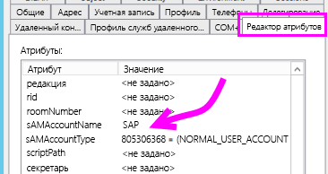
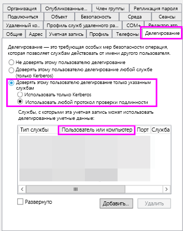
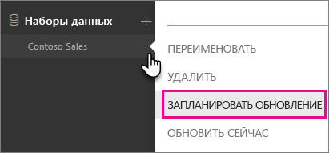
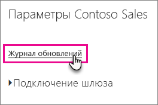

# <a name="troubleshoot-gateways---power-bi"></a>Устранение неполадок со шлюзами — Power BI

[!INCLUDE [gateway-rewrite](../includes/gateway-rewrite.md)]

Эта статья описывает распространенные проблемы при работе с локальным шлюзом данных в Power BI. Если вы столкнулись с ошибкой, которая не рассматривается здесь, посетите сайт [сообщества Power BI](https://community.powerbi.com). Также вы можете создать [запрос в службу поддержки](https://powerbi.microsoft.com/support).

## <a name="configuration"></a>Конфигурации

### <a name="error-power-bi-service-reported-local-gateway-as-unreachable-restart-the-gateway-and-try-again"></a>Ошибка. Из службы Power BI поступило сообщение о том, что локальный шлюз недоступен. Перезапустите шлюз и повторите попытку.

После завершения настройки служба Power BI будет вызвана снова, чтобы проверить шлюз. Служба Power BI не объявляет шлюз активным. Обеспечить подключение может перезапуск службы Windows. Для получения дополнительных сведений вы можете собрать и просмотреть журналы, как описано в статье [Сбор данных журналов из приложения локального шлюза данных](/data-integration/gateway/service-gateway-tshoot#collect-logs-from-the-on-premises-data-gateway-app).

## <a name="data-sources"></a>Источники данных

### <a name="error-unable-to-connect-details-invalid-connection-credentials"></a>Ошибка. Не удается установить подключение. Сведения: "Недействительные учетные данные подключения"

В разделе **Показать сведения** появится сообщение об ошибке, полученное из источника данных. В случае с SQL Server оно будет выглядеть следующим образом:

    Login failed for user 'username'.

Убедитесь, что имя пользователя и пароль указаны правильно. Также убедитесь, что эти учетные данные позволяют подключиться к источнику данных. Убедитесь, что учетная запись соответствует методу проверки подлинности.

### <a name="error-unable-to-connect-details-cannot-connect-to-the-database"></a>Ошибка. Не удается установить подключение. Сведения: "Не удается подключиться к базе данных"

Удалось подключиться к серверу, но не к указанной базе данных. Проверьте имя базы данных и убедитесь, что учетные данные пользователя позволяют получить доступ к базе данных.

В разделе **Показать сведения** появится сообщение об ошибке, полученное из источника данных. В случае с SQL Server оно будет выглядеть следующим образом:

    Cannot open database "AdventureWorks" requested by the login. The login failed. Login failed for user 'username'.

### <a name="error-unable-to-connect-details-unknown-error-in-data-gateway"></a>Ошибка. Не удается установить подключение. Сведения: "Неизвестная ошибка в шлюзе данных"

Эта ошибка может возникать по разным причинам. Не забудьте проверить подключение к источнику данных с компьютера, на котором находится шлюз. Это может быть связано с недоступностью сервера.

В разделе **Показать сведения** появится код ошибки **DM_GWPipeline_UnknownError**.

Чтобы получить дополнительные сведения, выберите **Журналы событий** > **Журналы приложений и служб** > **Служба локального шлюза данных**.

### <a name="error-we-encountered-an-error-while-trying-to-connect-to-server-details-we-reached-the-data-gateway-but-the-gateway-cant-access-the-on-premises-data-source"></a>Ошибка. Возникла ошибка при попытке подключения к \<серверу\>. Сведения: "Выполнено подключение к шлюзу данных, но шлюз не может получить доступ к локальному источнику данных"

Не удалось подключиться к указанному источнику данных. Не забудьте проверить сведения, указанные для этого источника данных.

В разделе **Показать сведения** появится код ошибки **DM_GWPipeline_Gateway_DataSourceAccessError**.

Если базовое сообщение об ошибке аналогично следующему, это означает, что учетная запись, которую вы используете для источника данных, не имеет прав администратора сервера для этого экземпляра служб Analysis Services. Дополнительные сведения см. в статье [Предоставление прав администратора сервера экземпляру служб Analysis Services](https://docs.microsoft.com/sql/analysis-services/instances/grant-server-admin-rights-to-an-analysis-services-instance).

    The 'CONTOSO\account' value of the 'EffectiveUserName' XML for Analysis property is not valid.

Если базовое сообщение об ошибке аналогично следующему, это может означать, что в учетной записи службы для Analysis Services отсутствует атрибут каталога [token-groups-global-and-universal](https://msdn.microsoft.com/library/windows/desktop/ms680300.aspx) (TGGAU).

    The username or password is incorrect.

В доменах с поддержкой доступа на базе технологий, предшествующих версии Windows 2000, атрибут TGGAU включен. В большинстве новых доменов он по умолчанию отключен. Дополнительные сведения см. в статье [Некоторым приложениям и API требуется доступ к сведениям об авторизации объектов учетной записи](https://support.microsoft.com/kb/331951).

Чтобы проверить, включен ли этот атрибут, выполните следующие действия.

1. Подключитесь к компьютеру со службами Analysis Services из приложения SQL Server Management Studio. В дополнительных свойствах соединения укажите параметр EffectiveUserName для соответствующего пользователя и посмотрите, повторится ли ошибка.
2. Проверить, указан ли этот атрибут, можно с помощью программы dsacls для Active Directory. Эта программа есть на контроллере домена. Вам потребуется передать в эту программу различающееся имя домена для учетной записи.

        dsacls "CN=John Doe,CN=UserAccounts,DC=contoso,DC=com"

    Результаты должны содержать что-то наподобие этого:

            Allow BUILTIN\Windows Authorization Access Group
                                          SPECIAL ACCESS for tokenGroupsGlobalAndUniversal
                                          READ PROPERTY

Чтобы устранить эту проблему, необходимо включить атрибут TGGAU для учетной записи, которую использует служба Windows Analysis Services.

#### <a name="another-possibility-for-the-username-or-password-is-incorrect"></a>Другой вариант связан с неправильным именем пользователя или паролем.

Эта ошибка также может возникнуть, если сервер Analysis Services и пользователи находятся в разных доменах и для них не установлено двустороннее доверие.

Чтобы установить отношения доверия между доменами, вам потребуется обратиться к их администраторам.

#### <a name="unable-to-see-the-data-gateway-data-sources-in-the-get-data-experience-for-analysis-services-from-the-power-bi-service"></a>Источники данных шлюза данных в интерфейсе "Получить данные" для служб Analysis Services недоступны из службы Power BI

Убедитесь, что ваша учетная запись указана на вкладке **Пользователи** источника данных в конфигурации шлюза. Если у вас нет доступа к шлюзу, свяжитесь с его администратором и попросите его проверить это для вас. Только учетным записям в списке **Пользователи** доступен источник данных, указанный в списке служб Analysis Services.

### <a name="error-you-dont-have-any-gateway-installed-or-configured-for-the-data-sources-in-this-dataset"></a>Ошибка. Не установлен или не настроен шлюз для источников данных в этом наборе.

Обязательно добавьте в шлюз источники данных, как описано в разделе [Добавление источника данных](service-gateway-data-sources.md#add-a-data-source). Если шлюз не отображается в разделе **Управление шлюзами** на портале администрирования, попробуйте очистить кэш браузера или выйти из службы, а затем войти в нее заново.

## <a name="datasets"></a>Наборы данных

### <a name="error-there-is-not-enough-space-for-this-row"></a>Ошибка. Недостаточно места для этой строки.

Эта ошибка происходит, если размер одной строки превышает 4 МБ. Необходимо найти эту строку в источнике данных и попытаться отфильтровать ее или уменьшить ее размер.

### <a name="error-the-server-name-provided-doesnt-match-the-server-name-on-the-sql-server-ssl-certificate"></a>Ошибка. Указанное имя сервера не соответствует имени сервера в SSL-сертификате сервера SQL Server.

Эта ошибка может произойти, если общее имя сертификата предназначено для полного доменного имени сервера (FQDN), а пользователь указал только NetBIOS-имя для сервера. Это вызывает несоответствие сертификата. Для устранения проблемы необходимо, чтобы для имени сервера в источнике данных шлюза и PBIX-файле использовалось полное доменное имя сервера.

### <a name="error-you-dont-see-the-on-premises-data-gateway-present-when-you-configure-scheduled-refresh"></a>Ошибка. Локальный шлюз данных не отображается при настройке запланированного обновления.

Эта ошибка может возникать в нескольких сценариях:

- Имена сервера и базы данных не совпадают со значениями, указанными в Power BI Desktop и источнике данных, настроенном для шлюза. Эти имена должны совпадать. В них не учитывается регистр символов.
- Ваша учетная запись не указана на вкладке **Пользователи** источника данных в конфигурации шлюза. Необходимо, чтобы администратор шлюза добавил вашу учетную запись в этот список.
- Файл Power BI Desktop содержит несколько источников данных, но шлюз настроен не для всех. Необходимо определить для каждого источника данных шлюз, чтобы он отображался в запланированном обновлении.

### <a name="error-the-received-uncompressed-data-on-the-gateway-client-has-exceeded-the-limit"></a>Ошибка. Превышен допустимый объем полученных несжатых данных в клиенте шлюза.

Точное ограничение составляет 10 ГБ несжатых данных для каждой таблицы. Есть несколько эффективных вариантов оптимизации и предотвращения этой проблемы. В частности, для этого можно уменьшить использование часто повторяющихся значений длинных строк, а вместо них применять нормализованный ключ или удалять неиспользуемые столбцы.

## <a name="reports"></a>Отчеты

### <a name="error-report-could-not-access-the-data-source-because-you-do-not-have-access-to-our-data-source-via-an-on-premises-data-gateway"></a>Ошибка. Не удалось установить подключение отчета к источнику данных, так как у вас нет доступа к нашему источнику данных в локальном шлюзе данных.

Эта ошибка обычно происходит из-за одной из следующих проблем:

- Сведения об источнике данных не совпадают со сведениями в базовом наборе данных. Имена сервера и базы данных в источнике данных, заданном для локального шлюза, должны совпадать с тем, что вы указали в Power BI Desktop. Если вы используете IP-адрес в Power BI Desktop, источник данных локального шлюза должен также использовать IP-адрес.
- В шлюзах вашей организации нет ни одного доступного источника данных. Вы можете настроить источник данных в новом или существующем локальном шлюзе.

### <a name="error-data-source-access-error-please-contact-the-gateway-administrator"></a>Ошибка. Ошибка доступа к источнику данных. Обратитесь к администратору шлюза.

Если в этом отчете используется подключение к службам Analysis Services, возможно, ошибка связана с передачей недействительного значения EffectiveUserName или с отсутствием разрешений на компьютере с Analysis Services. Как правило, проблемы с проверкой подлинности возникают в ситуации, когда передаваемое значение EffectiveUserName не совпадает с локальным именем участника-пользователя.

Чтобы подтвердить действующее имя пользователя, выполните следующие действия.

1. Найдите действующее имя пользователя в [журналах шлюза](/data-integration/gateway/service-gateway-tshoot#collect-logs-from-the-on-premises-data-gateway-app).
2. Обнаружив значение, которое передается, проверьте его правильность. Если это ваш пользователь, вы можете уточнить его имя участника-пользователя с помощью следующей команды в командной строке. Имя имеет форму адреса электронной почты.

        whoami /upn

Вы также можете посмотреть, что именно Power BI получает из каталога Azure Active Directory.

1. Перейдите к [https://developer.microsoft.com/graph/graph-explorer](https://developer.microsoft.com/graph/graph-explorer).
2. Выберите **Войти** в правом верхнем углу.
3. Выполните следующий запрос: Вы увидите довольно большой ответ в формате JSON.

        https://graph.windows.net/me?api-version=1.5
4. Найдите атрибут **userPrincipalName**.

Если имя участника-пользователя Azure Active Directory не совпадает с аналогичным значением в локальном каталоге Active Directory, вы можете заменить его действительным значением с помощью функции [сопоставления имен пользователей](service-gateway-enterprise-manage-ssas.md#map-user-names-for-analysis-services-data-sources). Вы также можете попросить администратора своего клиента или локального каталога Active Directory изменить имя участника-пользователя.

## <a name="kerberos"></a>Kerberos

Если основной сервер базы данных и локальный шлюз данных неправильно настроены для [ограниченного делегирования Kerberos](service-gateway-sso-kerberos.md), включите [подробное ведение журнала](/data-integration/gateway/service-gateway-performance#slow-performing-queries) на шлюзе. Затем проанализируйте ошибки или трассировки в файлах журналов шлюза, чтобы начать устранение неполадок. Чтобы собрать данные журналов для просмотра, см. статью [Сбор данных журналов из приложения локального шлюза данных](/data-integration/gateway/service-gateway-tshoot#collect-logs-from-the-on-premises-data-gateway-app).

### <a name="impersonationlevel"></a>ImpersonationLevel

Значение ImpersonationLevel связано с настройкой имени субъекта-службы или параметрами локальной политики.

```
[DataMovement.PipeLine.GatewayDataAccess] About to impersonate user DOMAIN\User (IsAuthenticated: True, ImpersonationLevel: Identification)
```

**Решение**

Чтобы устранить проблему, выполните следующие действия.

1. Настройте имя субъекта-службы для локального шлюза.
2. Настройте ограниченное делегирование в Active Directory.

### <a name="failedtoimpersonateuserexception-failed-to-create-windows-identity-for-user-userid"></a>FailedToImpersonateUserException: Не удалось создать удостоверение Windows для идентификатора пользователя

Исключение FailedToImpersonateUserException может возникнуть, если вам не удается олицетворить другого пользователя. Эта ошибка также может произойти, если вы пытаетесь олицетворить учетную запись из другого домена, отличного от того, в котором включена служба шлюза. Это ограничение.

**Решение**

* Проверьте правильность конфигурации согласно инструкциям в предыдущем разделе ImpersonationLevel.
* Убедитесь, что идентификатор пользователя, который используется для олицетворения, представляет действительную учетную запись Active Directory.

### <a name="general-error-1033-error-while-you-parse-the-protocol"></a>Общая ошибка: 1033. Ошибка при анализе протокола

Ошибка 1033 может произойти, если внешний идентификатор, настроенный в SAP HANA, не соответствует имени пользователя при олицетворении с помощью имени субъекта-пользователя (alias@domain.com). В верхней части журналов ошибок отображается сообщение Original UPN "alias@domain.com" replaced with a new UPN "alias@domain.com" (Исходное имя участника-пользователя "alias@domain.com" заменено новым "alias@domain.com"), как показано ниже:

```
[DM.GatewayCore] SingleSignOn Required. Original UPN 'alias@domain.com' replaced with new UPN 'alias@domain.com.'
```

**Решение**

* Для SAP HANA требуется, чтобы олицетворенный пользователь применил атрибут sAMAccountName в Active Directory (псевдоним пользователя). Если этот атрибут неверен, появится ошибка 1033.

    

* В журналах будет отображаться не имя субъекта-пользователя, а sAMAccountName (псевдоним), после которого указан домен (alias@doimain.com).

    

```xml
      <setting name="ADUserNameReplacementProperty" serializeAs="String">
        <value>sAMAccount</value>
      </setting>
      <setting name="ADServerPath" serializeAs="String">
        <value />
      </setting>
      <setting name="CustomASDataSource" serializeAs="String">
        <value />
      </setting>
      <setting name="ADUserNameLookupProperty" serializeAs="String">
        <value>AADEmail</value>
```

### <a name="sap-aglibodbchdb-dllhdbodbc-communication-link-failure-10709-connection-failed-rte-1-kerberos-error-major-miscellaneous-failure-851968-minor-no-credentials-are-available-in-the-security-package"></a>[SAP AG] [LIBODBCHDB DLL] [HDBODBC] Ошибка связи. -10709 Не удалось установить подключение (RTE:[-1] Ошибка Kerberos. Major: "Общий сбой [851968]." Дополнительный: "В пакете безопасности отсутствуют учетные данные".

Сообщение о сбое подключения 10709 появляется, если делегирование неправильно настроено в Active Directory.

**Решение**

* Убедитесь, что вы указали сервер SAP HANA на вкладке делегирования в Active Directory для учетной записи службы шлюза.

   

## <a name="refresh-history"></a>Журнал обновлений

Если вы используете шлюз для запланированного обновления, просмотреть возникшие ошибки можно в разделе **Журнал обновлений**. Также в нем приводятся полезные данные, которые могут потребоваться при создании запроса на поддержку. Можно просматривать как запланированные обновления, так и обновления по запросу. Ниже описано, как можно открыть журнал обновлений.

1. В области навигации Power BI в разделе **Наборы данных** выберите набор данных. Откройте меню и выберите пункт **Запланировать обновление**.

    

2. В **Параметры для...** &gt; **Запланировать обновление** выберите **Журнал обновлений**.

    

    

Дополнительные сведения об устранении неполадок в сценариях обновления см. в [этой статье](refresh-troubleshooting-refresh-scenarios.md).

## <a name="fiddler-trace"></a>Трассировка Fiddler

[Fiddler](https://www.telerik.com/fiddler) — это бесплатное средство от компании Telerik для отслеживания HTTP-трафика. С помощью этого средства с клиентского компьютера можно просматривать прямой и обратный трафик в службе Power BI, В списке трафика можно найти ошибки и другие связанные сведения.


## <a name="next-steps"></a>Дальнейшие действия

* [Устранение неполадок локального шлюза данных](/data-integration/gateway/service-gateway-tshoot)
* [Настройка параметров прокси-сервера для локального шлюза данных](/data-integration/gateway/service-gateway-proxy)  
* [Управление своим источником данных — службы Analysis Services](service-gateway-enterprise-manage-ssas.md)  
* [Управление своим источником данных — SAP HANA](service-gateway-enterprise-manage-sap.md)  
* [Управление своим источником данных — SQL Server](service-gateway-enterprise-manage-sql.md)  
* [Управление источником данных — импорт или запланированное обновление](service-gateway-enterprise-manage-scheduled-refresh.md)  

Появились дополнительные вопросы? Ответы на них см. в [сообществе Power BI](https://community.powerbi.com/).
