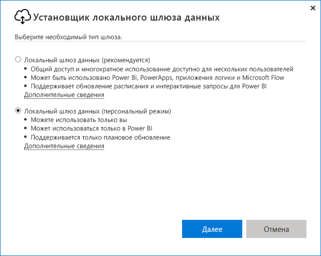
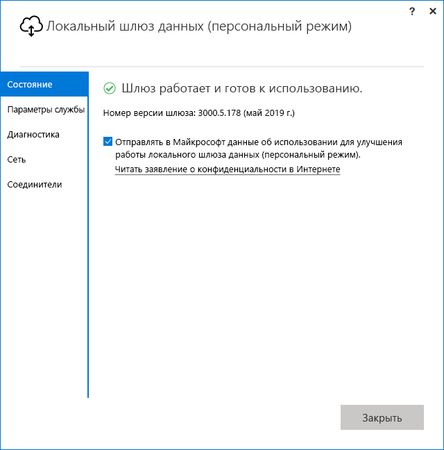

# <a name="use-personal-gateways-in-power-bi"></a>Использование персональных шлюзов в Power BI

[!INCLUDE [gateway-rewrite](../includes/gateway-rewrite.md)]

Локальный шлюз данных (персональный режим) представляет собой версию локального шлюза данных, которая работает только в Power BI. С помощью персонального шлюза вы можете установить шлюз на своем компьютере и получить доступ к локальным данным.

> [!NOTE]
> У каждого пользователя Power BI может быть только один персональный шлюз. Если для пользователя установить еще один личный шлюз, даже на другом компьютере, последняя установленная версия заменит предыдущую.

## <a name="on-premises-data-gateway-vs-on-premises-data-gateway-personal-mode"></a>Сравнение локального шлюза данных и локального шлюза данных (персональный режим)

Следующая таблица описывает различия между локальным шлюзом данных и локальным шлюзом данных (персональный режим).

|   |Локальный шлюз данных | Локальный шлюз данных (персональный режим) |
| ---- | ---- | ---- |
|Поддерживаемые облачные службы |Power BI, PowerApps, Azure Logic Apps, Power Automate, Azure Analysis Services, потоки данных |Power BI |
|Запуски |Согласно настройке пользователя, имеющего доступ к шлюзу |Согласно проверке подлинности Windows и настройке для других типов проверки подлинности |
|Можно устанавливать только в качестве администратора компьютера |Да |Нет |
|Централизованное управление шлюзами и источниками данных |Да |Нет |
|Импорт данных и планирование обновления |Да |Да |
|Поддержка DirectQuery |Да |Нет |
|Поддержка LiveConnect для Analysis Services |Да |Нет |

## <a name="install-the-on-premises-data-gateway-personal-mode"></a>Установка локального шлюза данных (персональный режим)

Порядок установки локального шлюза данных (персональный режим):

1. [Скачайте локальный шлюз данных](https://go.microsoft.com/fwlink/?LinkId=820925&clcid=0x409).

2. В установщике выберите локальный шлюз данных (персональный режим) и нажмите кнопку **Далее**.

   

Файлы шлюза устанавливаются в каталог _"%localappdata%\Microsoft\On-premises data gateway (personal mode)_ . После успешного завершения установки и входа в систему вы увидите следующий экран.



## <a name="use-fast-combine-with-the-personal-gateway"></a>Использование функции быстрого объединения с персональным шлюзом

Быстрое объединение в личном шлюзе позволяет игнорировать указанные уровни конфиденциальности при выполнении запросов. Порядок установки функции быстрого объединения для ее работы с локальным шлюзом данных (персональный режим):

1. Используйте проводник, чтобы открыть следующий файл:

   `%localappdata%\Microsoft\On-premises data gateway (personal mode)\Microsoft.PowerBI.DataMovement.Pipeline.GatewayCore.dll.config`

2. В нижней части файла добавьте следующий текст:

    ```xml
    <setting name="EnableFastCombine" serializeAs="String">
       <value>true</value>
    </setting>
    ```

3. После завершения параметры вступят в силу примерно через 1 минуту. Чтобы проверить, работают ли они правильно, выполните обновление по требованию в службе Power BI, чтобы убедиться, что функция быстрого объединения включена.

## <a name="frequently-asked-questions-faq"></a>Вопросы и ответы

**Вопрос.** Можно ли запустить локальный шлюз данных (персональный режим) параллельно с локальным шлюзом данных (ранее известным как корпоративный шлюз)?
  
**Ответ.** Да, оба шлюза могут быть запущены одновременно.

**Вопрос.** Можно ли запустить локальный шлюз данных (персональный режим) в качестве службы?
  
**Ответ.** Нет. Локальный шлюз данных (персональный режим) можно запустить только как приложение. Если требуется запустить шлюз в качестве службы или в режиме администратора, воспользуйтесь [локальным шлюзом данных](/data-integration/gateway/service-gateway-onprem) (ранее известным как корпоративный шлюз).

**Вопрос.** Как часто обновляется локальный шлюз данных (персональный режим)?
  
**Ответ.** Мы планируем обновлять персональный шлюз каждый месяц.

**Вопрос.** Почему отображается сообщение о необходимости обновить учетные данные?
  
**Ответ.** Это сообщение может отобразиться по нескольким причинам. Чаще всего это связано с тем, что вы повторно установили локальный шлюз данных (персональный режим) и персональный шлюз Power BI на разных компьютерах. Кроме того, возможно, возникла системная ошибка или ошибка в источнике данных, и Power BI не удалось выполнить проверку подключения или время ожидания подключения истекло. Чтобы обновить учетные данные в службе Power BI, щелкните значок шестеренки и выберите **Параметры** > **Наборы данных**. Найдите нужный набор данных и выберите **Учетные данные источника данных**.

**Вопрос.** Сколько времени предыдущая версия персонального шлюза будет не в сети во время обновления?
  
**Ответ.** Обновление персонального шлюза займет всего несколько минут.

**Вопрос.** Я использую сценарии R и Python. Поддерживаются ли они?
  
**Ответ.** Сценарии R и Python поддерживаются в персональном режиме.

## <a name="next-steps"></a>Дальнейшие действия

* [Настройка параметров прокси-сервера для локального шлюза данных](/data-integration/gateway/service-gateway-proxy)  

Появились дополнительные вопросы? Ответы на них см. в [сообществе Power BI](https://community.powerbi.com/).
