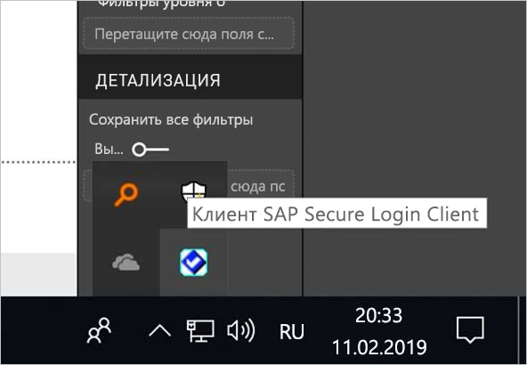
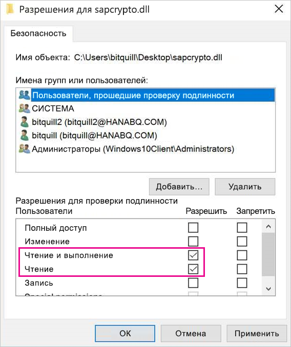
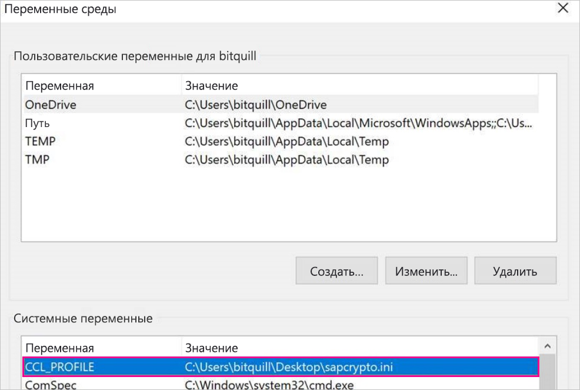
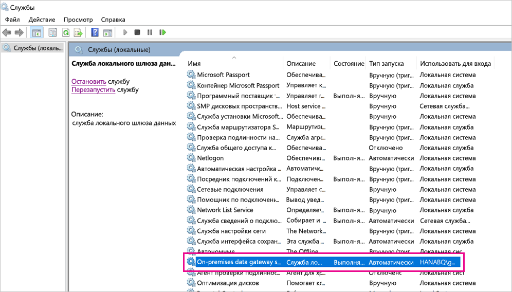
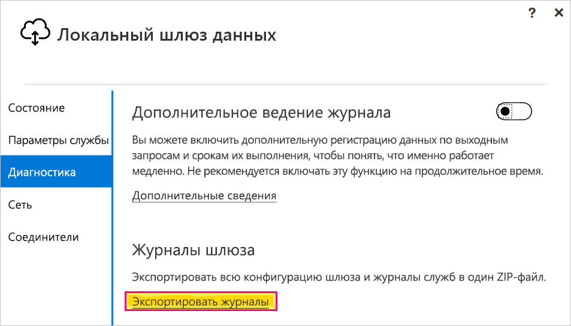

# <a name="use-kerberos-single-sign-on-for-sso-to-sap-bw-using-commoncryptolib-sapcryptodll"></a>Использование единого входа Kerberos для SAP BW с помощью CommonCryptoLib (sapcrypto.dll)

В этой статье описывается, как настроить источник данных SAP BW для включения единого входа из службы Power BI с использованием библиотеки CommonCryptoLib (sapcrypto.dll).

> [!NOTE]
> Прежде чем пытаться обновить отчет на основе SAP BW, в котором используется единый вход Kerberos, выполните действия, описанные в этой статье, а также инструкции в статье [Настройка единого входа на основе Kerberos](service-gateway-sso-kerberos.md). Использование CommonCryptoLib в качестве библиотеки SNC позволяет устанавливать подключения с единым входом к серверам приложений и серверам сообщений SAP BW.

## <a name="configure-sap-bw-to-enable-sso-using-commoncryptolib"></a>Настройка SAP BW для включения единого входа с использованием CommonCryptoLib

> [!NOTE]
> Локальный шлюз данных является 64-разрядным программным обеспечением, поэтому для выполнения единого входа в BW требуется 64-разрядная версия CommonCryptoLib (sapcrypto.dll). Если вы планируете проверить подключение с единым входом к серверу SAP BW в графическом интерфейсе SAP GUI перед попыткой осуществить подключение с единым входом через шлюз (рекомендуется), вам также потребуется 32-разрядная версия CommonCryptoLib, так как SAP GUI является 32-разрядным программным обеспечением.

1. Убедитесь, что сервер BW правильно настроен для единого входа Kerberos с использованием CommonCryptoLib. Если это так, вы сможете использовать единый вход для доступа к серверу BW (напрямую или через сервер сообщений SAP BW) с помощью такого средства SAP, как SAP GUI, которое было настроено для использования CommonCryptoLib. 

   Дополнительные сведения об этапах установки см. в статье [Единый вход SAP. Проверка подлинности с использованием Kerberos/SPNEGO](https://blogs.sap.com/2017/07/27/sap-single-sign-on-authenticate-with-kerberosspnego/). Ваш сервер BW должен использовать CommonCryptoLib в качестве библиотеки SNC и иметь имя SNC, начинающееся с *CN=* , например *CN=BW1*. Дополнительные сведения о требованиях к имени SNC (в частности, о параметре snc/identity/as) см. на странице [Параметры SNC для конфигурации Kerberos](https://help.sap.com/viewer/df185fd53bb645b1bd99284ee4e4a750/3.0/360534094511490d91b9589d20abb49a.html).

1. Если вы еще не сделали этого, установите 64-разрядную версию [соединителя SAP .NET](https://support.sap.com/en/product/connectors/msnet.html) на компьютере, где установлен шлюз. 
   
   Чтобы проверить, установлен ли компонент, попробуйте подключиться к серверу BW в Power BI Desktop с компьютера шлюза. Если вы не можете подключиться с использованием реализации 2.0, значит соединитель .NET не установлен или не был установлен в глобальном кэше сборок.

1. Убедитесь, что на компьютере, где установлен шлюз, не запущен клиент безопасного входа SAP (Secure Login Client — SLC). 

   Клиент SLC кэширует билеты Kerberos таким образом, который может негативно повлиять на способность шлюза использовать Kerberos для единого входа. 

1. Если клиент SLC установлен, удалите его или завершите его работу. Щелкните правой кнопкой мыши значок в области уведомлений и выберите пункт **Выйти** и **Выход**, прежде чем пытаться установить подключение единого входа с помощью шлюза. 

   Клиент SLC не поддерживается на компьютерах Windows Server. Для получения дополнительных сведений см. [Заметку SAP 2780475](https://launchpad.support.sap.com/#/notes/2780475) (требуются права s-user).

   

1. Если вы удаляете клиент SLC или выбираете пункт **Выйти** и **Выход**, откройте окно cmd и введите `klist purge`, чтобы очистить все кэшированные билеты Kerberos, прежде чем пытаться установить подключение единого входа через шлюз.

1. Скачайте 64-разрядную библиотеку CommonCryptoLib (sapcrypto.dll) версии *8.5.25 или более поздней* с панели запуска SAP и скопируйте ее в папку на компьютере шлюза. В том же каталоге, куда вы скопировали sapcrypto.dll, создайте файл sapcrypto.ini со следующим содержимым:

    ```
    ccl/snc/enable_kerberos_in_client_role = 1
    ```

    Этот INI-файл содержит сведения о конфигурации, необходимые CommonCryptoLib для реализации единого входа в сценарии шлюза.

    > [!NOTE]
    > Эти файлы должны храниться в одном расположении. Иными словами, _/path/to/sapcrypto/_ должен содержать как sapcrypto.ini, так и sapcrypto.dll.

    Как пользователь службы шлюза, так и пользователь Active Directory (AD), которого олицетворяет пользователь службы, должны иметь разрешения на чтение и выполнение для обоих файлов. Рекомендуется предоставить разрешения на доступ к INI- и DLL-файлам группе пользователей, прошедших проверку подлинности. В целях тестирования можно также явно предоставить эти разрешения пользователю службы шлюза и пользователю Active Directory, используемому для тестирования. На снимке экрана ниже мы предоставили группе "Пользователи, прошедшие проверку подлинности" разрешения на **чтение и выполнение** для sapcrypto.dll:

    

1. Если вы еще не связали источник данных SAP BW со шлюзом, через который будет осуществляться подключение в рамках единого входа, добавьте его на странице **Управление шлюзами** в службе Power BI. Если такой источник данных уже есть, измените его. 
    - Выберите **SAP Business Warehouse** в качестве **типа источника данных**, если вы хотите создать подключение с единым входом к серверу приложений BW. 
    - Выберите параметр **Сервер сообщений SAP Business Warehouse**, если вы хотите создать подключение с единым входом к серверу сообщений BW.

1. В поле **Библиотека SNC** выберите переменную среды **SNC\_LIB** или **SNC\_LIB\_64** либо вариант **Другое**. 

   - Если выбрана переменная **SNC\_LIB**, нужно задать переменную среды **SNC\_LIB\_64** на компьютере шлюза, указав абсолютный путь к 64-разрядной копии sapcrypto.dll на компьютере шлюза. Пример: *C:\Users\Test\Desktop\sapcrypto.dll*.

   - Если выбран вариант **Другое**, вставьте абсолютный путь к *sapcrypto.dll* в поле "Путь к пользовательской библиотеке SNC" на странице **Управление шлюзами**. 

1. Для параметра **Имя партнера SNC** введите SNC-имя сервера BW. В разделе **Дополнительные параметры** установите флажок **Использовать единый вход (SSO) через Kerberos для запросов DirectQuery**. Заполните остальные поля так, как если бы вы устанавливали подключение с проверкой подлинности Windows из PBI Desktop.

1. Создайте системную переменную среды **CCL\_PROFILE** и присвойте ей путь к файлу sapcrypto.ini.

    

    Файлы sapcrypto.dll и sapcrypto.ini должны находиться в одной папке. В приведенном выше примере файлы sapcrypto.ini и sapcrypto.dll находятся на рабочем столе.

1. Перезапустите службу шлюза.

    

1. [Запуск отчета Power BI](service-gateway-sso-kerberos.md#run-a-power-bi-report)

## <a name="troubleshooting"></a>Устранение неполадок

Если вам не удается обновить отчет в службе Power BI, можно использовать трассировку шлюза, трассировку CPIC и трассировку CommonCryptoLib, чтобы диагностировать проблему. Так как трассировка CPIC и CommonCryptoLib являются продуктами SAP, корпорация Майкрософт не может предоставить по ним поддержку.

### <a name="gateway-logs"></a>Журналы шлюза

1. Воспроизведите проблему.

2. Откройте [приложение шлюза](https://docs.microsoft.com/data-integration/gateway/service-gateway-app), перейдите на вкладку **Диагностика** и выберите **Экспорт журналов**.

      

### <a name="cpic-tracing"></a>Трассировка CPIC

1. Чтобы включить трассировку CPIC, задайте две переменные среды: **CPIC\_TRACE** and **CPIC\_TRACE\_DIR**. 

   Первая задает уровень трассировки, а вторая — каталог файла трассировки. Этот каталог должен представлять собой расположение, куда могут осуществлять запись члены группы "Пользователи, прошедшие проверку подлинности". 
 
2. Задайте для **CPIC\_TRACE** значение *3*, а для **CPIC\_TRACE\_DIR** любой каталог, куда следует записывать файлы трассировки. Например:

   

3. Воспроизведите ошибку и убедитесь в том, что **CPIC\_TRACE\_DIR** содержит файлы трассировки.
 
    Трассировка CPIC может диагностировать проблемы более высокого уровня, такие как сбой загрузки библиотеки sapcrypto.dll. Например, ниже приведен фрагмент файла трассировки CPIC, в котором произошла ошибка загрузки .dll:

    ```
    [Thr 7228] *** ERROR => DlLoadLib()==DLENOACCESS - LoadLibrary("C:\Users\test\Desktop\sapcrypto.dll")
    Error 5 = "Access is denied." [dlnt.c       255]
    ```

    Если возникла такая ошибка, а вы установили разрешения на чтение и выполнение для sapcrypto.dll и sapcrypto.ini, как описано [выше](#configure-sap-bw-to-enable-sso-using-commoncryptolib), попробуйте задать те же разрешения на чтение и выполнение для папки, содержащей файлы.

    Если вы по-прежнему не можете загрузить библиотеку .dll, попробуйте включить [аудит для файла](/windows/security/threat-protection/auditing/apply-a-basic-audit-policy-on-a-file-or-folder). Анализ результирующих журналов аудита в Просмотре событий Windows поможет определить причину сбоя загрузки файла. Найдите запись об ошибке, инициированную олицетворенным пользователем Active Directory. Например, для олицетворенного пользователя `MYDOMAIN\mytestuser` запись о сбое в журнале аудита будет выглядеть примерно так:

    ```
    A handle to an object was requested.

    Subject:
        Security ID:        MYDOMAIN\mytestuser
        Account Name:       mytestuser
        Account Domain:     MYDOMAIN
        Logon ID:       0xCF23A8

    Object:
        Object Server:      Security
        Object Type:        File
        Object Name:        <path information>\sapcrypto.dll
        Handle ID:      0x0
        Resource Attributes:    -

    Process Information:
        Process ID:     0x2b4c
        Process Name:       C:\Program Files\On-premises data gateway\Microsoft.Mashup.Container.NetFX45.exe

    Access Request Information:
        Transaction ID:     {00000000-0000-0000-0000-000000000000}
        Accesses:       ReadAttributes
                
    Access Reasons:     ReadAttributes: Not granted
                
    Access Mask:        0x80
    Privileges Used for Access Check:   -
    Restricted SID Count:   0
    ```

### <a name="commoncryptolib-tracing"></a>Трассировка CommonCryptoLib 

1. Включите трассировку CommonCryptoLib, добавив следующие строки в созданный ранее файл sapcrypto.ini:

    ```
    ccl/trace/level=5
    ccl/trace/directory=<drive>:\logs\sectrace
    ```

2. Измените значение параметра `ccl/trace/directory` на расположение, куда могут осуществлять запись члены группы "Пользователи, прошедшие проверку подлинности". 

3. Можно также создать INI-файл, чтобы изменить это поведение. В том же каталоге, где находятся файлы sapcrypto.ini и sapcrypto.dll, создайте файл sectrace.ini со следующим содержимым: Замените значение параметра `DIRECTORY` на расположение на компьютере, куда могут осуществлять запись члены группы "Пользователи, прошедшие проверку подлинности":

    ```
    LEVEL = 5
    DIRECTORY = <drive>:\logs\sectrace
    ```

4. Воспроизведите ошибку и убедитесь в том, что расположение, указанное в параметре **DIRECTORY**, содержит файлы трассировки. 

5. По завершении отключите трассировку CPIC и CCL.

    Дополнительные сведения о трассировке CommonCryptoLib см. в [заметке SAP 2491573](https://launchpad.support.sap.com/#/notes/2491573) (требуются права s-user SAP).

## <a name="next-steps"></a>Дальнейшие действия

Дополнительные сведения о локальном шлюзе данных и DirectQuery см. в следующих ресурсах:

* [Что такое локальный шлюз данных?](/data-integration/gateway/service-gateway-onprem)
* [Power BI и DirectQuery](desktop-directquery-about.md)
* [Источники данных, поддерживаемые DirectQuery](power-bi-data-sources.md)
* [Использование DirectQuery и SAP Business Warehouse (BW)](desktop-directquery-sap-bw.md)
* [DirectQuery и SAP HANA](desktop-directquery-sap-hana.md)
