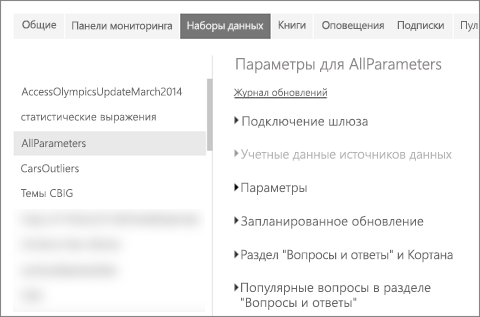
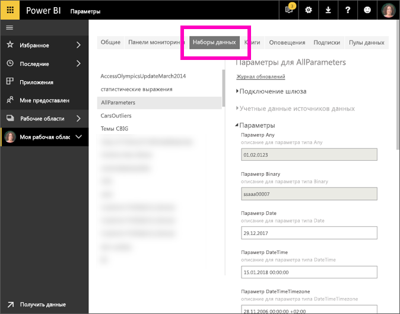

# Изменение настроек параметров в службе Power BI
Авторы отчетов добавляют параметры запросов в отчеты в Power BI Desktop. Параметры позволяют создавать части отчетов в зависимости от *значений* одного или нескольких параметров. Например, автор отчета может создать параметр, который ограничивает данные одной страной или регионом, или параметр, который определяет число допустимых форматов для таких полей, как поле даты, времени и текста.

## Просмотр и изменение параметров в службе Power BI

Вы, как автор отчета, определяете параметры в Desktop. Когда вы [публикуете этот отчет в службе Power BI](../create-reports/desktop-upload-desktop-files.md), настройки параметров и выбранные варианты переносятся вместе с ним. Вы можете просмотреть и изменить некоторые настройки параметров в службе Power BI, но не параметры, ограничивающие доступные данные, а параметры, которые определяют и описывают допустимые значения.

1. В службе Power BI щелкните значок шестеренки , чтобы открыть окно **Параметры**.

2. Выберите вкладку **Наборы данных** и выделите набор данных в списке. 
    
    

3. Разверните узел **Параметры**.  Если выбранный набор данных не содержит параметры, вы увидите сообщение со ссылкой для получения дополнительных сведений о параметрах запроса. Однако если набор данных содержит параметры, развернув заголовок **Параметры**, вы увидите эти параметры. 

    

    Просмотрите настройки параметров и при необходимости внесите изменения. Неактивные поля недоступны для редактирования. 

## Дальнейшие действия
Ситуативный способ добавления простых параметров путем [изменения URL-адреса](../collaborate-share/service-url-filters.md).