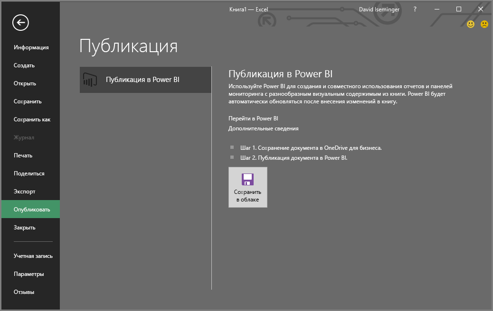
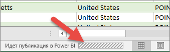

# Публикация в Power BI из Microsoft Excel
Microsoft Excel 2016 и более новых версий позволяет публиковать книги Excel непосредственно в рабочей области [Power BI](https://powerbi.microsoft.com), где вы можете создавать предельно наглядные отчеты и информационные панели на основе данных книги. Затем вы можете предоставить свои данные для общего доступа другим сотрудникам организации.

При публикации книги в Power BI необходимо учитывать следующие моменты.

* Для входа в Office, OneDrive для бизнеса (при использовании сохраненных здесь книг) и Power BI должна использоваться одна и та же учетная запись.
* При этом нельзя опубликовать пустую книгу или книгу без какого-либо содержимого, поддерживаемого Power BI.
* Нельзя опубликовать зашифрованные или защищенные паролем книги, а также книги, защищенные с помощью управления защитой информации.
* Для публикация в Power BI требуется включить современную проверку подлинности (по умолчанию). Если эта функция отключена, параметр "Опубликовать" в меню "Файл" недоступен.

## Публикация книги Excel
Чтобы опубликовать книгу Excel, в Excel выберите **Файл** > **Опубликовать**, а затем — **Отправить** или **Экспорт**.

Если вы решили **отправить** книгу в Power BI, вы можете взаимодействовать с книгой так же, как в Excel Online. Можно также закрепить выбранные элементы книги на информационных панелях Power BI, а также предоставить общий доступ к книге или выбранным элементам с помощью Power BI.

Если выбран **Экспорт**, можно экспортировать табличные данные и их модель в набор данных Power BI, который затем можно использовать для создания отчетов и информационных панелей Power BI.

### Публикация локальных файлов
Excel поддерживает публикацию локальных файлов Excel. Их не нужно сохранять в OneDrive для бизнеса или SharePoint Online.

> [!IMPORTANT]
> Если вы используете Excel 2016 (или более поздней версии) с подпиской Office 365, публиковать можно только локальные файлы. Публикация в Power BI поддерживается и в изолированных установках Excel 2016, но только при сохранении книги в OneDrive для бизнеса или SharePoint Online.
> 

При выборе параметра **Опубликовать** вы можете выбрать рабочую область для публикации. Если файл Excel находится в OneDrive для бизнеса, вы можете опубликовать его только в разделе *Моя рабочая область*. Если файл Excel находится на локальном диске, можно опубликовать его в разделе *Моя рабочая область* или в общей рабочей области, к которой у вас есть доступ.

Предусмотрено два способа передачи книги в Power BI.

После публикации содержимое книги импортируется в Power BI отдельно от локального файла. Если вы хотите обновить файл в Power BI, необходимо повторно опубликовать обновленную версию или обновить данные, настроив обновление по расписанию для книги или набора данных в Power BI.

### Публикация из изолированной установки Excel
При публикации из изолированной установки Excel книга должна быть сохранена в OneDrive для бизнеса. Щелкните **Сохранить в облаке** и выберите расположение в OneDrive для бизнеса.

После сохранения книги в OneDrive для бизнеса при нажатии кнопки **Опубликовать** вам будут доступны два способа передачи книги в Power BI: **Отправить** или **Экспорт**.

#### Отправка книги в Power BI
Если выбран вариант **Отправить**, ваша книга отобразится в Power BI так же, как в Excel Online. При этом у вас появится ряд возможностей, недоступных в Excel Online. С их помощью вы сможете закрепить элементы из листов на информационных панелях.

Книгу нельзя редактировать в Power BI. Если необходимо внести какие-либо изменения в данные, можно нажать **Изменить** и отредактировать книгу в Excel Online или открыть ее в Excel на своем компьютере. Любые внесенные изменения сохраняются в книге в OneDrive для бизнеса.

Если выбран вариант **Отправить**, в Power BI набор данных не создается. Книга будет отображаться в разделе "Отчеты" в рабочей области в области навигации. Книги, переданные в Power BI, обозначаются специальным значком Excel, который идентифицирует их как переданные книги Excel.

Выбирайте вариант **Отправить**, только если хотите отобразить в Power BI какие-либо данные с листов, сводные таблицы или диаграммы.

Использование команды "Отправить" из функции "Публикация в Power BI" в Excel аналогично использованию в Power BI в браузере команды **Получить данные > Файл > OneDrive для бизнеса > Connect, Manage and View Excel in Power BI (Подключиться к данным Excel, а также управлять ими и просматривать их в Power BI)** .

#### Экспорт данных книги в Power BI
Если выбран вариант **Экспорт**, все поддерживаемые данные в таблицах и (или) в модели данных будут экспортированы в новый набор данных в Power BI. Все листы Power View в книге будут созданы повторно в Power BI в виде отчетов.

Вы можете продолжить редактирование в книге. При сохранении изменений они будут синхронизированы с набором данных в Power BI, обычно в течение часа. Если обновления должны выполняться быстрее, можно снова выбрать в Excel параметр **Опубликовать**, после чего изменения будут экспортированы незамедлительно. Любые визуализации в отчетах и информационных панелях также постоянно обновляются.

Выберите параметр **Опубликовать**, если для загрузки данных в модель данных вы использовали функции загрузки и преобразования данных или Power Pivot или если ваша книга содержит листы Power View с визуализациями, которые должны отображаться в Power BI.

Использование команды **Экспорт** аналогично использованию в Power BI в браузере команды **Получить данные > Файл > OneDrive для бизнеса > Export Excel data into Power BI (Экспорт данных Excel в Power BI)** .

## Публикация
При выборе любого из этих вариантов Excel выполнит вход в Power BI, используя вашу текущую учетную запись, а затем опубликует книгу в рабочей области Power BI. Чтобы следить за ходом выполнения процесса публикации, можно отслеживать строку состояния в Excel.

По завершении вы можете перейти в Power BI непосредственно из Excel.

## Дальнейшие действия
[Данные Excel в Power BI](service-excel-workbook-files.md)  
Появились дополнительные вопросы? [Ответы на них см. в сообществе Power BI.](https://community.powerbi.com/)

