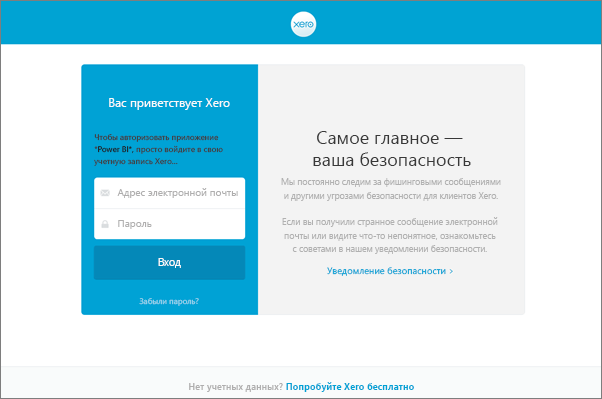

# Как обновить учетные данные для пакета содержимого Xero в случае сбоя обновления
Если вы используете пакет содержимого Xero Power BI, то у вас могли возникнуть некоторые проблемы с ежедневным обновлением пакета содержимого из-за недавнего инцидента со службой Power BI.

Чтобы увидеть, удалось ли выполнить обновление пакета содержимого, можно проверить состояние последнего обновления для набора данных Xero, как показано на снимке экрана ниже.

Если вы видите, что обновление завершилось сбоем, как показано выше, то выполните следующие действия, чтобы обновить учетные данные пакета содержимого.

1. Нажмите **Дополнительные параметры** (...) рядом с набором данных Xero, а затем выберите команду **Запланировать обновление**. Откроется страница параметров пакета содержимого Xero.
   
    
2. На странице **Settings for Xero** (Параметры Xero) выберите **Учетные данные источников данных** > **Изменить учетные данные**.
   
    
3. Введите название организации > **Далее**.
   
    
4. Войдите, используя учетную запись Xero.
   
    
5. Теперь, когда учетные данные обновлены, давайте убедимся, что запланированное обновление будет запускаться ежедневно. Для этого нажмите кнопку **Дополнительные параметры** (...) рядом с набором данных Xero, а затем снова выберите команду **Запланировать обновление**.
   
    
6. Также можно обновить набор данных немедленно. Нажмите **Дополнительные параметры** (...) рядом с набором данных Xero, а затем выберите команду **Обновить**.
   
    

Если у вас по-прежнему возникают проблемы с обновлением, свяжитесь с нами через сайт [https://support.powerbi.com](https://support.powerbi.com) 

Чтобы ознакомиться с дополнительными сведениями о пакете содержимого Xero для Power BI, посетите страницу справки [Пакет содержимого Xero для Power BI](service-connect-to-xero.md).

### Дальнейшие действия
* У вас имеются и другие вопросы? [Ответы на них см. в сообществе Power BI.](https://community.powerbi.com/)

