# Установка и распространение приложений-шаблонов в организации

Являетесь ли вы аналитиком Power BI? Если это так, в этой статье вы узнаете, как установить [приложения-шаблоны](service-template-apps-overview.md) для подключения к различным службам, используемым для обеспечения работы вашей организации, таким как Salesforce, Microsoft Dynamics и Google Analytics. Можно изменять панели мониторинга и отчеты в приложениях-шаблонах в соответствии с потребностями своей организации, а затем распространить их в виде обычных [приложений](../consumer/end-user-apps.md) среди коллег. 

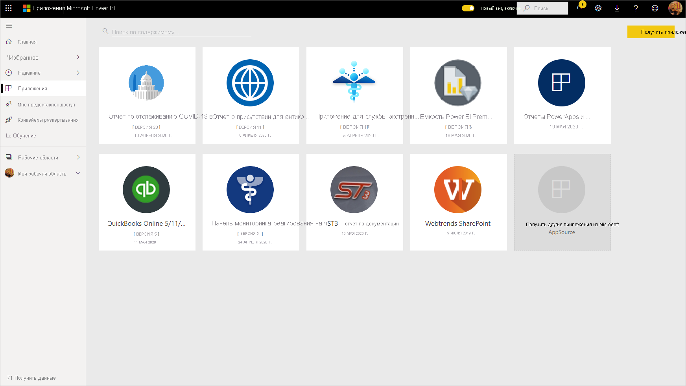

Если вас интересует создание приложений-шаблонов самостоятельно для распространения за пределами организации, обратитесь к статье [Создание приложений-шаблонов в Power BI](service-template-apps-create.md). Используя минимальное количество кода (или вообще без него), партнеры Power BI могут создавать приложения Power BI и развертывать их для клиентов Power BI. 

## Предварительные требования  

Для установки, настройки и распространения приложения-шаблона потребуется следующее. 

* [Лицензия Power BI Pro](../fundamentals/service-self-service-signup-for-power-bi.md).
* Разрешения на установку приложений-шаблонов в клиенте.
* Действительная ссылка для установки приложения, полученная либо из AppSource, либо от создателя приложения.
* Хорошее знание [основных принципов Power BI](../fundamentals/service-basic-concepts.md).

## Установка приложения-шаблона

1. В службе Power BI в области навигации выберите **Приложения** > **Получить приложения**.

    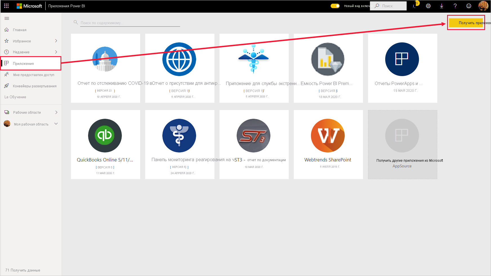

1. В появившемся окне AppSource выберите **Приложения**. Найдите приложение, а затем выберите **Получить**.

    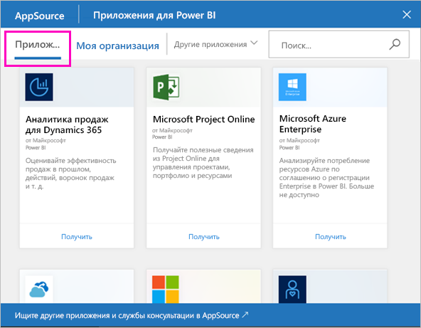

1. В появившемся диалоговом окне выберите **Установить**.

    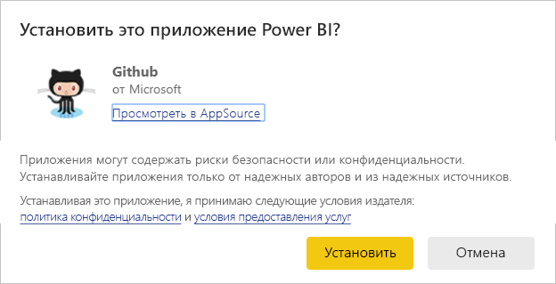
    
    Приложение устанавливается вместе со связанной рабочей областью. **Если вы решили настроить приложение, это необходимо сделать в соответствующей рабочей области**.

    > [!NOTE]
    > При переходе по ссылке для установки приложения, отсутствующего в AppSource, появится диалоговое окно с просьбой подтвердить выбор.
    >
    >Чтобы установить приложение-шаблон, которое отсутствует в AppSource, необходимо обратиться к администратору с просьбой предоставить соответствующие разрешения. Дополнительные сведения см. в разделе [Параметры приложений-шаблонов](../admin/service-admin-portal.md#template-apps-settings) статьи, посвященной порталу администрирования Power BI.

    После успешной установки появится соответствующее уведомление о том, что новое приложение готово.

    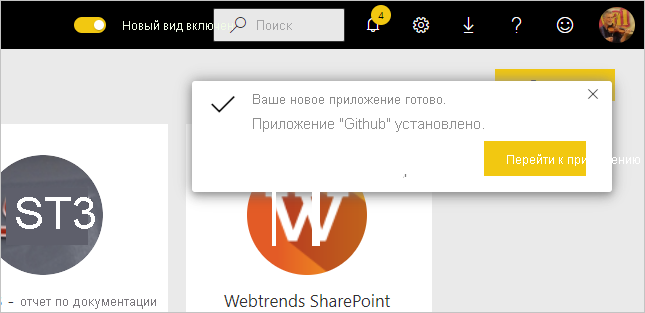

## Подключение к данным

1. Выберите **Перейти к приложению**.

1. В окне **Начало работы с новым приложением** выберите **Обзор**.

   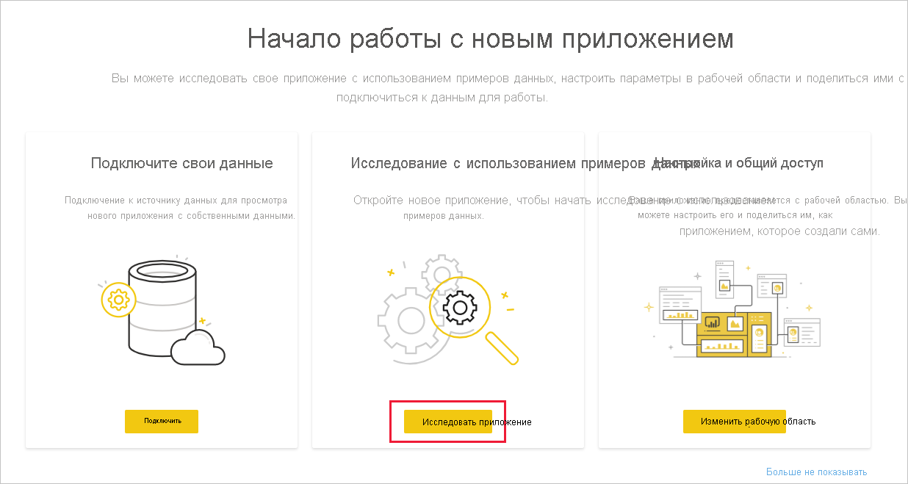

   Приложение откроется с образцом данных.

1. Щелкните ссылку **Подключите свои данные** в баннере в верхней части страницы.

   

    
    Откроется диалоговое окно или серия диалоговых окон, в которых вы измените источник данных из образца данных на собственный источник данных. Обычно это подразумевает переопределение параметров набора данных и учетных данных источника. См. раздел [Известные ограничения](service-template-apps-overview.md#known-limitations).
    
    В примере ниже подключение к данным включает два диалоговых окна.

   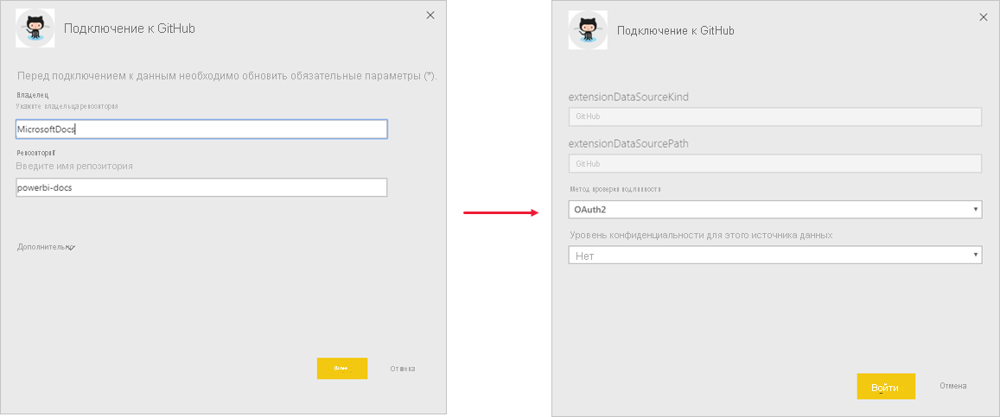

    По завершении ввода данных в диалоговых окнах подключения начинается процесс подключения. Баннер информирует о том, что данные обновляются и в это время вы просматриваете демонстрационные данные.

    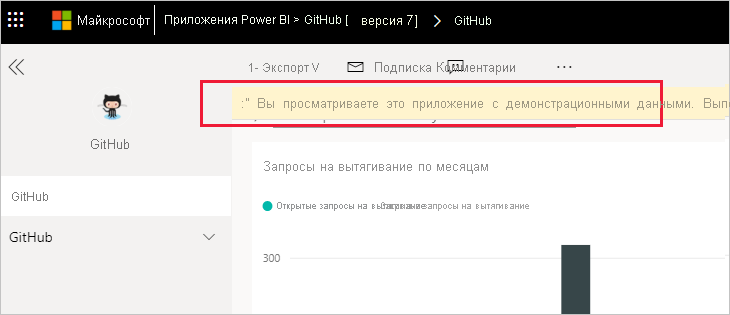

   Данные отчета будут автоматически обновляться раз в день, если только вы не отключили это во время входа в систему. Также можно [настроить собственное расписание обновления](./refresh-scheduled-refresh.md), чтобы в отчете всегда отражались актуальные данные.

## Настройка приложения и общий доступ к нему

После подключения к данным и обновления данных можно настроить любые отчеты и панели мониторинга, включенные в приложения, а также предоставить доступ к приложению своим коллегам. Однако помните, что любые внесенные изменения будут перезаписаны при обновлении приложения до новой версии, если не сохранить измененные элементы под разными именами. [Ознакомьтесь с дополнительными сведениями о перезаписи](#overwrite-behavior).

Чтобы настроить приложение и предоставить к нему общий доступ, щелкните значок карандаша в правом верхнем углу страницы.

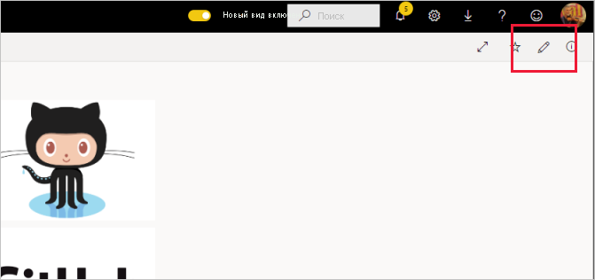

Сведения об изменении артефактов в рабочей области см. в следующих разделах.
* [Обзор редактора отчетов в Power BI](../create-reports/service-the-report-editor-take-a-tour.md)
* [Основные понятия для разработчиков в службе Power BI](../fundamentals/service-basic-concepts.md)

После внесения изменений в артефакты в рабочей области можно приступать к публикации приложения и предоставлению общего доступа к нему. Сведения о том, как это сделать, см. в разделе [Публикация приложения](../collaborate-share/service-create-distribute-apps.md#publish-your-app).

## Обновление приложения-шаблона

Время от времени авторы приложений-шаблонов выпускают новые улучшенные версии приложений-шаблонов, используя AppSource, прямые ссылки или и то и другое.

Если вы первоначально загрузили приложение из AppSource, то при появлении новой версии приложения шаблона вы получите уведомления двумя способами.
* В службе Power BI появится баннер обновления с сообщением о том, что доступна новая версия приложения.
  
* Вы получаете уведомление в области уведомлений Power BI.

  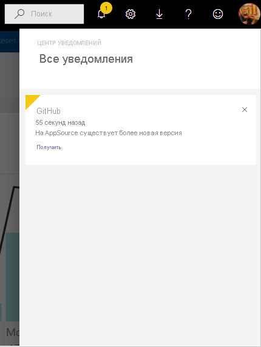

>[!NOTE]
>Если изначально приложение было получено посредством прямой ссылки, а не через AppSource, единственный способ узнать, имеется ли новая версия, это обратиться к создателю приложения-шаблона.

  Чтобы установить обновление, нажмите **Получить** в баннере с уведомлением или в центре уведомлений или снова найдите приложение в AppSource и выберите **Получить**. Если вы получили прямую ссылку на обновление от создателя приложения-шаблона, просто щелкните ссылку.
  
  Будет предложено заменить текущую версию или установить новую версию в новой рабочей области. По умолчанию выбрана замена.

  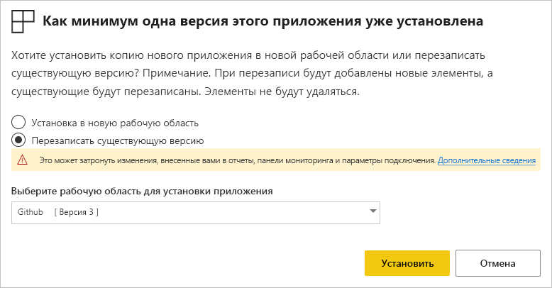

- **Перезаписать существующую версию:** перезаписывает существующую рабочую область обновленной версией приложения-шаблона. [Ознакомьтесь с дополнительными сведениями о перезаписи](#overwrite-behavior).

- **Установить в новую рабочую область:** установка новой версии рабочей области и приложения, которые необходимо перенастроить (то есть подключиться к данным, определить навигацию и разрешения).

### Поведение при перезаписи

* При перезаписи обновляются отчеты, панели мониторинга и набор данных в рабочей области, а не в приложении. Перезапись не влияет на навигацию, установку и разрешение приложения.
* После обновления рабочей области необходимо **обновить приложение, чтобы применить изменения из рабочей области к приложению**.
* Перезапись сохраняет настроенные параметры и проверку подлинности. После обновления запускается автоматическое обновление набора данных. **Во время этого обновления в приложении, отчетах и на панели мониторинга представлены демонстрационные данные**.

  

* Перезапись всегда демонстрирует образцы данных до завершения обновления. Если автор приложения-шаблона внес изменения в набор данных или параметры, пользователи рабочей области и приложения смогут увидеть новые данные только после завершения обновления. Вместо этого для них по-прежнему будут отображаться демонстрационные данные.
* При перезаписи никогда не удаляются новые отчеты или панели мониторинга, добавленные в рабочую область. Исходные отчеты и панели мониторинга перезаписываются с учетом изменений, внесенных изначальным автором.

>[!IMPORTANT]
>Не забудьте [обновить приложение](#customize-and-share-the-app) после перезаписи, чтобы применить изменения к отчетам и панели мониторинга для пользователей приложения организации.

## Дальнейшие действия

[Создание рабочих областей вместе с коллегами в Power BI](../collaborate-share/service-create-the-new-workspaces.md)
