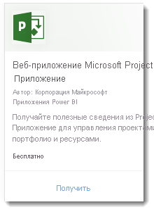
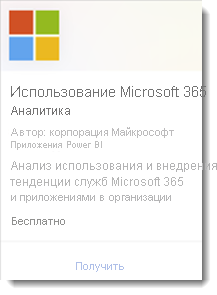
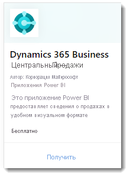
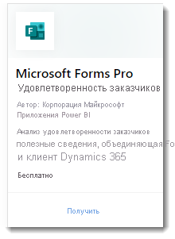

# Что такое приложения-шаблоны Power BI?

Новые *приложения-шаблоны* Power BI позволяют партнерам создавать приложения Power BI с минимальным количеством кода или вообще без него и развертывать их для любых клиентов.  В этой статье приводится обзор программы приложений-шаблонов Power BI.

Партнеры Power BI создают готовый набор содержимого для клиентов и самостоятельно публикуют его.  

Они разрабатывают приложения-шаблоны, позволяющие клиентам подключаться и создавать экземпляры с использованием собственных учетных записей. Являясь специалистами в предметной области, клиенты могут представлять данные в виде, наиболее удобном для корпоративных пользователей.  

Вы отправляете приложения-шаблоны в центр для партнеров. Затем приложения становятся общедоступными в [Marketplace для приложений Power BI](https://app.powerbi.com/getdata/services) и [Microsoft AppSource](https://appsource.microsoft.com/?product=power-bi). Ниже приведен общий обзор процедуры создания общедоступного приложения-шаблона.

## Marketplace для приложений Power BI

Приложения-шаблоны Power BI позволяют пользователям Power BI Pro и Power BI Premium получать оперативные сведения через предустановленные панели мониторинга и отчеты, которые можно подключать к источникам данных в реальном времени. Многие приложения Power BI уже доступны в [Marketplace для приложений Power BI](https://app.powerbi.com/getdata/services).

|  |
|     :---:      |
|     |
|  |

## Процесс
Общий процесс разработки и отправки приложения-шаблона включает несколько стадий. Некоторые стадии могут включать сразу несколько действий.

| Этап | Power BI Desktop |  |Служба Power BI  |  |Центр для партнеров  |
|---|--------|--|---------|---------|---------|
| **Первый** | Создание модели данных и отчета в PBIX-файле |  | Создание рабочей области. Импорт PBIX-файла. Создание дополнительной панели мониторинга.  |  | Регистрация в качестве партнера |
| **Второй** |  |  | Создание тестового пакета и запуск внутренней проверки.        |  | |
| **Третий** | |  | Повышение уровня тестового пакета до подготовительного для проверки его работы вне среды клиента Power BI, а затем отправка пакета в AppSource.  |  | Создание предложения приложения-шаблона Power BI с помощью подготовительного пакета и запуск процесса проверки |
| **Четвертый** | |  | Повышение уровня подготовительного пакета до рабочего. |  | Ввод в эксплуатацию |

## Подготовка

Для создания приложения-шаблона требуются соответствующие разрешения. Дополнительные сведения см. в статье о портале администрирования Power BI в разделе "Параметры приложений-шаблонов". 

Чтобы опубликовать приложение-шаблон в службе Power BI и AppSource, необходимо [зарегистрироваться в качестве издателя в центре для партнеров](/azure/marketplace/become-publisher).
 
## Основные действия

Ниже приведены основные действия. 

1. [Просмотрите требования](#requirements) и выполните их. 

2. Создайте отчет в Power BI Desktop. С помощью параметров сохраните его в виде файла, который могут использовать другие. 

3. Создайте рабочую область для приложения-шаблона в своем клиенте в службе Power BI (app.powerbi.com). 

4. Импортируйте PBIX-файл и добавьте в приложение содержимое, например панель мониторинга. 

5. Создайте тестовый пакет для самостоятельной проверки приложения-шаблона в вашей организации. 

6. Повысьте уровень тестового приложения до предварительного, чтобы отправить приложение на проверку в AppSource и протестировать его вне своего клиента. 

7. Отправьте содержимое в [центр для партнеров](/azure/marketplace/partner-center-portal/create-power-bi-app-offer) для публикации. 

8. Сделайте предложение доступным в AppSource и перенесите его в рабочую среду в Power BI.

9. Теперь вы можете начать разработку следующей версии в той же рабочей области в среде подготовки. 

## Требования

Для создания приложения-шаблона требуются соответствующие разрешения. Дополнительные сведения см. в [разделе "Параметры приложений-шаблонов" статьи о портале администрирования](../admin/service-admin-portal.md#template-apps-settings) Power BI.

Чтобы опубликовать приложение-шаблон в службе Power BI и AppSource, необходимо [зарегистрироваться в качестве издателя в центре для партнеров](/azure/marketplace/become-publisher).
 > [!NOTE] 
 > Управление отправкой приложений-шаблонов осуществляется в [центре для партнеров](/azure/marketplace/partner-center-portal/create-power-bi-app-offer). Для входа используйте ту же учетную запись регистрации Центра разработчиков Майкрософт. Для всех предложений в AppSource нужно использовать одну и ту же учетную запись Майкрософт. Не следует использовать разные учетные записи для отдельных служб или приложений.

## Советы 

- Убедитесь, что приложение включает образцы данных, позволяющие любому пользователю быстро приступить к работе. 
- Тщательно изучите приложение, установив его в основном и вспомогательном клиенте. Убедитесь, что заказчики видят только то, что вы хотите им предоставить. 
- Используйте AppSource в качестве интернет-магазина для размещения приложения. В этом случае приложение сможет найти любой пользователь Power BI. 
- Рассмотрите возможность создания нескольких приложений-шаблонов для уникальных сценариев. 
- Активируйте возможности настройки данных, например поддержку пользовательских подключений и конфигураций параметров в установщике.

Дополнительные рекомендации см. в статье [Советы по созданию приложений-шаблонов в Power BI](service-template-apps-tips.md).

## Известные ограничения

| Признак | Известные ограничения |
|---------|---------|
|Содержимое:  Наборы данных   | Должен присутствовать строго один набор данных. Разрешены только наборы данных, созданные в Power BI Desktop (PBIX-файлы).  Не поддерживаются: наборы данных из других приложений-шаблонов, наборы данных для нескольких рабочих областей, отчеты с разбивкой на страницы (RDL-файлы), книги Excel. |
|Содержимое: Панели мониторинга | Плитки в режиме реального времени недопустимы (другими словами, не поддерживаются принудительная отправка или трансляция наборов данных) |
|Содержимое: Потоки данных | Не поддерживаются: Потоки данных |
|Содержимое из файлов | Разрешены только PBIX-файлы.  Не поддерживаются: RDL-файлы (отчеты с разбивкой на страницы), книги Excel.   |
| Источники данных | Разрешены источники данных, поддерживаемые для обновления данных по расписанию в облаке.  Не поддерживаются: <li> DirectQuery</li><li>Активные подключения (не Azure AS)</li> <li>Локальные источники данных (личный и корпоративный шлюзы не поддерживаются)</li> <li>Режим реального времени (не поддерживается принудительная отправка наборов данных)</li> <li>Составные модели</li></ul> |
| Набор данных: для нескольких рабочих областей | Наборы данных для нескольких рабочих областей недопустимы.  |
| Параметры запроса | Не поддерживаются: параметры типа Any или Binary блокируют операцию обновления набора данных. |
| Визуальные элементы Power BI | Поддерживаются только общедоступные визуальные элементы Power BI. [Визуальные элементы Power BI для организации](../developer/visuals/power-bi-custom-visuals-organization.md) не поддерживаются |
| Национальные облака | Приложения шаблона недоступны в национальных облаках |

## Поддержка
Для поддержки во время разработки используйте [https://powerbi.microsoft.com/support](https://powerbi.microsoft.com/support). Мы постоянно отслеживаем и контролируем этот сайт. Сообщения об инцидентах быстро передаются в соответствующую группу.

## Дальнейшие действия

[Создание приложения-шаблона](service-template-apps-create.md)