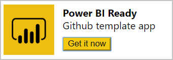

# Советы по созданию приложений-шаблонов в Power BI

Процедура [создания приложения-шаблона](service-template-apps-create.md) в Power BI включает формирование рабочей области, тестирование приложения и перенос его в рабочую среду. Однако другим важным аспектом, естественно, является разработка отчета и панели мониторинга. Процесс разработки затрагивает четыре основных компонента. Работая над ними, вы можете создавать самые мощные и удобные приложения-шаблоны.

* **Запросы** позволяют [подключаться](desktop-connect-to-data.md) к данным и [преобразовывать](../transform-model/desktop-query-overview.md) их, а также определять [параметры](https://powerbi.microsoft.com/blog/deep-dive-into-query-parameters-and-power-bi-templates/). 
* В **модели данных** создаются [связи](../transform-model/desktop-create-and-manage-relationships.md) и [меры](../transform-model/desktop-measures.md), а также адаптируется работа с функцией "Вопросы и ответы".  
* На **[страницах отчетов](../create-reports/desktop-report-view.md)** находятся визуальные элементы и фильтры для анализа данных.  
* **[Панели мониторинга](../consumer/end-user-dashboards.md)** и [плитки](../create-reports/service-dashboard-create.md) содержат обзор результатов анализа.
* Образец данных облегчает поиск вашего приложения сразу же после установки.

Каждый из этих элементов может быть вам знаком как существующая функция Power BI. Создавая приложение-шаблон, следует принимать во внимание ряд дополнительных факторов по каждому из них. Более подробные сведения приводятся в соответствующих разделах ниже.

## Запросы
В приложениях-шаблонах запросы, созданные в Power BI Desktop, используются для подключения к источникам данных и импорта данных. Эти запросы необходимы для получения согласованных схем и поддерживают обновление данных по расписанию (DirectQuery не поддерживается).

### Подключение к API
Чтобы приступить к созданию запросов, нужно подключиться к API из Power BI Desktop.

Для подключения к API можно использовать стандартные соединители данных, доступные в Power BI Desktop. Вы можете использовать соединитель веб-данных ("Получить данные" -> "Интернет"), чтобы подключиться к REST API, или соединитель OData ("Получить данные" -> "Канал OData"), чтобы подключиться к каналу OData.

> [!NOTE]
> В настоящее время шаблон приложения не поддерживает настраиваемые соединители, поэтому для миграции лучше воспользоваться Odatafeed Auth 2.0, чтобы избежать проблем совместимости для некоторых вариантов подключения, или отправить соединитель на сертификацию. Подробную информацию о том, как разработать и сертифицировать соединитель, можно найти в [Документации по соединителям данных](https://aka.ms/DataConnectors).

### Зависимость от источника
Запросы определяют, какие данные включаются в модель данных. В зависимости от размера вашей системы такие запросы также должны включать фильтры, гарантирующие, что ваши клиенты будут работать с контролируемым размером, соответствующим вашему бизнес-сценарию.

Приложения-шаблоны Power BI могут параллельно выполнять множество запросов для множества пользователей.  Заранее продумайте стратегию регулирования и параллелизма, а также получите у нас рекомендации, как сделать приложение-шаблон отказоустойчивым.

### Применение схемы
Убедитесь, что ваши запросы устойчивы к изменениям в системе, так как изменения в схеме в момент обновления могут нарушить модель. Если в ответ на некоторые запросы источник может выдавать пустой результат или сообщать об отсутствии схемы, можно настроить возврат пустой таблицы или понятных сообщений об ошибках.

### Параметры
[Параметры](https://powerbi.microsoft.com/blog/deep-dive-into-query-parameters-and-power-bi-templates/) в Power BI Desktop позволяют пользователям указывать входные значения для настройки извлекаемых данных. Заранее продумайте параметры, чтобы после трудоемкого создания подробных запросов и отчетов не требовалась их переработка.

> [!NOTE]
> Приложения-шаблоны поддерживают все параметры, за исключением Any и Binary.
>

### Дополнительные рекомендации по запросам

* Убедитесь, что все столбцы корректно типизированы.
* Столбцы имеют информативные имена (см. [Вопросы и ответы](#qa)).  
* Подумайте об использовании функций или запросов для совместно используемой логики.  
* В настоящее время служба не поддерживает уровни конфиденциальности. При получении запроса об уровнях конфиденциальности может потребоваться переписать запрос для использования относительных путей.  

## Модели данных

Четко определенная модель данных позволяет клиентам легко и удобно взаимодействовать с приложением-шаблоном. Создайте модель данных в Power BI Desktop.

> [!NOTE]
> Основное моделирование (типизация, имена столбцов) должно осуществляться преимущественно с использованием [запросов](#queries).

### Вопросы и ответы
От моделирования также зависит, насколько хорошие результаты предоставляет вашим клиентам функция "Вопросы и ответы". Добавьте синонимы к часто используемым столбцам и следите за тем, чтобы имена столбцов были верно указаны в [запросах](#queries).

### Дополнительные рекомендации по модели данных

Убедитесь, что выполнены следующие задачи:

* Применено форматирование ко всем столбцам значений. Применены типы в запросах.  
* Применено форматирование ко всем мерам.
* Задан способ вычисления итогового значения по умолчанию. Особенно важно указать "Не вычислять итоговое значение", когда это необходимо (например, для уникальных значений).  
* Заданы категории данных, если применимо.  
* Заданы необходимые связи.  

## Отчеты
Страницы отчета позволяют получить более глубокий анализ данных, включенных в приложение-шаблон. Они ответят на ключевые бизнес-вопросы, для решения которых и создавалось приложение. Создайте отчет с помощью Power BI Desktop.

### Дополнительные рекомендации по отчетам

* Используйте на каждой странице несколько визуальных элементов для перекрестной фильтрации.  
* Тщательно выравнивайте визуальные элементы (избегайте наложения).  
* Макет страницы может иметь режим "4:3" или "16:9".  
* Все представленные агрегаты должны иметь смысл в числовом виде (средние, уникальные значения).  
* Срезы должны давать рациональные результаты.  
* Логотип должен присутствовать как минимум на главном отчете.  
* По возможности элементы должны быть представлены в цветовой схеме клиента.  

## Панели мониторинга
Основным инструментом взаимодействия клиентов с приложением-шаблоном служит панель мониторинга. Она должна содержать обзор содержимого пакета, особенно меры, играющие важную роль в вашем бизнес-сценарии.

Чтобы создать панель мониторинга для приложения-шаблона, просто отправьте PBIX-файл через меню "Получить данные" > "Файлы" или опубликуйте его непосредственно из Power BI Desktop.

### Дополнительные рекомендации по панелям мониторинга

* Закрепляя плитки на панели мониторинга, придерживайтесь одной общей темы.  
* Прикрепите к теме логотип, чтобы клиенты знали, откуда пакет.  
* Рекомендуется использовать макет шириной в 5–6 небольших плиток, подходящий для большинства разрешений экранов.  
* Все плитки на панели мониторинга должны иметь подходящие заголовки и подзаголовки.  
* Группируйте плитки на панели мониторинга для различных сценариев, вертикально или горизонтально.  

## Образцы данных
Приложение-шаблон, как часть этапа создания приложений, создает оболочку для кэширования данных в рабочей области как части приложения.

* Это позволяет программе установки понять функциональность и назначение приложения перед подключением данных.
* А также создает интерфейс, который управляет установщиком для дальнейшего изучения возможностей приложения, что приводит к подключению набора данных в приложение.

Мы рекомендуем использовать перед созданием приложения качественный образец данных. Убедитесь, что отчеты и панели мониторинга приложения заполняются данными.

## Публикация в AppSource
Приложения-шаблоны можно опубликовать в AppSource, следуя рекомендациям ниже перед отправкой приложения в AppSource.

* Убедитесь, что вы создаете приложение-шаблон с помощью образцов данных, которые могут помочь установщику понять, что приложение должно делать (пустой отчет и панель мониторинга не будут одобрены).
Приложения-шаблоны поддерживают только приложения с примерами данных, обязательно установите флажок статического приложения. [Дополнительные сведения](https://docs.microsoft.com/power-bi/service-template-apps-create#create-the-test-template-app)
* Используйте инструкции для команды проверки, которые содержат учетные данные и параметры, необходимые для подключения к данным.
* Приложение должно содержать значок приложения в Power BI и в вашем предложении на портале Cloud Partner. [Дополнительные сведения](https://docs.microsoft.com/power-bi/service-template-apps-create#create-the-test-template-app)
* Теперь целевая страница настроена. [Дополнительные сведения](https://docs.microsoft.com/power-bi/service-template-apps-create#create-the-test-template-app)
* Убедитесь в том, что вы следуете документации по [предложению приложения Power BI в центре для партнеров](https://docs.microsoft.com/azure/marketplace/partner-center-portal/create-power-bi-app-offer).
* Если панель мониторинга является частью приложения, убедитесь, что она не пуста.
* Установите приложение, используя ссылку приложения перед его отправкой, убедитесь, что можно подключить набор данных и взаимодействие с приложением происходит надлежащим образом.
* Перед отправкой PBIX в рабочую область шаблона убедитесь в том, что все ненужные подключения выгружены.
* Следуйте[рекомендациям по проектированию отчетов и визуальных элементов](https://docs.microsoft.com/power-bi/visuals/power-bi-visualization-best-practices) в Power BI, чтобы добиться максимального влияния на пользователей и получить одобрение для распространения приложения.
<!--- * In general, only application with valuable functionality can be approved for general use on AppSource. Application with sample data content only must have either a guidance or statistical value.) -->

## Создание ссылки для скачивания приложения

После публикации приложения-шаблона в AppSource можно создать ссылку для скачивания с веб-сайта в одно из следующих мест:
* страница скачивания AppSource — является общедоступной; получить ссылку можно со своей страницы AppSource;
* Power BI — доступно для просмотра пользователю Power BI.

Пример перенаправления пользователя на ссылку для скачивания приложения в Power BI: [репозиторий GitHub](https://github.com/microsoft/Template-apps-examples/tree/master/src).

## Дальнейшие действия

[Что такое приложения-шаблоны Power BI?](service-template-apps-overview.md)
