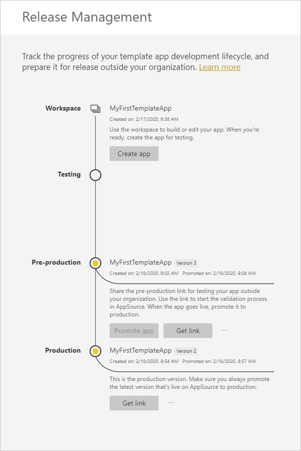

# Обновление, удаление и извлечение приложения-шаблона

Теперь, когда приложение доступно в рабочей версии, вы можете вновь запускать этап тестирования, не нарушая работу.
## Обновление приложения

Если вы внесли изменения в Power BI Desktop, начните с шага (1). Если вы не вносили изменения в Power BI Desktop, начните с шага (4).

1. Отправьте обновленный набор данных и перезапишите существующий набор данных. **Убедитесь, что используется то же имя набора данных**. При использовании другого имени будет создан новый набор данных для пользователей, которые обновляют приложение.

1. Импортируйте PBIX-файл с компьютера.

1. Подтвердите перезапись.

1. В панели **Управление выпусками** выберите **Создать приложение**.
1. Повторите процедуру создания приложения.
1. После установки параметров в категориях **Фирменная символика**, **Содержимое**, **Управление** и **Доступ** вновь выберите **Создать приложение**.
1. Нажмите **Закрыть** и вернитесь в **Управление выпусками**.

   Теперь у вас есть две версии: версия в рабочей среде и новая версия на этапе тестирования.

    

1. Когда вы будете готовы повысить уровень приложения до предварительного для дальнейшего тестирования вне клиента, вернитесь в область "Управление выпусками" и щелкните **Повысить уровень приложения** рядом с пунктом **Тестирование**.

   Теперь у вас есть версия в рабочей среде и версия в подготовительной среде.

   

   Теперь ваша ссылка активна. **Обратите внимание, что кнопка "Повысить уровень приложения" на этапе подготовки к работе неактивна**. Это необходимо для предотвращения случайной перезаписи активной рабочей ссылки на текущую версию приложения до того, как портал Cloud Partner проверит и утвердит новую версию приложения.

1. Еще раз отправьте ссылку на портал Cloud Partner, следуя инструкциям в разделе [Обновление предложения приложения Power BI](https://docs.microsoft.com/azure/marketplace/cloud-partner-portal/power-bi/cpp-update-existing-offer). На портале Cloud Partner необходимо повторно **опубликовать**  предложение, а также повторно его проверить и утвердить.

   Когда предложение будет утверждено, кнопка "Повысить уровень приложения" станет активной. 
1. Повысьте уровень приложения до рабочей среды.
   
### Поведение при обновлении

1. Обновление приложения позволит установщику приложения-шаблона [обновить приложение-шаблон](service-template-apps-install-distribute.md#update-a-template-app) в уже установленной рабочей области без потери конфигурации подключения.
1. Сведения о том, как изменения в наборе данных влияют на установленное приложение-шаблон, см. в разделе про [поведение установщика при перезаписи](service-template-apps-install-distribute.md#overwrite-behavior).
1. При обновлении (перезаписи) приложение-шаблон сначала возвращается к образцу данных и автоматически повторно подключается к конфигурации пользователя (параметры и проверка подлинности). До завершения обновления отчеты, панели мониторинга и приложение организации будут демонстрировать баннер с образцом данных.
1. Если в обновленный набор данных, требующий ввода пользователей, добавлен новый параметр запроса, необходимо установить флажок *Необходимо*. После обновления приложения в программе установки будет предложено ввести строку подключения.
 

## Извлечение рабочего пространства
Возврат к предыдущей версии приложения-шаблона теперь реализовать намного проще благодаря возможности извлечения. Описанные ниже шаги позволят извлечь в новое рабочее пространство нужную версию приложения из любого этапа выпуска.

1. В панели управления выпусками нажмите значок **(...)** , а затем **Извлечь**.

     
2. В диалоговом окне введите имя для извлеченного рабочего пространства. Новое рабочее пространство будет добавлено.

Версии нового рабочего пространства установятся повторно и можно будет продолжить разработку и распространение приложения-шаблона из недавно извлеченного рабочего пространства.

## Удаление версии приложения-шаблона
Рабочая область шаблона является источником активного распространяемого приложения-шаблона. В целях обеспечения защиты пользователей приложения-шаблона невозможно удалить рабочую область без предварительного удаления всех созданных версий приложения в рабочей области.
Удаление версии приложения сопровождается удалением URL-адреса приложения, после чего он больше не будет работоспособным.

1. В панели управления выпусками выберите значок **(...)** , а затем щелкните **Удалить**.
 
 

>[!NOTE]
>Проследите за тем, чтобы не удалить версию приложения, используемую клиентами или **AppSource** иначе они больше не будут работать.

## Дальнейшие действия

Сведения о том, как с вашим приложением-шаблоном взаимодействуют пользователи, см. в разделе [Установка, настройка и распространение приложений-шаблонов в организации](service-template-apps-install-distribute.md).

Дополнительные сведения о распространении приложения: [Предложение приложения Power BI](https://docs.microsoft.com/azure/marketplace/cloud-partner-portal/power-bi/cpp-power-bi-offer).
