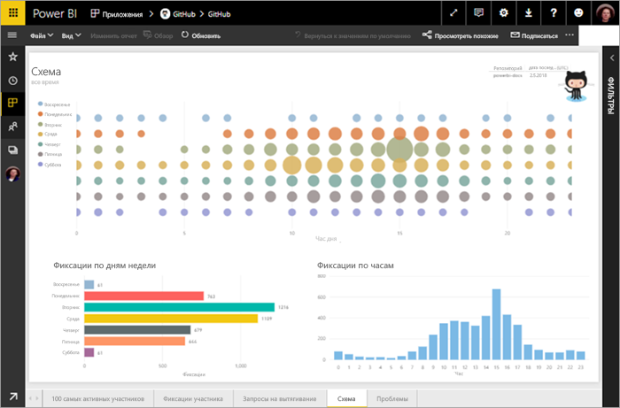
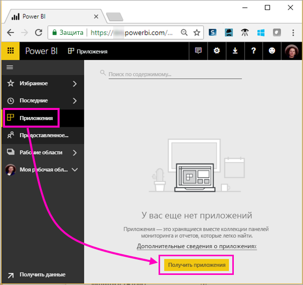
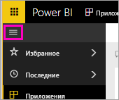
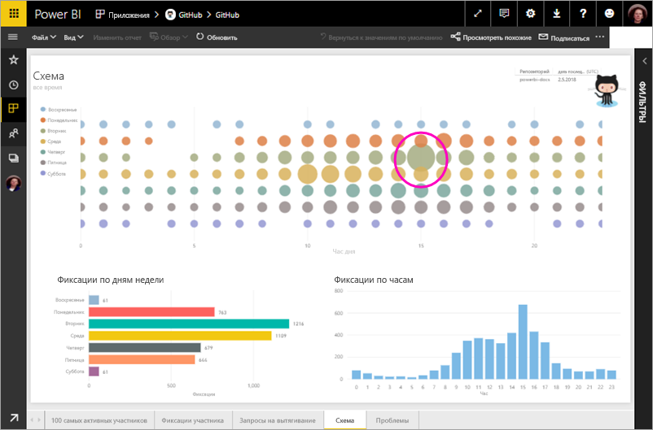
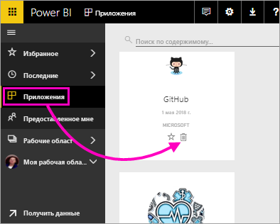

# Руководство. Подключение к репозиторию в GitHub с помощью Power BI
В этом учебнике вы подключитесь к реальным данным в службе GitHub с помощью Power BI, после чего служба Power BI автоматически создаст панели мониторинга и отчеты. Подключившись к общедоступному *репозиторию* содержимого Power BI, можно знать ответы на подобные вопросы: сколько людей участвует в создании общедоступного содержимого Power BI; кто вносит наибольший вклад; в какой день недели содержимое добавляется наиболее активно; И другие вопросы. 

В этом учебнике вы выполните следующие действия:

> [!div class="checklist"]
> * зарегистрируете учетную запись GitHub, если у вас ее еще нет; 
> * войдете в учетную запись Power BI или зарегистрируете ее, если у вас ее еще нет;
> * откроете службу Power BI;
> * найдете приложение GitHub;
> * введете сведения для общедоступного репозитория Power BI в GitHub;
> * просмотрите панель мониторинга и отчет с данными GitHub;
> * очистите ресурсы, удалив приложение.

Если вы не зарегистрированы в Power BI, перед началом работы [пройдите бесплатную регистрацию](https://app.powerbi.com/signupredirect?pbi_source=web).

## Предварительные требования

Для прохождения этого учебника требуется учетная запись GitHub. 

- [Зарегистрируйте учетную запись GitHub](/contribute/get-started-setup-github).

## Способы подключения
1. Войдите в службу Power BI (`https://app.powerbi.com`). 
2. В области навигации выберите **Приложения**, а затем — **Получить приложения**.
   
    

3. Выберите **Приложения**, в поле поиска введите **GitHub** и нажмите кнопку **Получить**.
   
    

4. В окне **Установить это приложение Power BI?** выберите **Установить**.
5. В окне **Новое приложение готово** выберите **Перейти к приложению**.
6. На экране **Начало работы с новым приложением** выберите **Подключиться**.

    

7. Введите имя и владельца репозитория. URL-адрес этого репозитория — https://github.com/MicrosoftDocs/powerbi-docs, поэтому в поле **Владелец репозитория** укажите **MicrosoftDocs**, а в поле **Репозиторий** — **powerbi-docs**. 
   
    

5. Введите созданные учетные данные GitHub. Power BI может пропустить этот шаг, если вы уже вошли в GitHub в браузере. 

6. В качестве метода **проверки подлинности** оставьте для **OAuth2**\>**Войти**.

7. Следуйте инструкциям по проверке подлинности GitHub на экране. Предоставьте Power BI разрешение на доступ к данным GitHub.
   
   Теперь Power BI может подключаться к данным в GitHub.  Данные обновляются раз в день.

8. После импорта данных в Power BI отображается содержимое новой рабочей области GitHub. 
9. Нажмите на стрелку рядом с именем рабочей области в области навигации. Отображается рабочая область, содержащая панель мониторинга и отчет. 

    

10. Щелкните **Дополнительные параметры** (...) рядом с именем панели мониторинга > **Переименовать** > введите **Панель мониторинга GitHub**.
 
     

8. Щелкните глобальный значок навигации, чтобы свернуть область навигации и освободить место на экране.

    

10. Выберите вашу панель мониторинга GitHub.
    
    Панель мониторинга GitHub содержит динамические данные, поэтому в вашем случае значения могут быть другими.

    

    

## Задать вопрос

1. Установите курсор в поле **Задать вопрос о своих данных**. Power BI предлагает **Вопросы для начала работы**. 

1. Выберите **Количество пользователей**.
 
    

13. Между **количество** и **пользователей** введите **запросов на вытягивание на**. 

     Power BI создаст линейчатую диаграмму с числом запросов на вытягивание по пользователям.

    

13. Нажмите на булавку, чтоб закрепить на панели мониторинга и выберите **Выход из вопросов и ответов**.

## Просмотр отчета GitHub 

1. На панели мониторинга GitHub выберите гистограмму **Запросы на вытягивание по месяцам**, чтобы открыть связанный отчет.

    

2. Выберите имя пользователя в диаграмме **Общее число запросов на вытягивание на пользователя**. В этом примере мы видим, что большая часть часов пришлась на февраль.

    

3. Выберите вкладку **Перфокарта**, чтобы перейти к следующей странице отчета. 
 
    

    Очевидно, что больше всего *фиксаций* приходится на 15:00 во вторник.

## Очистка ресурсов

Завершив работу с учебником, вы можете удалить приложение GitHub. 

1. В области навигации выберите **Приложения**.
2. Наведите указатель на плитку GitHub и щелкните значок **Удалить** в виде корзины.

    

## Дальнейшие действия

В этом учебнике вы подключились к общедоступному репозиторию GitHub и получили данные, которые служба Power BI отформатировала в панели мониторинга и отчете. Вы получили ответы на некоторые вопросы, изучив панель мониторинга и отчет. Теперь вы можете узнать, как подключаться к другим службами, таким как Salesforce, Microsoft Dynamics и Google Analytics. 
 
> [!div class="nextstepaction"]
> [Подключение к используемым веб-службам](service-connect-to-services.md)