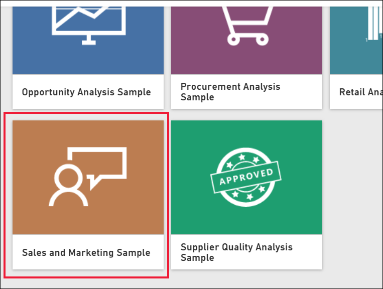
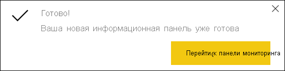
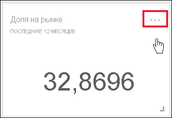
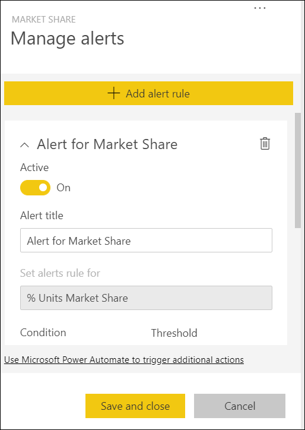
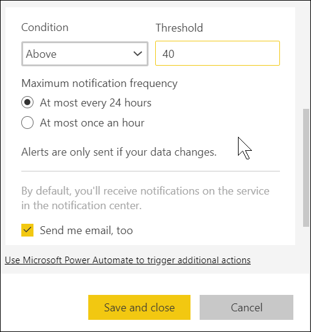
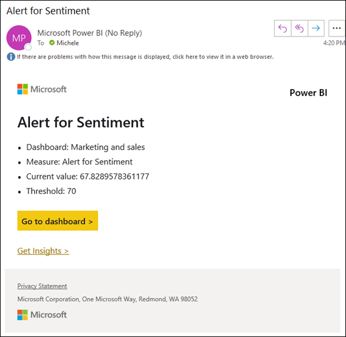
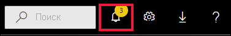
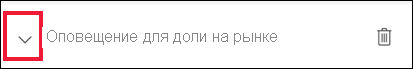
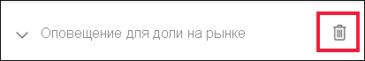
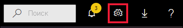

# Руководство. Настройка оповещений на панелях мониторинга Power BI

[!INCLUDE[consumer-appliesto-yynn](../includes/consumer-appliesto-yynn.md)]

[!INCLUDE [power-bi-service-new-look-include](../includes/power-bi-service-new-look-include.md)]

Вы можете настроить оповещения в службе Power BI, уведомляющие вас о том, что данные на панелях мониторинга выходят за пределы заданного порога. Оповещения можно настроить только для закрепленных плиток на основе визуальных элементов отчетов, которые содержат только датчики, ключевые показатели эффективности и карточки. 

Оповещения можно создавать для панелей мониторинга:
- которые вы создали и сохранили в разделе **Моя рабочая область**;
- к которым вам предоставлен общий доступ в [емкости Premium](end-user-license.md); 
- в любой доступной вам рабочей области, если у вас есть лицензия Power BI Pro.    

Оповещения отправляются только при обновлении данных. При обновлении данных Power BI проверяет, настроены ли для них оповещения. Если значение достигает заданного порога, оповещение срабатывает. 

Эта функция продолжает развиваться, поэтому ознакомьтесь с [разделом "Советы и устранение неполадок" ниже](#tips-and-troubleshooting).

Видеть настроенные вами оповещения можете только вы (даже если доступ к панели мониторинга предоставлен другим пользователям). Оповещения о данных полностью синхронизированы на всех платформах. Их можно настроить и просматривать [в мобильных приложениях Power BI](mobile/mobile-set-data-alerts-in-the-mobile-apps.md) и службе Power BI. 

> [!WARNING]
> Эти оповещения содержат сведения о данных. Если вы просматриваете данные Power BI на мобильном устройстве и это устройство украдено, рекомендуем отключить все оповещения с помощью службы Power BI.
> 

В этом учебнике рассматриваются следующие темы.
> [!div class="checklist"]
> * Кто может настраивать оповещения
> * Какие визуальные элементы поддерживают оповещения
> * Кто может просматривать мои оповещения
> * Работают ли оповещения в классических и мобильных приложениях Power BI
> * Как создать оповещение
> * Куда будут поступать мои оповещения

## Обязательные условия

Если вы не зарегистрированы в Power BI, перед началом работы [пройдите бесплатную регистрацию](https://app.powerbi.com/signupredirect?pbi_source=web).

1. В этом примере используется плитка карточки на панели мониторинга из примера "Продажи и маркетинг". Откройте службу Power BI (app.powerbi.com), войдите и откройте раздел **Моя рабочая область**.    
    

2. В левом нижнем углу выберите **Получить данные**.

    

3. На странице "Получение данных" выберите **Примеры**.

4. Выберите "Продажи и маркетинг — пример", затем выберите **Подключить**.

    

5. После подключения Power BI к примеру выберите **Перейти к панели мониторинга** в появившемся диалоговом окне.     
    

## Добавление оповещения на плитку панели мониторинга

1. Щелкните многоточие на плитке панели мониторинга с датчиком, ключевым показателем эффективности или карточкой.
   
   

2. Выберите значок оповещения  или элемент **Управление оповещениями**, чтобы добавить одно или несколько оповещений для карточки **Доля рынка**.

   

   
1. На панели **Управление оповещениями** выберите **+ Добавить правило оповещения**.  Установите ползунок в положение **Вкл.** и назовите оповещение. Заголовки позволяют легко распознать оповещения.
   
   
4. Прокрутите содержимое вниз и введите параметры оповещения.  В этом примере мы создадим оповещение, которое уведомляет нас раз в сутки, если доля на рынке увеличивается до 40 или выше. Оповещения будут появляться в [центре уведомлений](end-user-notification-center.md). Кроме того, служба Power BI будет отправлять нам сообщения электронной почты.
   
   

5. Щелкните **Сохранить и закрыть**.
 

   > 

## Получение оповещений
Если при обновлении данных отслеживаемые значения выходят за установленные пороги, может произойти несколько вещей. Сначала Power BI проверяет, прошло ли больше часа или 24 часов (в зависимости от выбранного варианта) с момента отправки предыдущего оповещения. Оповещение приходит тогда, когда пороговое значение, заданное для оповещения, превышено.

После этого Power BI отправляет оповещение в центр уведомлений и, при необходимости, по электронной почте. Каждое оповещение содержит прямую ссылку на данные. Щелкните ссылку, чтобы просмотреть соответствующую плитку.  

1. Если вы включили отправку оповещений на электронную почту, в ваш ящик придет примерно такое сообщение: Это оповещение, которое мы задали для карточки **Тональность**.
   
   
2. Power BI также добавляет сообщение в **центр уведомлений**.
   
   
3. Чтобы просмотреть подробные сведения об оповещении, откройте свой Центр уведомлений.
   
    
   
  

## Управление оповещениями

Управлять оповещениями можно разными способами: непосредственно на плитке панели мониторинга, в меню параметров Power BI, а также на соответствующих плитках в [мобильном приложении Power BI для iPhone](mobile/mobile-set-data-alerts-in-the-mobile-apps.md) или [мобильном приложении Power BI для Windows 10](mobile/mobile-set-data-alerts-in-the-mobile-apps.md).

### Непосредственно с плитки

1. Если нужно изменить или удалить оповещение для плитки, снова откройте окно **Управление оповещениями**, выбрав значок оповещения . Отобразятся все оповещения, заданные вами для этой плитки.
   
    .
2. Чтобы изменить оповещение, нажмите на стрелку рядом с его названием.
   
    .
3. Чтобы удалить оповещение, выберите значок корзины справа от его названия.
   
      

### Меню параметров Power BI

1. Выберите значок шестеренки в строке меню Power BI.
   
    .
2. В разделе **Параметры** выберите **Оповещения**.
   
    
3. Здесь можно включать, отключать и удалять оповещения, а также открывать окно **Управление оповещениями** для внесения изменений.

## Советы и устранение неполадок 

* Если вы не можете настроить оповещение для датчика, ключевого показателя эффективности или карточки, обратитесь к администратору арендатора или в службу ИТ-поддержки. Иногда оповещения отключены или недоступны для панели мониторинга или для отдельных типов плиток панели мониторинга.
* Оповещения отправляются только при обновлении данных. Они не работают со статическими данными. Большинство примеров, предоставляемых корпорацией Майкрософт, являются статическими. 
* Для получения и просмотра общего содержимого нужна лицензия Power BI Pro или Premium. Дополнительные сведения см. в статье [Использование службы Power BI в качестве потребителя](end-user-license.md).
* Можно настроить оповещения для визуальных элементов на основе потоковых наборов данных, если они закреплены на панели мониторинга из отчета. Для плиток потоковой передачи, созданных непосредственно на панели мониторинга с помощью элементов **Добавление плитки** > **Пользовательские данные потоковой передачи**, оповещения настроить невозможно.

## Очистка ресурсов
Инструкции по удалению оповещений приводятся выше. Коротко говоря, следует щелкнуть значок шестеренки в строке меню Power BI. В разделе **Параметры** выберите **Оповещения** и удалите нужное оповещение.

> [!div class="nextstepaction"]
> [Настройка оповещений о данных на мобильном устройстве](mobile/mobile-set-data-alerts-in-the-mobile-apps.md)

