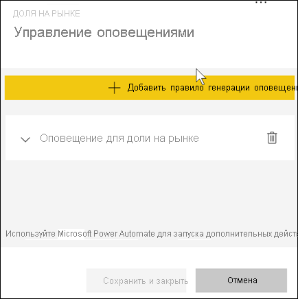

# Руководство. Настройка оповещений на панелях мониторинга Power BI
Вы можете настроить оповещения, уведомляющие вас о том, что данные на панелях мониторинга выходят за пределы заданного порога. Поддерживаются оповещения для датчиков, ключевых показателей эффективности и карточек. Эта функция продолжает развиваться, поэтому ознакомьтесь с [разделом "Советы и устранение неполадок" ниже](#tips-and-troubleshooting).

Видеть настроенные вами оповещения можете только вы (даже если доступ к панели мониторинга предоставлен другим пользователям). Оповещения о данных полностью синхронизированы на всех платформах. Их можно настроить и просматривать [в мобильных приложениях Power BI](mobile/mobile-set-data-alerts-in-the-mobile-apps.md) и службе Power BI. 

> [!WARNING]
> Эти оповещения содержат сведения о данных. Если вы просматриваете данные Power BI на мобильном устройстве и это устройство украдено, рекомендуем отключить все оповещения с помощью службы Power BI.
> 

В этом учебнике рассматриваются следующие темы.
> [!div class="checklist"]
> * Кто может настраивать оповещения
> * Какие визуальные элементы поддерживают оповещения
> * Кто может просматривать мои оповещения
> * Работают ли оповещения в классических и мобильных приложениях Power BI
> * Как создать оповещение
> * Куда будут поступать мои оповещения

Если вы не зарегистрированы в Power BI, перед началом работы [пройдите бесплатную регистрацию](https://app.powerbi.com/signupredirect?pbi_source=web).

В этом примере используется плитка карточки на панели мониторинга из примера приложения "Продажи и маркетинг". Это приложение доступно в [Microsoft AppSource](https://appsource.microsoft.com). Сведения о получении приложения см. в статье об [установке и использовании приложений в Power BI](end-user-app-view.md).

1. Щелкните многоточие на плитке панели мониторинга с датчиком, ключевым показателем эффективности или карточкой.
   
   
2. Выберите значок колокольчика  или **Управление оповещениями**, чтобы добавить одно оповещение или несколько для показателя **Общее число магазинов**.

   

   
1. На панели **Управление оповещениями** выберите **+ Добавить правило оповещения**.  Установите ползунок в положение **Вкл.** и назовите оповещение. Заголовки позволяют легко распознать оповещения.
   
   
4. Прокрутите содержимое вниз и введите параметры оповещения.  В этом примере мы создадим оповещение, которое уведомляет нас раз в сутки, если доля на рынке увеличивается до 35 или выше. Оповещения будут появляться в Центре уведомлений. Кроме того, служба Power BI будет отправлять нам сообщения электронной почты.
   
   
5. Щелкните **Сохранить и закрыть**.
 
   > [!NOTE]
   > Оповещения отправляются только при обновлении данных. При обновлении данных Power BI проверяет, настроены ли для них оповещения. Если значение достигает заданного порога, оповещение срабатывает. 
   > 

## Получение оповещений
Если при обновлении данных отслеживаемые значения выходят за установленные пороги, может произойти несколько вещей. Сначала Power BI проверяет, прошло ли больше часа или 24 часов (в зависимости от выбранного варианта) с момента отправки предыдущего оповещения. Оповещение приходит тогда, когда пороговое значение, заданное для оповещения, превышено.

После этого Power BI отправляет оповещение в центр уведомлений и, при необходимости, по электронной почте. Каждое оповещение содержит прямую ссылку на данные. Щелкните ссылку, чтобы просмотреть соответствующую плитку.  

1. Если вы включили отправку оповещений на электронную почту, в ваш ящик придет примерно такое сообщение: Это оповещение, которое мы настроили на другой панели мониторинга. На этой панели мониторинга отслеживаются задачи, выполненные группой по удобству работы.
   
   
2. Power BI добавляет сообщение в ваш **Центр уведомлений**, а также значок нового оповещения на соответствующую плитку.
   
   
3. Чтобы просмотреть подробные сведения об оповещении, откройте свой Центр уведомлений.
   
    
   
  

## Управление оповещениями

Управлять оповещениями можно разными способами: непосредственно на плитке панели мониторинга, в меню параметров Power BI, а также на соответствующих плитках в [мобильном приложении Power BI для iPhone](mobile/mobile-set-data-alerts-in-the-mobile-apps.md) или [мобильном приложении Power BI для Windows 10](mobile/mobile-set-data-alerts-in-the-mobile-apps.md).

### Непосредственно с плитки

1. Если нужно изменить или удалить оповещение для плитки, снова откройте окно **Manage alerts** (Управление оповещениями), выбрав значок колокольчика . Отобразятся все оповещения, заданные вами для этой плитки.
   
    .
2. Чтобы изменить оповещение, нажмите на стрелку рядом с его названием.
   
    .
3. Чтобы удалить оповещение, выберите значок корзины справа от его названия.
   
      

### Меню параметров Power BI

1. Выберите значок шестеренки в строке меню Power BI.
   
    .
2. В разделе **Параметры** выберите **Оповещения**.
   
    
3. Здесь можно включать, отключать и удалять оповещения, а также открывать окно **Управление оповещениями** для внесения изменений.

## Советы и устранение неполадок 

* Оповещения можно настраивать только для датчиков, ключевых показателей эффективности и карточек.
* Если вы не можете настроить оповещение для датчика, ключевого показателя эффективности или карточки, обратитесь к системному администратору. Иногда оповещения отключены или недоступны для панели мониторинга или для отдельных типов плиток панели мониторинга.
* Оповещения отправляются только при обновлении данных. Они не работают со статическими данными. Большинство примеров, предоставляемых корпорацией Майкрософт, являются статическими. 

## Очистка ресурсов
Инструкции по удалению оповещений приводятся выше. Коротко говоря, следует щелкнуть значок шестеренки в строке меню Power BI. В разделе **Параметры** выберите **Оповещения** и удалите нужное оповещение.

> [!div class="nextstepaction"]
> [Настройка оповещений о данных на мобильном устройстве](mobile/mobile-set-data-alerts-in-the-mobile-apps.md)

