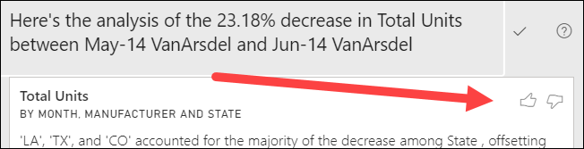

# Использование функции анализа для объяснения колебаний в визуальных элементах отчетов (предварительная версия)

[!INCLUDE[consumer-appliesto-ynnn](../includes/consumer-appliesto-ynnn.md)]

Часто в визуальных элементах отчета вы видите значительный рост или резкое снижение значений, и встает вопрос о причине таких колебаний. С помощью функции **анализа** в **службе Power BI** эту причину можно узнать всего за несколько щелчков.

Например, рассмотрим следующий визуальный элемент, отображающий *общее количество единиц* в *месяц* и по *производителю*. VanArsdel превосходит своих конкурентов, но в июне 2014 года был его глубокий спад. В таких случаях можно подробнее исследовать данные, чтобы пояснить такие изменения. 

Вы можете запросить в службе Power BI объяснение роста, снижения показателей или необычного распределения в визуальных элементах, а также быстро выполнить автоматический информативный анализ своих данных. Просто щелкните правой кнопкой мыши точку данных и выберите **Анализ > Объяснить снижение** (или "Объяснить рост", если предыдущая строка на диаграмме меньше), либо **Анализ > Найти, в чем отличие распределения**, и вы получите ценную информацию в удобном окне.

Функция анализа — это контекстная функция, результаты которой зависят от последней точки данных, например предыдущей строки или столбца.

> [!NOTE]
> Эта функция находится на стадии предварительной версии и подлежит изменению. Функция аналитики включена по умолчанию (не требуется устанавливать флажок предварительной версии, чтобы включить ее).

### Выбранные факторы и категории

После изучения различных столбцов Power BI выбирает и выводит столбцы, в которых показано самое большое изменение относительной доли. Для каждого из них самые важные для изменения доли значения выводятся в описании. Кроме того, выводятся значения с наибольшим фактическим ростом или снижением.

Чтобы просмотреть все аналитические сведения, созданные Power BI, используйте полосу прокрутки. Порядок ранжируется с наиболее значимым участником, отображаемым первым. 

## Использование аналитики
Чтобы использовать аналитические сведения для объяснения тенденций, видимых на визуальных элементах, щелкните правой кнопкой мыши любую точку данных на линейчатой диаграмме или графике и выберите **Анализ**. Затем выберите отображаемый параметр: **Объяснить рост**, **Объяснить снижение** или **Explain the difference** (Объяснить разницу).

Power BI запустит алгоритмы машинного обучения с использованием данных, и в окне появится визуальный элемент с описанием того, какие категории больше всего повлияли на рост, снижение или разницу.  В этом примере первые аналитические сведения представляют собой каскадную диаграмму.

С помощью небольших значков в нижней части каскадного визуального элемента можно отобразить аналитические данные в виде точечной диаграммы, гистограммы с накоплением или диаграммы ленты.

Используйте значки *Палец вверх* и *Палец вниз* в верхней части страницы. С их помощью вы можете оставить отзыв о визуальном элементе и функции.  

Аналитику можно использовать, когда отчет находится в режиме чтения или правки, что позволяет выполнять в нем анализ данных и создавать визуальные элементы, которые вы можете легко добавлять в отчеты. Если отчет открыт в режиме правки, рядом со значками пальцев вверх и вниз появится значок "плюс". Щелкните значок "плюс", чтобы добавить аналитические сведения в отчет в качестве нового визуального элемента. 

## Сведения о возвращаемых результатах

Сведения, возвращаемые функцией аналитических сведений, показывают, что изменилось между двумя периодами времени, чтобы вам было проще понять произошедшие изменения.  

Алгоритм берет все столбцы в модели, рассчитывает разбивку по столбцам для периодов *до* и *после*, определяет, насколько значительные изменения произошли в этой разбивке, а затем возвращает столбцы с самыми крупными изменениями. Например, пункт *Состояние* был выбран в приведенных выше каскадных аналитических сведениях, так как вклад, сделанный Луизианой, Техасом и Колорадо, составлял от 13 % до 19 % с июня по июль и стал наибольшим уменьшением в *общем количестве единиц*.  

Для возвращенных аналитических сведений может отображаться четыре визуальных элемента. Три из этих визуальных элементов подчеркивают изменение доли между двумя периодами. Например, чтобы объяснить рост между *вторым* и *третьим* кварталами. На диаграмме ленты показано изменение как до, так и после выбранной точки данных.

### Точечная диаграмма

Точечная диаграмма показывает значение меры в первый период (по оси x) и значение меры во второй период (по оси y) для каждого значения столбца (в данном случае — *Состояние*). Точки данных располагаются в зеленой области, если значения увеличились, и в красной — если сократились. 

Пунктирная линия показывает среднее значение. Поэтому точки выше линии увеличились больше, чем общий рост, а точки ниже — меньше.  

Если значение элемента данных было пустым в любой период, эти элементы не будут отображаться на точечной диаграмме.

### Нормированная гистограмма с накоплением

Визуальный элемент нормированной гистограммы с накоплением показывает значение вклада в общее количество (100 %) для выбранной точки данных и предыдущего объекта. Таким образом, вы можете параллельно сравнивать долю для каждой точки данных. В этом примере подсказки показывают фактическую долю для выбранного значения Техаса. Так как список состояний длинный, подсказки помогают просмотреть подробные сведения. Благодаря всплывающим подсказкам мы видим, что Техас внес примерно тот же процент к общему количеству единиц (31 % и 32 %), а фактическое число единиц уменьшилось с 89 до 71. Помните, что ось Y содержит количество в процентах, а не общее количество, а каждая полоса столбца — количество процентов, а не значение. 

### Ленточная диаграмма

Ленточная диаграмма показывает значение меры до и после. Это особенно удобно для просмотра изменений участника, если при этом изменился *порядок* участников (например, *LA* занимал второе место, а затем опустился на одиннадцатое).  Несмотря на то, что *TX* представляется широкой лентой в верхней части, обозначающей, что он является наиболее значимым участником до и после, снижение показывает, что значение вклада упало как в течение выбранного периода, так и после.

### Каскадная диаграмма

Четвертый визуальный элемент — это каскадная диаграмма, где отображается фактический рост и снижение между периодами. Этот визуальный элемент наглядно показывает один значительный вклад до уменьшения за июнь 2014 года. В данном случае **Состояние**. Кроме того, влияние **состояния**на общее количество единиц заключается в том, что снижения в Луизиане, Техасе и Колорадо играют наиболее важную роль.      

 

## Рекомендации и ограничения
Так как результаты анализа основаны на сведениях об изменениях, которые поступают из предыдущей точки данных, они не будут доступны при выборе первой точки данных в визуальном элементе. 

**Анализ** недоступен для всех типов визуальных элементов. 

В следующем списке представлена коллекция сценариев, которые сейчас не поддерживаются для функции **анализ (объяснения снижения, роста и разницы)** :

* фильтры "Ведущие N";
* фильтры включения и исключения;
* фильтры мер;
* нечисловые меры.
* Использование функции "Показать значение как"
* Отфильтрованные меры — это расчеты на уровне визуального элемента с применением определенного фильтра (например, *Общий объем продаж для Франции*), которые используются в некоторых визуальных элементах, созданных функцией аналитических сведений.
* категориальные столбцы по оси X, только если они не определяют порядок сортировки по столбцам, которые являются скалярными (но если используется иерархия, то каждый столбец в активной иерархии должен соответствовать этому условию);

## Дальнейшие действия
[Каскадные диаграммы в Power BI](../visuals/power-bi-visualization-waterfall-charts.md)    
[Точечные и пузырьковые диаграммы в Power BI](../visuals/power-bi-visualization-scatter.md)
[Визуализации в отчетах Power BI](../visuals/power-bi-report-visualizations.md)
[Создание ленточных диаграмм в Power BI](../visuals/desktop-ribbon-charts.md)
