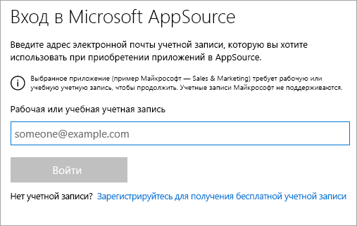
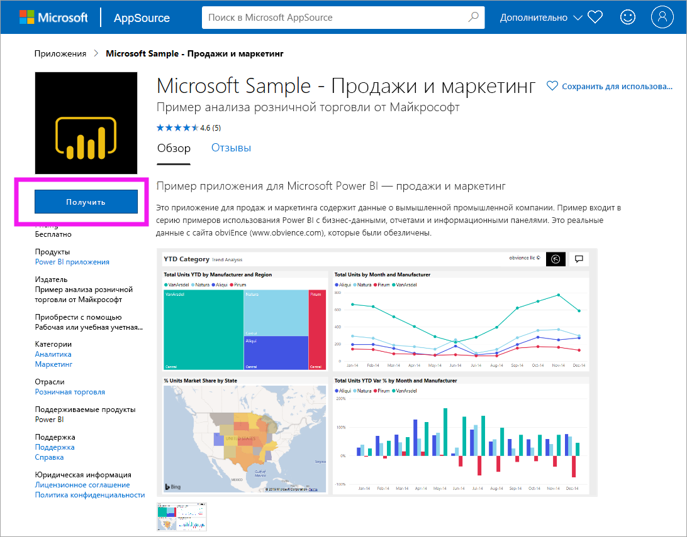
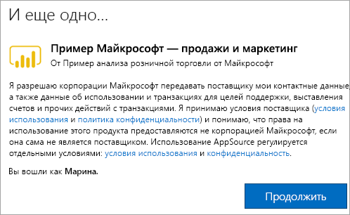

# Установка и использование образца приложения "Маркетинг и продажи" в службе Power BI

[!INCLUDE[consumer-appliesto-yyny](../includes/consumer-appliesto-yyny.md)]

После знакомства с [общими принципами получения содержимого Power BI](end-user-app-view.md) вы уже представляете, как получить приложение "Маркетинг и продажи" с веб-сайта Microsoft AppSource (appsource.com). 

## Microsoft AppSource (appsource.com)
Ссылка на приложение: [Приложение "Маркетинг и продажи"](https://appsource.microsoft.com/product/power-bi/microsoft-retail-analysis-sample.salesandmarketingsample?tab=Overview). Щелкните эту ссылку, чтобы открыть страницу для скачивания этого приложения с веб-сайта Microsoft AppSource. 

1. Для получения приложения может потребоваться выполнить вход в систему. Укажите для этого тот же адрес электронной почты, который вы используете для работы с Power BI. 

    

2. Выберите **Get it now** (Получить). 

    

3. При первом входе на веб-сайт AppSource необходимо принять условия использования. 

    

4. Откроется служба Power BI. Подтвердите, что хотите установить это приложение.

    

5. После установки приложения в службе Power BI появится сообщение об успешном выполнении операции. Выберите **Перейти к приложению**, чтобы открыть приложение. В зависимости от того, как разработчик создал приложение, появится либо панель мониторинга приложения, либо отчет о приложении.

    

    Приложение можно открыть непосредственно из списка содержимого приложений, выбрав пункт **Приложения**, а затем — **Продажи и маркетинг**.

    

6. Выберите, что вы хотите сделать: исследовать или настроить новое приложение и предоставить к нему общий доступ. Так как мы выбрали пример приложения Майкрософт, начнем с его изучения. 

    

7.  Откроется новое приложение с панелью мониторинга. *Разработчик* приложений также мог настроить открытие приложения с отчетом.  

    

## Взаимодействие с панелями мониторинга и отчетами в приложении
Изучите данные на панелях мониторинга и в отчетах, входящих в состав приложения. Вам доступны все стандартные возможности взаимодействия Power BI, такие как фильтрация, выделение, сортировка и детализация.  Все еще немного путаете панели мониторинга и отчеты?  Прочите [статью о панелях мониторинга](end-user-dashboards.md) и [статью об отчетах](end-user-reports.md).  

## Дальнейшие действия
* [Общие сведения о приложениях](end-user-apps.md)
* [Просмотр отчета Power BI](end-user-report-open.md)
* [Другие способы предоставления общего доступа к содержимому](end-user-shared-with-me.md)
