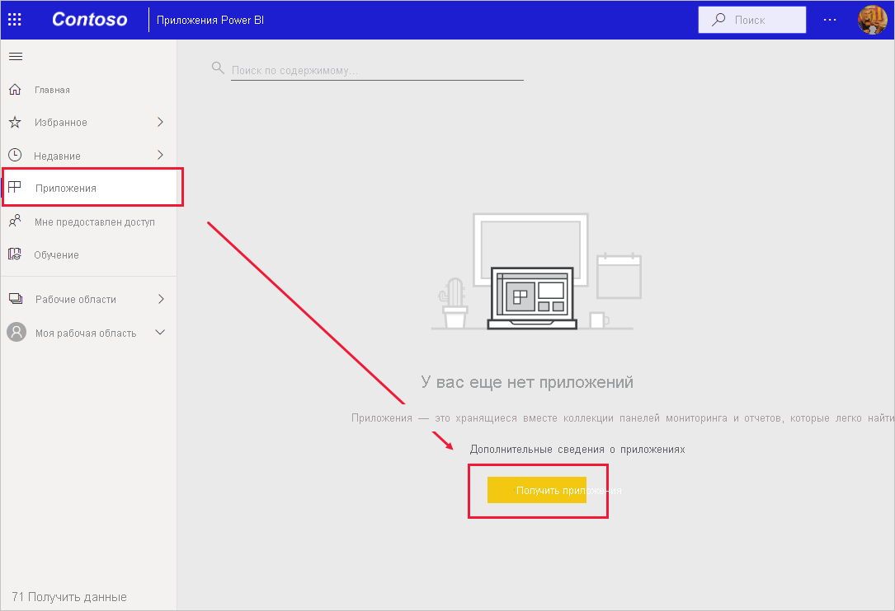
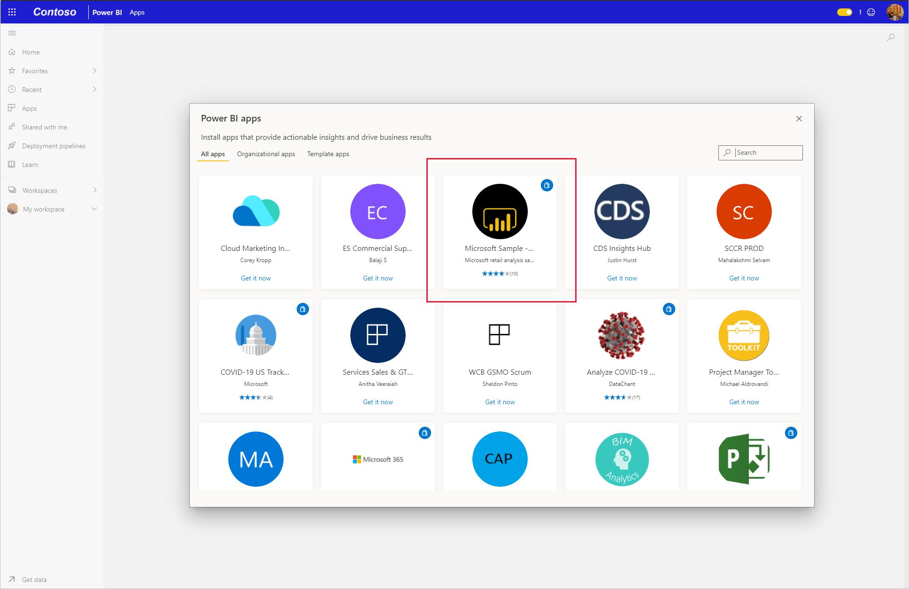
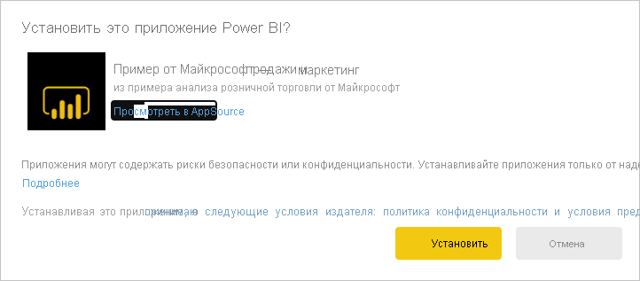
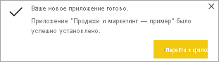
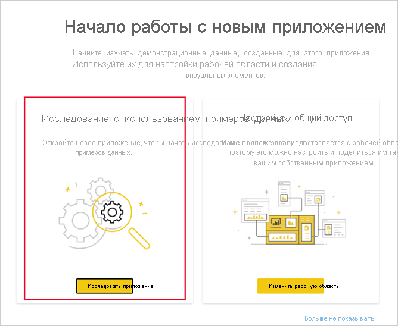

# Установка и использование образца приложения "Маркетинг и продажи" в службе Power BI

[!INCLUDE[consumer-appliesto-yyny](../includes/consumer-appliesto-yyny.md)]

После знакомства с [общими принципами получения содержимого Power BI](end-user-app-view.md) вы уже представляете, как получить приложение "Маркетинг и продажи" с веб-сайта Microsoft AppSource (appsource.com). 

## Получение приложения из Marketplace для приложений Power BI

1. [Войдите в службу Power BI](./end-user-sign-in.md) (если вы еще не сделали этого). 

1. В Power BI выберите **Приложения > Получить приложения**. 

    

1. Откроется Marketplace для приложений Power BI. Найдите приложение "Продажи и маркетинг". Если вы не видите его, попробуйте ввести "Продажи" в поле поиска.

    

1. Щелкните плитку приложения. Откроется предложение приложения в AppSource. Щелкните **ПОЛУЧИТЬ**.

   

1. Подтвердите, что хотите установить это приложение.

   

5. После установки приложения в службе Power BI появится сообщение о ее успешном выполнении. Выберите **Перейти к приложению**, чтобы открыть приложение. В зависимости от того, как разработчик создал приложение, появится либо панель мониторинга приложения, либо отчет о приложении.

    

    Приложение можно открыть непосредственно из списка содержимого приложений, выбрав пункт **Приложения**, а затем — **Продажи и маркетинг**.

    

6. Выберите, что вы хотите сделать: исследовать или настроить новое приложение и предоставить к нему общий доступ. Так как мы выбрали пример приложения Майкрософт, начнем с его изучения. 

    

7.  Откроется новое приложение с панелью мониторинга. *Разработчик* приложений также мог настроить открытие приложения с отчетом.  

    

## Взаимодействие с панелями мониторинга и отчетами в приложении
Изучите данные на панелях мониторинга и в отчетах, входящих в состав приложения. Вам доступны все стандартные возможности взаимодействия Power BI, такие как фильтрация, выделение, сортировка и детализация.  Все еще немного путаете панели мониторинга и отчеты?  Прочите [статью о панелях мониторинга](end-user-dashboards.md) и [статью об отчетах](end-user-reports.md).  

## Дальнейшие действия
* [Общие сведения о приложениях](end-user-apps.md)
* [Просмотр отчета Power BI](end-user-report-open.md)
* [Другие способы предоставления общего доступа к содержимому](end-user-shared-with-me.md)
