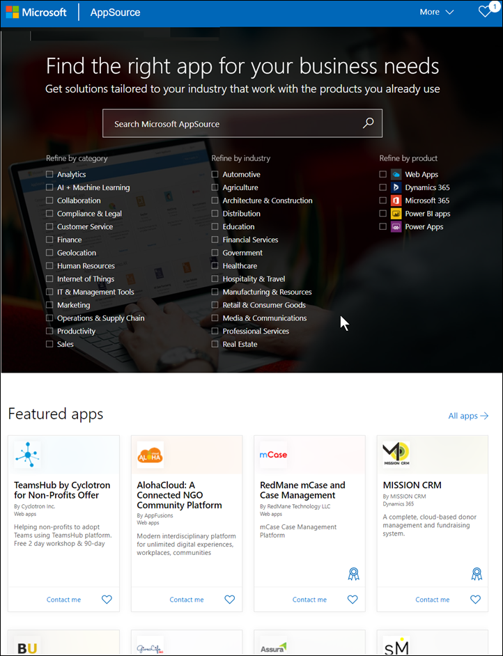

# Установка и использование образца приложения "Маркетинг и продажи" в службе Power BI

[!INCLUDE[consumer-appliesto-yyny](../includes/consumer-appliesto-yyny.md)]

После знакомства с [общими принципами получения содержимого Power BI](end-user-app-view.md) давайте получим приложение "Маркетинг и продажи" с использованием Microsoft AppSource. 

## Получение приложения из Microsoft AppSource

1. Откройте [https://appsource.microsoft.com](https://appsource.microsoft.com).

   

1. В поле поиска введите **Маркетинг** и установите флажок рядом с параметром **Уточнить по продукту > Приложения Power BI**. 

    

1. Выберите плитку приложения **Пример Майкрософт — продажи и маркетинг**. При необходимости изучите общие сведения и обзоры и просмотрите изображения.  Затем нажмите кнопку **Получить**.

   

1. Подтвердите, что хотите установить это приложение.

   

5. После установки приложения в службе Power BI появится сообщение о ее успешном выполнении. Выберите **Перейти к приложению**, чтобы открыть приложение. В зависимости от того, как разработчик создал приложение, появится либо панель мониторинга приложения, либо отчет о приложении.

    

    Приложение можно открыть непосредственно из списка содержимого приложений, выбрав пункт **Приложения**, а затем — плитку приложения **Продажи и маркетинг**.

    

6. Выберите, следует ли подключить собственные данные, исследовать их с помощью демонстрационных данных либо настроить новое приложение и поделиться им. Так как мы выбрали пример приложения Майкрософт, начнем с его изучения. 

    

7.  Откроется новое приложение с панелью мониторинга. *Разработчик* приложений также мог настроить открытие приложения с отчетом.  

    

## Взаимодействие с панелями мониторинга и отчетами в приложении
Изучите данные на панелях мониторинга и в отчетах, входящих в состав приложения. Вам доступны все стандартные возможности взаимодействия Power BI, такие как фильтрация, выделение, сортировка и детализация.  Все еще немного путаете панели мониторинга и отчеты?  Прочите [статью о панелях мониторинга](end-user-dashboards.md) и [статью об отчетах](end-user-reports.md).  

## Дальнейшие действия
* [Общие сведения о приложениях](end-user-apps.md)    
* [Просмотр отчета Power BI](end-user-report-open.md)    
* [Другие способы предоставления общего доступа к содержимому](end-user-shared-with-me.md)
