# Установка и использование приложений с информационными панелями и отчетами в Power BI
Теперь, когда у вас есть [базовое представление о приложениях](end-user-apps.md), давайте узнаем, как открыть приложение и работать с ним. 

## Получение нового приложения
Существует несколько способов получения нового приложения. Ваш коллега, создавший отчет, может автоматически установить приложение в вашей учетной записи Power BI или отправить вам прямую ссылку на приложение. Вы можете перейти на AppSource и выполнить поиск приложений, доступных от разработчиков, в компании и за ее пределами. 

В Power BI на мобильном устройстве вы можете установить приложение только по прямой ссылке, но не из AppSource. Если разработчик приложения автоматически установит приложение, вы увидите его в своем списке приложений.

## Установка приложения по прямой ссылке
Простейший путь установить новое приложение самостоятельно — это получить по электронной почте прямую ссылку на приложение от его разработчика.  

**На компьютере** 

Если щелкнуть эту ссылку в письме, служба Power BI ([https://powerbi.com](https://powerbi.com)) откроет приложение в браузере. 

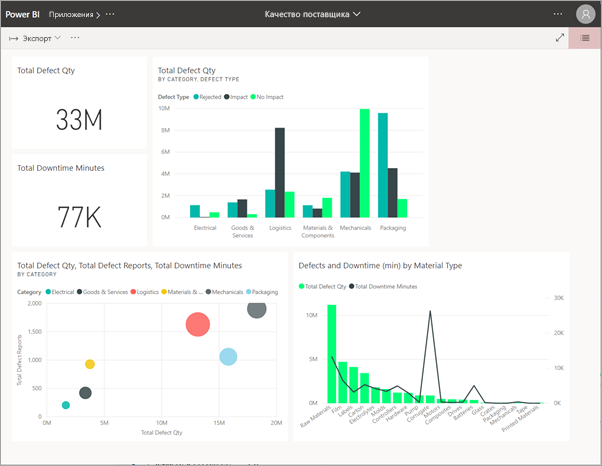

**На мобильном устройстве iOS или Android** 

Если щелкнуть ссылку в письме на мобильном устройстве, приложение установится автоматически и откроется на мобильном устройстве. Может потребоваться сначала выполнить вход. 

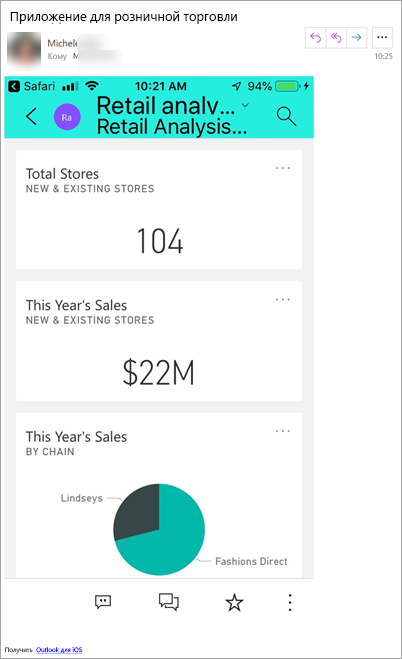

## Получение приложения из Microsoft AppSource
Вы также можете найти и установить приложения в Microsoft AppSource. Отображаются только приложения, к которым у вас есть доступ (т. е. автор предоставил вам или всем разрешение).

1. Выберите **Приложения**  > **Получить приложения**. 
   
        
2. Вы можете выполнить поиск в AppSource в разделе **Моя организация**, чтобы сократить количество результатов и найти необходимое приложение.
   
    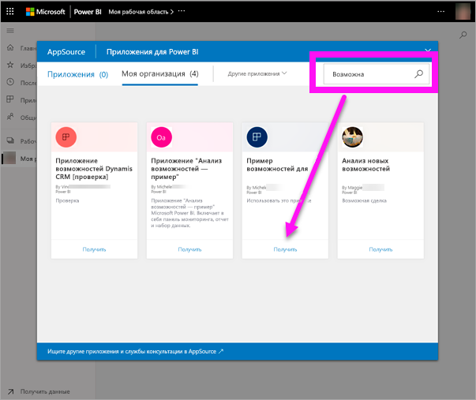
3. Выберите **Получить**, чтобы добавить его в список "Приложения". 

## Получение приложения с веб-сайта Microsoft AppSource (https://appsource.microsoft.com) )
В этом примере мы откроем один из примеров приложений Майкрософт. В AppSource доступны приложения для многих служб, которые вы используете для своей работы.  Это такие службы, как Salesforce, Microsoft Dynamics, Google Analytics, GitHub, Zendesk, Marketo и многие другие. Дополнительные сведения см. в статье [Подключение к используемым службам с помощью Power BI](../service-connect-to-services.md). 

1. В браузере откройте https://appsource.microsoft.com и выберите **Приложения Power BI**.

    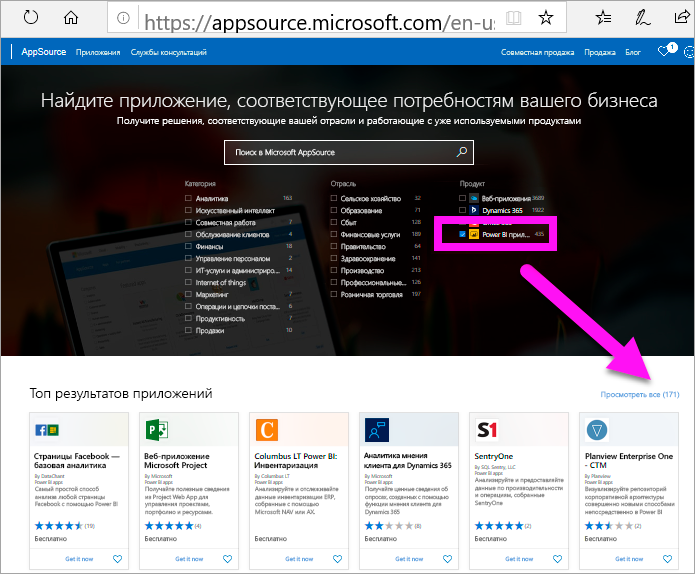

2. Выберите **Показать все**, чтобы отобразить список всех приложений Power BI, доступных в настоящее время в AppSource. Найдите приложение **Продажи и маркетинг — пример**.

    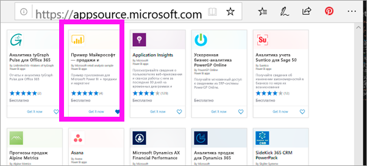

3. Выберите **Получить** и примите условия использования.

    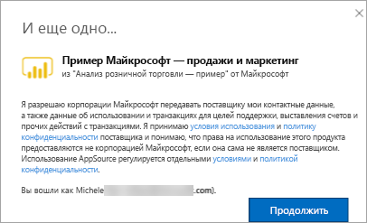

4. Подтвердите, что хотите установить это приложение.

    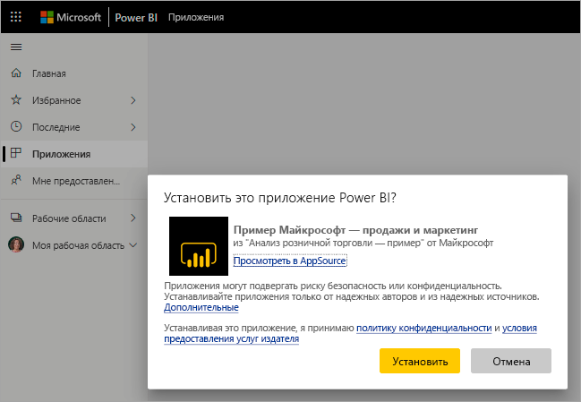

5. После установки приложения в службе Power BI появится сообщение об успешном выполнении операции. Выберите **Перейти к приложению**, чтобы открыть приложение. В зависимости от того, как разработчик создал приложение, появится либо панель мониторинга приложения, либо отчет о приложении.

    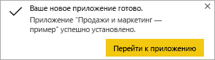

    Приложение можно открыть непосредственно из списка содержимого приложений, выбрав пункт **Приложения**, а затем — **Продажи и маркетинг**.

    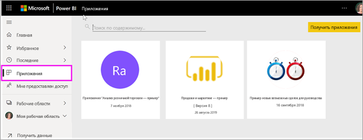

6. Выберите, что вы хотите сделать: исследовать или настроить новое приложение и предоставить к нему общий доступ. Так как мы выбрали пример приложения Майкрософт, начнем с его изучения. 

    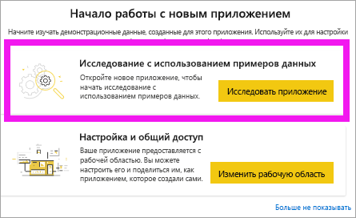

7.  Откроется новое приложение с панелью мониторинга. *Разработчик* приложений мог настроить открытие приложения с отчетом.  

    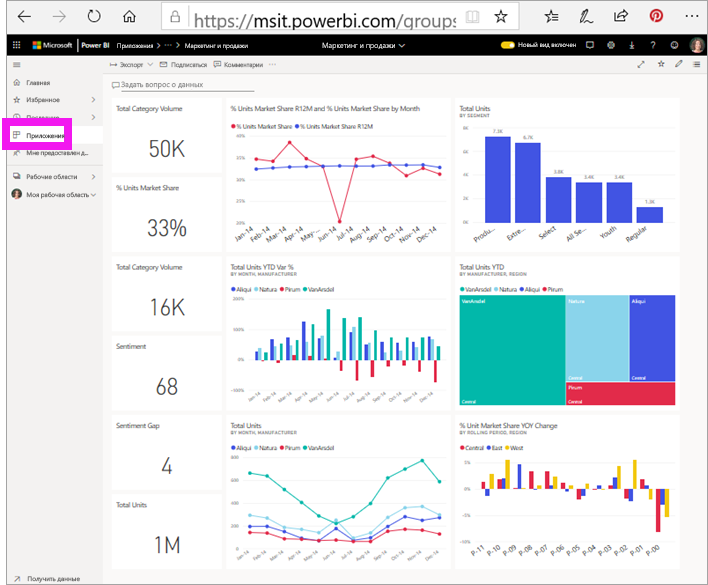

## Взаимодействие с панелями мониторинга и отчетами в приложении
Изучите данные на панелях мониторинга и в отчетах, входящих в состав приложения. Вам доступны все стандартные возможности взаимодействия Power BI, такие как фильтрация, выделение, сортировка и детализация.  Все еще немного путаете панели мониторинга и отчеты?  Прочите [статью о панелях мониторинга](end-user-dashboards.md) и [статью об отчетах](end-user-reports.md).  

## Дальнейшие действия
* [Общие сведения о приложениях](end-user-apps.md)
* [Просмотр отчета Power BI](end-user-report-open.md)
* [Другие способы предоставления общего доступа к содержимому](end-user-shared-with-me.md)
