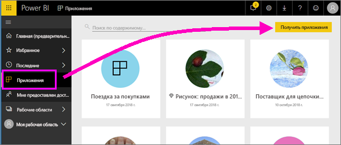
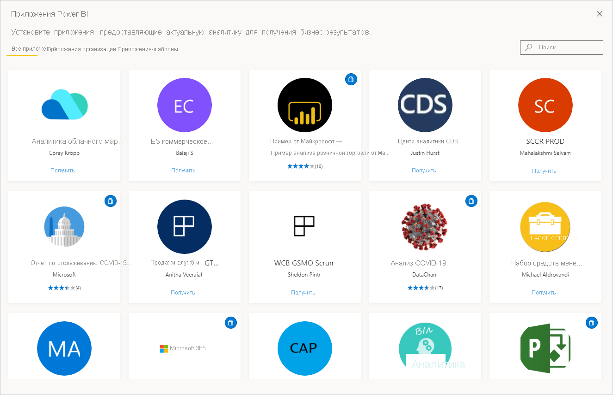
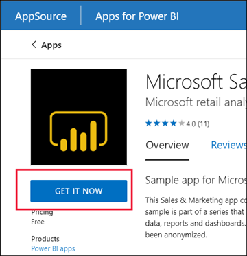
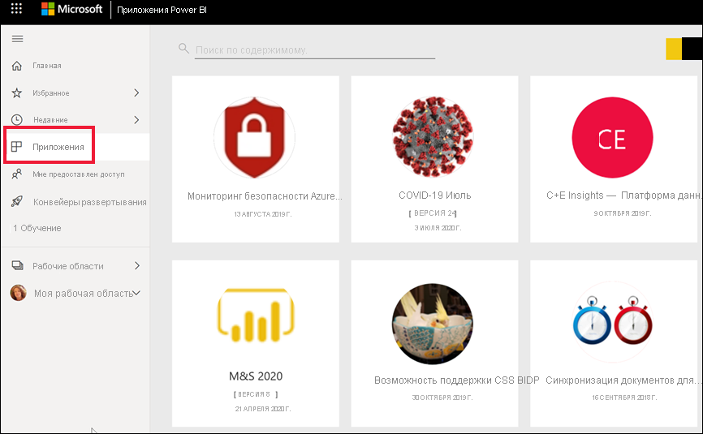
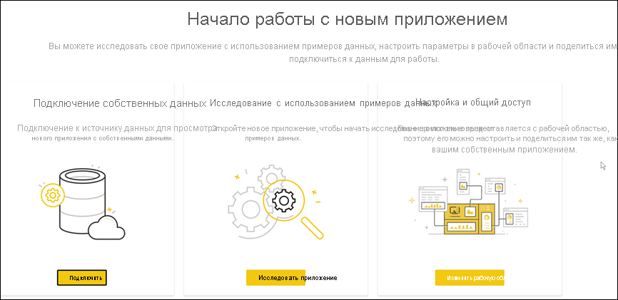
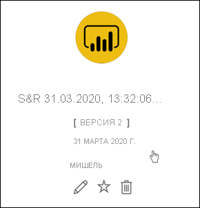

# Установка и использование приложений с информационными панелями и отчетами в Power BI

[!INCLUDE[consumer-appliesto-ynny](../includes/consumer-appliesto-ynny.md)]

[!INCLUDE [power-bi-service-new-look-include](../includes/power-bi-service-new-look-include.md)]

Теперь, когда у вас есть [базовое представление о приложениях](end-user-apps.md), давайте узнаем, как открыть приложение и работать с ним. 

## Получение нового приложения
Новое приложение можно получить несколькими способами.
* Его можно получить в магазине приложений Power BI в службе Power BI.
* Вы можете использовать прямую ссылку на приложение, полученную от его автора. 
* Конструктор приложений организации может автоматически установить приложение в вашу учетную запись Power BI.

В мобильном приложении Power BI приложение можно установить только по прямой ссылке. Если разработчик приложения автоматически установит приложение, вы увидите его в своем списке приложений.

## Приложения и лицензии
Не все пользователи Power BI могут просматривать приложения и взаимодействовать с ними. 
- Если у вас бесплатная лицензия, вы можете открывать приложения, которые хранятся в емкости Premium и к которым вам предоставлен доступ.  
- Если у вас есть лицензия Pro, вы можете открывать приложения, к которым вам предоставлен доступ.

Поэтому, если вы не можете открыть приложения, обратитесь к администратору или в службу поддержки. Сведения о лицензировании см. в разделе [Лицензирование Power BI](end-user-license.md).

## Получение приложения из Marketplace для приложений Power BI

Приложения можно найти и установить из Marketplace для приложений Power BI. В Marketplace для приложений можно получить как приложения организации, так и приложения-шаблоны.

- *Приложение организации* доступно для пользователей Power BI в вашей организации. Эти приложения также включают готовые панели мониторинга и отчеты, которые можно использовать в том виде, в котором они представлены, или настраивать и совместно использовать их. В организации могут быть приложения для отслеживания продаж, измерения производительности или анализа эффективности подбора персонала.
- *Приложение-шаблон* включает предварительно созданные панели мониторинга и отчеты. Его можно использовать для подключения к различным службам, используемым для обеспечения работы вашей организации, таким как Salesforce, Microsoft Dynamics и Google Analytics.

1. [Войдите в службу Power BI](./end-user-sign-in.md) (если вы еще не сделали этого). 

1. После открытия службы Power BI выберите **Приложения > Получить приложения**. 

    

1. Откроется Marketplace для приложений Power BI.

   

   Можно использовать три вкладки.
   * **Все приложения**. Здесь расположены приложения-шаблоны и все доступные вам приложения организации. Приложения-шаблоны обозначаются значком корзины в правом верхнем углу плитки.
   * **Приложения организации**. Здесь находятся приложения организации, к которым вам предоставлен доступ. 
   * **Приложения-шаблоны**. Здесь можно найти приложения-шаблоны, размещенные в AppSource.

   Кроме того, чтобы получить отфильтрованный набор приложений, можно использовать поле поиска. Введите часть названия приложения или его категорию (например, "Финансы", "Аналитика", "Маркетинг" и т. д.), чтобы ускорить поиск. 

   Результаты поиска зависят от открытой вкладки и содержат только приложения выбранного типа. Если открыта вкладка **Все приложения**, возвращаются как приложения организации, так и приложения-шаблоны. Если имена приложения организации и приложения-шаблона совпадают, это может ввести в заблуждение. Просто помните, что в верхнем правом углу плитки приложения-шаблона есть значок корзины.

Если вы нашли нужное приложение, выберите **Получить сейчас**, чтобы установить.

   

* Если вы устанавливаете приложение организации, оно будет сразу же добавлено в список приложений.
* Если вы устанавливаете приложение-шаблон, вы будете перенаправлены к приложению-шаблону, предлагаемому в AppSource. См. [пример](end-user-app-marketing.md) скачивания и установки примера приложения-шаблона из Marketplace для приложений Power BI. Приложение устанавливается вместе с рабочей областью с таким же именем.

   > [!NOTE]
   > Если у вас есть бесплатная лицензия пользователя, вы сможете скачивать приложения, но не просматривать их. Для этого нужно обновиться до учетной записи Power BI Pro или сохранить приложение в общей емкости "Премиум". См. сведения о [лицензиях для бизнес-пользователей](end-user-license.md).

## Установка приложения по прямой ссылке
Вы также можете установить приложение организации по прямой ссылке, отправленной по электронной почте из конструктора приложений.  

**На компьютере** 

Если щелкнуть эту ссылку в письме, служба Power BI ([https://app.powerbi.com](https://app.powerbi.com)) откроет приложение в браузере. 

**На мобильном устройстве iOS или Android** 

Если щелкнуть ссылку в письме на мобильном устройстве, приложение установится автоматически и откроется на мобильном устройстве. Может потребоваться сначала выполнить вход. 

## Взаимодействие с панелями мониторинга и отчетами в приложении
Изучите данные на панелях мониторинга и в отчетах, входящих в состав приложения. Вам доступны все стандартные возможности взаимодействия Power BI, такие как фильтрация, выделение, сортировка и детализация.  Все еще немного путаете панели мониторинга и отчеты?  Прочите [статью о панелях мониторинга](end-user-dashboards.md) и [статью об отчетах](end-user-reports.md).  

### Запуск приложения

Вы установили приложение или получили приложение от коллеги. Чтобы просмотреть это приложение, откройте список содержимого приложений, выбрав **Приложения** в области навигации.

Наведите указатель мыши и выберите приложение, которое нужно открыть. В зависимости от приложения может появиться приглашение, похожее на следующее.

Рекомендации по выбору см. в разделе [Установка приложений-шаблонов](../connect-data/service-template-apps-install-distribute.md).

Наведите указатель мыши на приложение, чтобы просмотреть подробные сведения, и выберите карточку приложения, чтобы открыть приложение.

Откроется приложение. Каждое приложение будет иметь свои собственные макет, визуальные элементы, цвета и параметры. Однако у всех приложений есть некоторые общие функции.

1. Имя приложения и время последнего обновления. Щелкните стрелку раскрывающегося списка, чтобы найти владельца и контактную информацию.
1. Выберите **Power BI**, чтобы вернуться к [домашней странице](end-user-home.md).
1. Панель действий. 
1. Холст страницы отчета.
1. Панель навигации приложения.  Под именем приложения находится список страниц отчета. Выберите имя страницы отчета, чтобы открыть ее. Сейчас мы открыли страницу *Частота возврата*. 
1. Выберите стрелку, чтобы развернуть область **Фильтры**.

Также можно просмотреть связанную рабочую область. [Сведения о рабочих областях](end-user-workspaces.md) Выберите **Power BI** (номер 2), чтобы вернуться на **домашнюю страницу** , и выберите **Рабочие области**. 

## Обновление приложения 

Время от времени создатели приложений могут выпускать новые версии своих приложений. Способ получения новой версии зависит от того, как была получена исходная версия. 

* Если вы получили приложение от своей организации, обновление до новой версии происходит автоматически — вам ничего делать не нужно. 

* Если вы получили приложение из AppSource, при следующем его открытии вы увидите баннер с уведомлением. В нем сообщается о доступности новой версии. 

    1. Чтобы произвести обновление, нажмите **Получить**.  

        <!-- -->

    2. Когда будет предложено установить обновленное приложение, нажмите **Установить**. 

         

    3. Так как у вас уже есть версия этого приложения, решите, нужно ли заменить существующую версию или установить обновленное приложение в новой рабочей области.   

         

     > [!NOTE] 
     > При установке новой версии все изменения, внесенные в отчеты и панели мониторинга, перезаписываются. Чтобы сохранить измененные отчеты и панели мониторинга, можно сохранить их с другими именами или в другом месте перед установкой. 

    4. После установки новой версии выберите **Обновить приложение**, чтобы завершить процесс обновления. 

## Рекомендации и устранение неполадок

- Возможность установки приложений может быть включена и отключена администратором Power BI. Чтобы включить эту функцию, обратитесь в ИТ-отдел или в службу поддержки.    
- Для использования приложений требуется лицензия Pro или подписка уровня "Премиум", чтобы приложение хранилось в общей емкости. [Сведения о лицензиях](end-user-license.md).

## Дальнейшие действия
* [Общие сведения о приложениях](end-user-apps.md)
* [Просмотр отчета Power BI](end-user-report-open.md)
* [Другие способы предоставления общего доступа к содержимому](end-user-shared-with-me.md)

