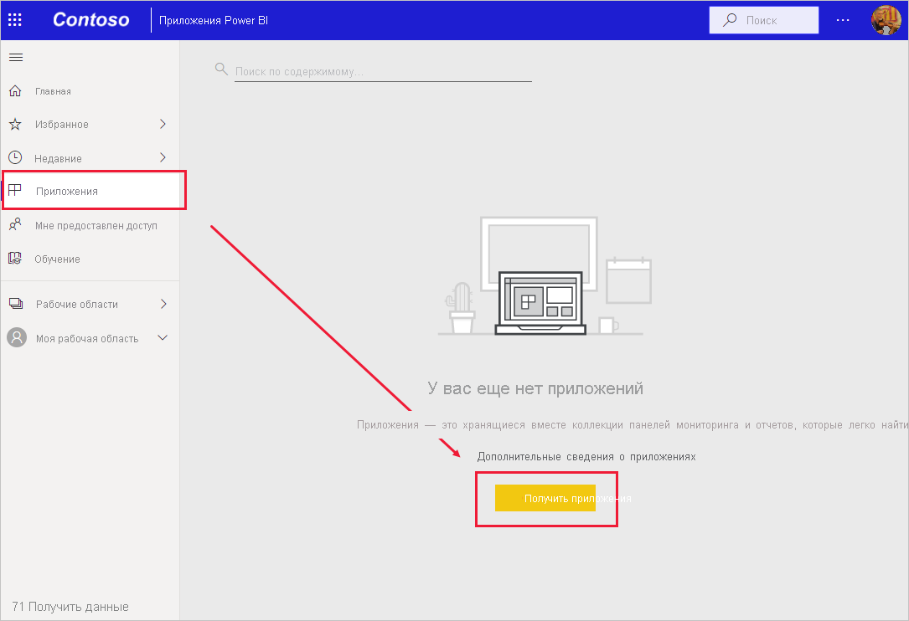

# Установка и использование приложений с информационными панелями и отчетами в Power BI
Теперь, когда у вас есть [базовое представление о приложениях](end-user-apps.md), давайте узнаем, как открыть приложение и работать с ним. 

## Получение нового приложения
Помните, что существует несколько способов получить новое приложение. Ваш коллега, создавший отчет, может автоматически установить приложение в вашей учетной записи Power BI или отправить вам прямую ссылку на приложение. Вы можете перейти к AppSource и выполнить поиск приложений, доступных в компании и за ее пределами. 

В Power BI на мобильном устройстве вы можете установить приложение только по прямой ссылке, но не из AppSource. Если создатель приложения автоматически установит приложение, вы увидите его в своем списке приложений.

## Установка приложения по прямой ссылке
Простейший путь установить новое приложение самостоятельно — это получить по электронной почте прямую ссылку на приложение от его создателя.  

**На компьютере** 

Если щелкнуть эту ссылку в письме, служба Power BI ([https://powerbi.com](https://powerbi.com)) откроется в браузере. Подтвердите установку, после чего Power BI откроет целевую страницу приложения.

**На мобильном устройстве iOS или Android** 

Если щелкнуть ссылку в письме на мобильном устройстве, приложение установится автоматически, после чего в мобильном приложении откроется список его содержимого. 

## Получение приложения из Microsoft AppSource
Вы также можете найти и установить приложения в Microsoft AppSource. Отображаются только приложения, к которым у вас есть доступ (т. е. автор предоставил вам или всем разрешение).

1. Последовательно выберите **Приложения**  > **Get apps** (Получить приложения). 
   
     
2. Вы можете выполнить поиск в AppSource в разделе **Моя организация**, чтобы сократить количество результатов и найти необходимое приложение.
   
     
3. Выберите **Получить**, чтобы добавить его в список "Приложения". 

## Взаимодействие с панелями мониторинга и отчетами в приложении
Теперь вы можете просмотреть данные информационных панелей и отчетов в приложении. Вам доступны все стандартные возможности взаимодействия Power BI, такие как фильтрация, выделение, сортировка и детализация. Вы также можете [экспортировать данные в Excel](end-user-export-data.md) из таблицы или другого визуального элемента в отчете. Ознакомьтесь со [сведениями о взаимодействии с отчетами в Power BI](end-user-reading-view.md). 

## Дальнейшие действия
* [Приложения Power BI для внешних служб](end-user-connect-to-services.md)
* У вас появились вопросы? [Попробуйте задать вопрос в сообществе Power BI.](http://community.powerbi.com/)

