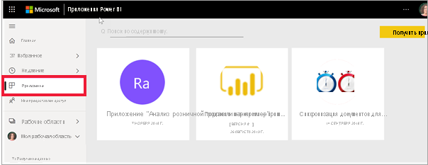
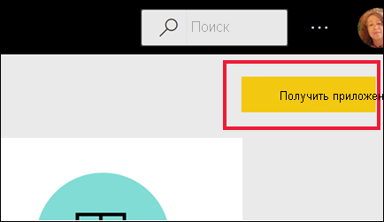
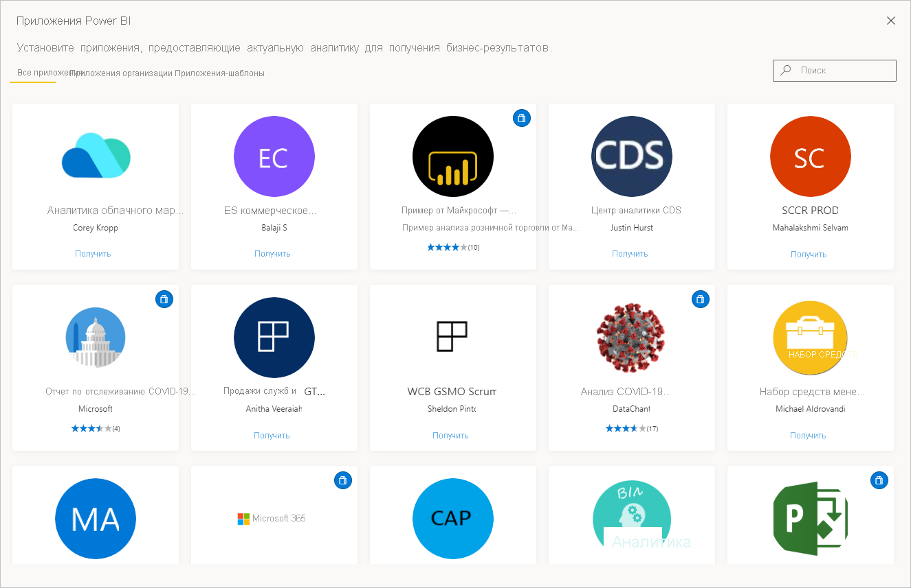

# Приложения в Power BI

[!INCLUDE[consumer-appliesto-ynny](../includes/consumer-appliesto-ynny.md)]

[!INCLUDE [power-bi-service-new-look-include](../includes/power-bi-service-new-look-include.md)]

## Что такое приложение Power BI?
*Приложения* — это тип содержимого Power BI, который объединяет связанные панели мониторинга и отчеты в одном месте. Приложение может иметь одну или несколько панелей мониторинга и один или несколько отчетов, объединенные вместе. Приложения, создаваемые *разработчиками* Power BI, которые распространяют приложения среди *потребителей*, таких как вы. 

Приложения упорядочены в списке **Приложения**. Просто выберите **Приложения**, чтобы вывести список приложений. Наведите указатель мыши на приложение, чтобы просмотреть дату последнего обновления и владельца. 

Чтобы использовать функции приложений, требуется лицензия Power BI Pro или приложение, которое должно храниться в емкости Premium и быть предоставлено вам для общего доступа. См. сведения о [лицензиях и емкости "Премиум" для потребителей](end-user-license.md).

## *Разработчики* приложений и *потребители* приложений
В зависимости от вашей роли вы можете быть создателем (*разработчиком*) приложений для собственного пользования или для совместного использования с коллегами. Или вы можете быть человеком, который получает и загружает приложения, созданные другими (*потребитель*). Эта статья предназначена для *потребителей* приложений.

## Преимущества приложений
Приложения являются простым способом одновременного совместного использования различных типов содержимого. *Разработчики* приложений создают панели мониторинга и отчеты и объединяют их в приложение. Затем *разработчики* предоставляют общий доступ к приложению или публикуют его в расположении, где оно будет доступно вам как *потребителю*. Так как связанные панели мониторинга и отчеты объединены в приложение, вы можете легко находить и устанавливать его в службе Power BI ([https://powerbi.com](https://powerbi.com)) и на мобильном устройстве. Когда вы установите приложение, вам не нужно запоминать имена разных панелей мониторинга или отчетов, так как все они находятся в приложении, в браузере или на мобильном устройстве.

В приложении все выпущенные автором обновления отображаются автоматически. Автор также контролирует график обновления данных, и вам не нужно беспокоиться об их актуальности. 

<!-- add conceptual art -->
## Получение нового приложения
Новое приложение можно получить разными способами. Вы можете искать и устанавливать приложения, а разработчики могут предоставить вам приложения для общего доступа. 

### Поиск и установка приложений из магазина Marketplace приложений Power BI
Одним из способов поиска приложений является выбор элемента **Получить приложения** на экране "Приложения Power BI". 

Просмотрите список приложений в магазине приложений Power BI, пока не найдете то, которое требуется установить. Выберите **Приложения организации**, которые доступны только сотрудникам вашей организации, или **Приложения-шаблоны**, которые публикуются корпорацией Майкрософт и сообществом и доступны для всех пользователей Power BI. 

Существует несколько других способов получения приложений. Ниже перечислены некоторые из них. Подробные пошаговые инструкции по получению и изучению приложения см. в статье об [установке и использовании приложения](end-user-app-view.md).

* Разработчик приложения может автоматически установить приложение в вашей учетной записи Power BI. В следующий раз, когда вы откроете службу Power BI, вы увидите новое приложение в списке **Приложения**. 
* Разработчик может отправить вам прямую ссылку на приложение. Когда вы щелкнете ссылку, приложение откроется в службе Power BI.
* В Power BI на мобильном устройстве вы можете установить приложение только по прямой ссылке, но не из магазина приложений. Если создатель приложения автоматически установит приложение, вы увидите его в своем списке приложений. 

## Дальнейшие действия
* [Открытие приложения и работа с ним](end-user-app-view.md)
* [Другие способы совместного использования содержимого](end-user-shared-with-me.md)

