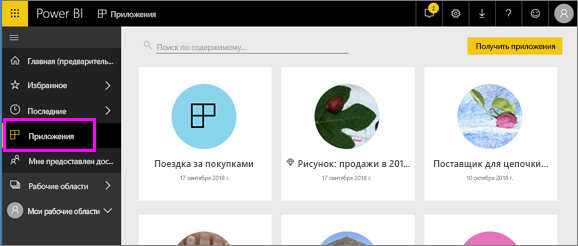

# Приложения в Power BI
## Что такое приложение Power BI?
*Приложения* — это тип содержимого Power BI, который объединяет связанные панели мониторинга и отчеты в одном месте. Приложение может иметь одну или несколько панелей мониторинга и один или несколько отчетов, объединенные вместе. Приложения, создаваемые *разработчиками* Power BI, которые распространяют приложения среди *потребителей*, таких как вы. 

Приложения упорядочены в списке **Приложения**.

## ***Разработчики*** приложений и ***потребители*** приложений
В зависимости от вашей роли вы можете быть создателем (разработчиком) приложений для собственного пользования или для совместного использования с коллегами. Или вы можете быть человеком, который получает и загружает приложения, созданные другими (потребитель). Эта статья предназначена для *потребителей* приложений.

## Преимущества приложений
Вы можете легко находить и устанавливать приложения в службе Power BI ([https://powerbi.com](https://powerbi.com)) и на мобильном устройстве. Когда вы установите приложение, вам не нужно запоминать имена разных панелей мониторинга, так как все они находятся в приложении, в браузере или на мобильном устройстве.

В приложении все выпущенные автором обновления отображаются автоматически. Автор также контролирует график обновления данных, и вам не нужно беспокоиться об их актуальности. 

<!-- add conceptual art -->
## Получение нового приложения
Приложения можно получить несколькими способами. 
- Создатель приложения может автоматически установить приложение в вашей учетной записи Power BI, и в следующий раз, когда вы откроете Power BI, вы увидите новое приложение в списке **Приложения**. 
- Создатель приложения может отправить вам ссылку на приложение по электронной почте. Ссылка откроет приложение в Power BI.
- Можно искать приложения в AppSource, где отображаются все доступные вам приложения. AppSource содержит приложения, опубликованные создателями отчетов в вашей компании и за ее пределами. Например, вы можете найти в AppSource приложение для службы, которую вы уже используете, —Google Analytics, GitHub или Microsoft Dynamics. 
- В Power BI на мобильном устройстве вы можете установить приложение только по прямой ссылке, но не из AppSource. Если создатель приложения автоматически установит приложение, вы увидите его в своем списке приложений.

## Дальнейшие действия
* [Открытие приложения и работа с ним](end-user-app-view.md)

