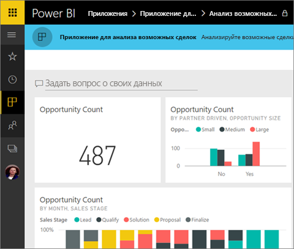
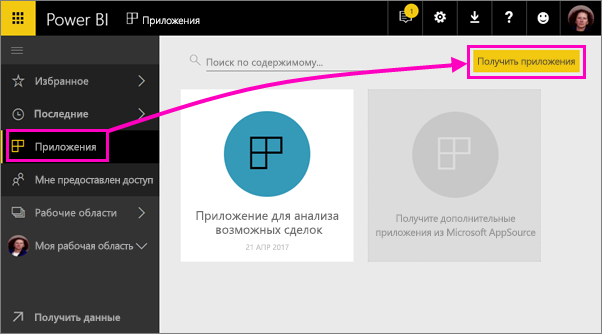
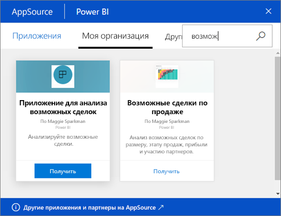

# Установка и использование приложений с информационными панелями и отчетами в Power BI
*Приложения* в Power BI позволяют объединить связанные панели мониторинга и отчеты в одном решении. Сотрудники организации могут создавать и распространять приложения с важной бизнес-информацией. [Внешние службы](end-user-connect-to-services.md), такие как Google Analytics и Microsoft Dynamics CRM, которые вы, вероятно, уже используете, также поддерживают приложения Power BI. 

Вы можете легко находить и устанавливать приложения в службе Power BI ([https://powerbi.com](https://powerbi.com)) и на мобильном устройстве. Когда вы установите приложение, вам не нужно запоминать имена разных панелей мониторинга, так как все они находятся в приложении, в браузере или на мобильном устройстве.

В приложении все выпущенные автором обновления отображаются автоматически. Автор также контролирует график обновления данных, и вам не нужно беспокоиться об их актуальности. 

## Получение нового приложения
Приложения можно получить несколькими способами. Создатель приложения может автоматически установить приложение в вашу учетную запись Power BI или отправить вам прямую ссылку на приложение. Кроме того, вы можете найти его в AppSource, где доступны все приложения, к которым можете получить доступ. В Power BI на мобильном устройстве вы можете установить приложение только по прямой ссылке, но не из AppSource. Если создатель приложения автоматически установит приложение, вы увидите его в своем списке приложений.

### Установка приложения по прямой ссылке
Простейший путь установить новое приложение самостоятельно — это получить прямую ссылку на приложение от его создателя. Power BI создает ссылку для установки, которую автор может отправить вам.

**На компьютере** 

Перейдите по ссылке в сообщении электронной почты, чтобы открыть службу Power BI ([https://powerbi.com](https://powerbi.com)) в браузере. Подтвердите установку, после чего откроется целевая страница приложения.

**На мобильном устройстве iOS или Android** 

Если щелкнуть ссылку в письме на мобильном устройстве, приложение установится автоматически, после чего в мобильном приложении откроется список его содержимого. 

### Получение приложения из Microsoft AppSource
Кроме того, вы можете найти в Microsoft AppSource и установить любые приложения, к которым у вас есть доступ. 

1. Последовательно выберите **Приложения**  > **Get apps** (Получить приложения). 
   
     
2. Выполните поиск в AppSource в разделе **Моя организация**, чтобы сократить количество результатов и найти необходимое приложение.
   
     
3. Выберите **Получить**, чтобы добавить его на страницу "Приложения". 

## Взаимодействие с панелями мониторинга и отчетами в приложении
Теперь вы можете просмотреть данные информационных панелей и отчетов в приложении. Вам доступны все стандартные возможности взаимодействия Power BI, такие как фильтрация, выделение, сортировка и детализация. Вы также можете [экспортировать данные в Excel](end-user-export-data.md) из таблицы или другого визуального элемента в отчете. Ознакомьтесь со [сведениями о взаимодействии с отчетами в Power BI](end-user-reading-view.md). 

## Дальнейшие действия
* [Приложения Power BI для внешних служб](end-user-connect-to-services.md)

