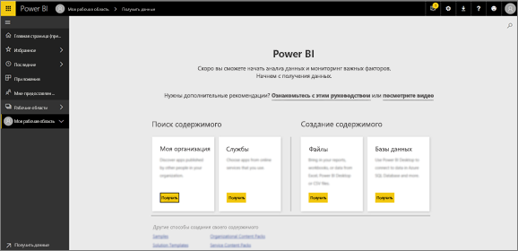
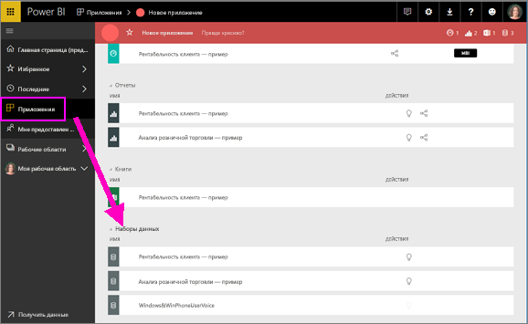
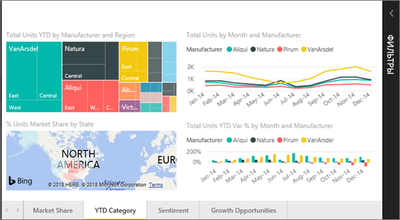
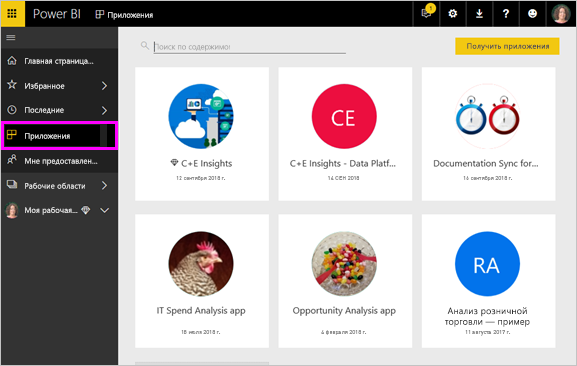

# Основные концепции для ***пользователей*** службы Power BI

## *Потребители*  и *конструкторы* Power BI
В этой статье предполагается, что вы уже прочли статью с [обзором Power BI](../power-bi-overview.md) и определили себя как ***потребителя*** Power BI. Потребители получают содержимое Power BI, такое как панели мониторинга и отчеты, от коллег. Потребители используют службу Power BI, которая является версией Power BI на основе веб-сайта.

Вам несомненно встретится термин "Power BI Desktop" или просто "Desktop". Это автономное средство, используемое *конструкторами*, которые создают и панели мониторинга, и отчеты и представляют общий доступ к ним. Важно знать, что существуют и другие средства Power BI, но пока вы являетесь потребителем, вы будете работать только со службой Power BI. И эта статья относится только к службе Power BI.

## Термины и понятия
Эта статья не является ни визуальной экскурсией по Power BI, ни практическим руководством. Это обзорная статья, которая, как мы надеемся, поможет вам разобраться с терминами и основными понятиями Power BI. Вы сможете получить полное представление о принципах работы с Power BI. Ознакомьтесь с возможностями службы Power BI и навигации в ней в [этой статье](end-user-experience.md).

## Первое открытие службы Power BI
Большинство потребителей Power BI получают эту службу, так как 1) их организация покупает лицензии и 2) администратор назначает эти лицензии сотрудникам.

Чтобы приступить к работе, просто откройте браузер и введите **app.powerbi.com**. При первом открытии службы Power BI вы увидите примерно следующее.

По мере использования Power BI вы сможете настраивать страницы и компоненты при каждом открытии веб-сайта.  Например, некоторые пользователи предпочитают, чтобы сначала открывалась главная страница Power BI, тогда как другим сразу нужна их избранная панель мониторинга. Не беспокойтесь, мы расскажем, как это сделать.
- [Главная страница (предварительная версия)](https://powerbi.microsoft.com/blog/introducing-power-bi-home-and-global-search)    
- [Настройка **основного** содержимого](end-user-featured.md)

Прежде чем мы идти дальше, давайте поговорим о стандартных блоках, входящих в состав службы Power BI.

## ***Содержимое*** Power BI
### Общие сведения о стандартных блоках
Потребителю Power BI доступно пять стандартных блоков: ***визуализации***, ***панели мониторинга***, ***отчеты***, ***приложения*** и  ***наборы данных***. Они иногда называются ***содержимым*** *Power BI*. А *содержимое* находится в ***рабочих областях***. Типичный рабочий процесс выглядит следующим образом:  *конструктор* Power BI (выделен желтым цветом на приведенной ниже схеме) собирает данные из *наборов данных*, вводит их в Power BI для анализа, создает  *отчеты* с *визуализациями*, которые представляют интересные факты и данные, закрепляет визуализации из отчетов на панель мониторинга и предоставляет общий доступ к отчетам и панелям *потребителям*, таким как вы (выделено черным цветом на схеме ниже), в виде *приложений* или других типов общего содержимого.

Рассмотрим их на самом простом уровне.
*  ***Визуализация*** (или *визуальный элемент*) — это разновидность диаграммы, которую *конструкторы* Power BI создают на основе данных из *отчетов* и *наборов данных*. Как правило, *конструкторы* создают визуальные элементы в Power BI Desktop.

    Дополнительные сведения см. в статье [Визуализации для *потребителей* Power BI](end-user-visualizations.md).

*  *Набор данных* представляет собой контейнер данных. Например, это может быть файл Excel от Всемирной организации здравоохранения, корпоративная база клиентов или файл Salesforce.  

*  *Панель мониторинга* — это один экран с интерактивными визуальными элементами, текстом и графикой. На одном экране панели мониторинга выводятся самые важные показатели, на основе которых можно сделать определенные выводы или получить ответы на вопросы. Содержимое панели мониторинга поступает из одного или нескольких отчетов и одного или нескольких наборов данных.

    Дополнительные сведения см. в статье [Панели мониторинга для *потребителей* Power BI](end-user-dashboards.md).

*  *Отчет* — это одна или несколько страниц интерактивных визуальных элементов, текста и графики, составляющих единый отчет. Отчет формируется на основе одного набора данных. Часто страницы отчета формируются так, чтобы отображать представляющую интерес область или давать ответ на один вопрос.

    Дополнительные сведения см. в статье [Отчеты для *потребителей* Power BI](end-user-reports.md).

*  С помощью *приложений* *конструкторы* объединяют связанные панели мониторинга и отчеты и предоставляют к ним общий доступ. *Потребители* получают некоторые приложения автоматически, однако они также могут выполнять поиск других приложений, созданных коллегами или участниками сообщества. Например, внешние службы, такие как Google Analytics и Microsoft Dynamics CRM, которые вы, вероятно, уже используете, поддерживают приложения Power BI.

Новичкам следует знать, что при первом входе в Power BI у вас не будет панелей мониторинга, приложений или отчетов.
_______________________________________________________

## Наборы данных
*Набор данных* — это коллекция данных, которую *конструкторы* импортируют или к которой подключаются и затем используют для создания отчетов и панелей мониторинга. Потребителю не придется напрямую взаимодействовать с наборами данных, но будет полезно понять их роль в общем процессе.  

Каждый набор данных представляет один источник данных, например книгу Excel на OneDrive, локальный набор табличных данных службы SSAS или набор данных Salesforce. Существует множество различных поддерживаемых источников данных.

Когда конструктор предоставляет общий доступ к приложению, вы увидите, какие наборы данных входят в состав приложения.

**ОДИН** набор данных...

* можно использовать многократно;
* можно использовать в различных отчетах;
* визуализации из этого одного набора данных можно отображать на нескольких разных панелях мониторинга.

  

Кроме того, наборы данных из других рабочих областей можно использовать для создания содержимого (отчеты, панели мониторинга) в своей рабочей области. Эти наборы данных отображаются со значком упоминаемого набора данных:

Следующий стандартный блок — визуализации.
__________________________________________________________

## Визуализации
Визуализации (также называемые визуальными элементами) отображают сведения, обнаруженные в данных. Визуализации упрощают интерпретацию данных, так как мозг способен быстрее осознавать изображения, чем, например, электронную таблицу или числа.

Вот лишь некоторые из визуализаций, представленных в Power BI: каскадная, лента, диаграмма в виде дерева, круговая, воронкообразная, карта, точечная и датчик. См. [полный список визуализаций, включенных в Power BI](../power-bi-visualization-types-for-reports-and-q-and-a.md).

   

Доступны также визуализации сообщества, которые называются *пользовательскими визуальными элементами*. Если вы получите отчет с незнакомым визуальным элементом, скорее всего, это будет пользовательский визуальный элемент. Если вам нужна помощь, Интерпретация пользовательского визуального элемента, <!--[look up the name of the report or dashboard *designer*](end-user-owner.md)-->найти имя отчета или панели мониторинга *конструктор* и свяжитесь с ним.

**ОДНА** визуализация в отчете...

* можно использовать многократно с помощью функций копирования и вставки;
* можно использовать на нескольких разных панелях мониторинга.
__________________________________________________
## Отчеты
Отчет Power BI — это одна или несколько страниц визуализаций, графиков и текста. Все визуализации отчета связаны с одним набором данных. *Конструкторы* предоставляют доступ к отчетам *потребителям*, которые [работают с отчетами в *режиме чтения*](end-user-reading-view.md).

**ОДИН** отчет...

* может быть связан с несколькими панелями мониторинга (плитки из одного отчета могут отображаться на нескольких панелях);
* создается с использованием данных только из одного набора;  
* может быть частью нескольких приложений.

  

________________________________________________

## Панели мониторинга
Панель мониторинга содержит настроенное представление определенной группы базовых наборов данных. *Конструкторы* создают панели мониторинга и предоставляют *потребителям* доступ к ним либо отдельно, либо в составе приложения. Панель мониторинга — это один холст, содержащий *плитки*, графику и текст.

  

Плитка представляет собой отображение визуального элемента, который *конструктор* *закрепляет*, например, из отчета на панель мониторинга.  На каждой закрепленной плитке отображается одна [визуализация](end-user-visualizations.md), созданная на основе набора и закрепленная на панели мониторинга. Плитка может также содержать целую страницу отчета и потоковую трансляцию данных или видео. *Конструкторы* могут добавлять плитки на панель мониторинга различными способами, которые невозможно рассмотреть подробно в этой обзорной статье. Дополнительные сведения см. в статье [Плитки панели мониторинга в Power BI](end-user-tiles.md).

С точки зрения потребителя панели мониторинга невозможно изменить. Однако можно добавлять комментарии, просматривать связанные данные, задавать панель в качестве основной, подписываться и т. д.

Для чего люди создают панели мониторинга?  Вот лишь некоторые причины:

* чтобы сразу просмотреть все сведения, необходимые для принятия решений;
* чтобы отслеживать наиболее важные сведения о бизнес-процессах;
* чтобы убедиться, что все коллеги просматривают и используют в работе одни и те же сведения;
* для наблюдения за состоянием предприятия, продукта, подразделения, маркетинговой кампании и т. д.;
* чтобы создавать индивидуальные представления большой панели мониторинга со всеми важными метриками.

**ОДНА** панель мониторинга...

* может отображать визуализации из многих разных наборов данных;
* может отображать визуализации из многих разных отчетов;
* может отображать визуализации, закрепленные с помощью других средств (например, Excel).

  

________________________________________________

## Приложения
Эти коллекции панелей мониторинга и отчетов упорядочивают связанное содержимое в один пакет. *Конструкторы* Power BI создают их и предоставляют к ним доступ отдельным пользователям, группам, всей организации или широкой аудитории. Вы как потребитель можете быть уверены, что вы и ваши коллеги работаете с одними данными, представляющими единую достоверную версию.

Вы можете легко находить и устанавливать приложения в службе Power BI (https://powerbi.com)) и на мобильном устройстве. Когда вы установите приложение, вам не нужно запоминать имена разных панелей мониторинга, так как все они находятся в приложении, в браузере или на мобильном устройстве.

Это приложение содержит три связанные панели мониторинга и три связанных отчета.

В приложении все выпущенные автором обновления отображаются автоматически. Автор также контролирует график обновления данных, и вам не нужно беспокоиться об их актуальности.

Приложения можно получить несколькими способами. Разработчик приложения может автоматически установить приложение в вашу учетную запись Power BI или отправить вам прямую ссылку на приложение. Кроме того, вы можете найти его в Microsoft AppSource, где доступны все приложения, к которым можете получить доступ. В Power BI на мобильном устройстве вы можете установить приложение только по прямой ссылке, но не из AppSource. Если разработчик приложения автоматически установит приложение, вы увидите его в своем списке приложений.

После установки приложения просто выберите его в списке приложений, а затем выберите панель мониторинга или отчет, чтобы открыть и изучить его.   

Надеюсь, что вы смогли разобраться, что собой представляют стандартные блоки, из которых состоит служба Power BI для потребителей.

## Дальнейшие действия
- Изучите [глоссарий](end-user-glossary.md)    
- [Ознакомьтесь со службой Power BI](end-user-experience.md)
- Прочите статью с [обзором Power BI, написанную специально для потребителей](end-user-consumer.md)    
- Посмотрите видео, где Уилл рассматривает основные понятия, связанные со службой Power BI. <iframe width="560" height="315" src="https://www.youtube.com/embed/B2vd4MQrz4M" frameborder="0" allowfullscreen></iframe>
