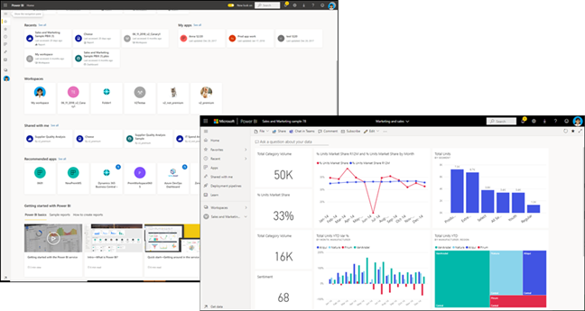

# Основные понятия для потребителей службы Power BI

[!INCLUDE[consumer-appliesto-ynnm](../includes/consumer-appliesto-ynnm.md)]

[!INCLUDE [power-bi-service-new-look-include](../includes/power-bi-service-new-look-include.md)]

В этой статье предполагается, что вы уже прочли статью с [обзором Power BI](../fundamentals/power-bi-overview.md) и определили себя как [бизнес-пользователя Power BI](end-user-consumer.md). *Бизнес-пользователи* получают содержимое Power BI, например панели мониторинга, отчеты и приложения, от коллег. *Бизнес-пользователи* работают со службой Power BI (app.powerbi.com), которая является веб-версией Power BI.

Для получения содержимого от других пользователей требуется одно из нижеперечисленного:
- Пользовательская лицензия Power BI Pro
- Ваша организация должна иметь подписку на Power BI Premium, а также должна предоставить доступ к содержимому в емкости Power BI Premium. [Поиск лицензии и типов подписок](end-user-license.md).

Вам несомненно встретится термин "Power BI Desktop" или просто "Desktop". Это автономное средство, используемое *конструкторами* , которые создают панели мониторинга и отчеты, а также предоставляют общий доступ к ним. Важно знать, что существуют и другие средства Power BI. Пока вы являетесь бизнес-пользователем**, вы будете работать только со службой Power BI. Эта статья относится только к службе Power BI.

## Термины и понятия

Эта статья не является ни визуальной экскурсией по Power BI, ни практическим руководством. Это обзорная статья, которая поможет вам разобраться с терминами и основными понятиями Power BI. Здесь вы сможете получить полное представление о принципах работы с Power BI. Ознакомьтесь с возможностями службы Power BI и навигацией в ней в статье [Краткое руководство. Навигация в службе Power BI](end-user-experience.md).

## Первое открытие службы Power BI

Большинство *бизнес-пользователей* Power BI получают эту службу, так как 1) их организация покупает лицензии и 2) администратор назначает эти лицензии сотрудникам.

Чтобы приступить к работе, откройте браузер и введите **app.powerbi.com** . При первом открытии службы Power BI вы увидите примерно следующее.

По мере использования службы Power BI вы сможете настраивать страницы и компоненты при каждом открытии веб-сайта. Например, некоторые пользователи предпочитают, чтобы сначала открывалась **главная страница** Power BI, тогда как другим сразу нужна их избранная панель мониторинга. Не беспокойтесь, в этой статье вы научитесь персонализировать службу.

- [Представляем главную страницу Power BI и глобальный поиск](https://powerbi.microsoft.com/blog/introducing-power-bi-home-and-global-search)

- [Основные панели мониторинга в службе Power BI](end-user-featured.md)

Прежде чем мы сможем идти дальше, давайте поговорим о стандартных блоках, входящих в состав службы Power BI.

_______________________________________________________

## Содержимое Power BI

### Общие сведения о стандартных блоках

*Бизнес-пользователю* Power BI доступно пять стандартных блоков: **_визуализации_** , **_панели мониторинга_** , **_отчеты_** , **_приложения_** и **_наборы данных_** . Они иногда называются **_содержимым_** *Power BI* . *Содержимое* находится в **_рабочих областях_** . Типичный рабочий процесс выглядит следующим образом: *конструктор* Power BI (выделен желтым цветом на приведенной ниже схеме) собирает данные из *наборов данных* , вводит их в Power BI для анализа, создает *отчеты* с *визуализациями* , которые представляют интересные факты и данные, закрепляет визуализации из отчетов на *панель мониторинга* и предоставляет общий доступ к отчетам и панелям *бизнес-пользователям* , таким как вы (выделено черным цветом на схеме ниже). *Конструктор* предоставляет к ним доступ из панелей мониторинга, отчетов или приложений.

Рассмотрим стандартные блоки на самом простом уровне.

-  **_Визуализация_** (или *визуальный элемент* ) — это диаграмма, созданная *конструкторами* Power BI. Визуальные элементы отображают данные из *отчетов* и *наборов данных* . Как правило, *конструкторы* создают визуальные элементы в Power BI Desktop.

    Дополнительные сведения см. в статье [Interact with Visuals in reports, dashboards, and apps](end-user-visualizations.md) (Взаимодействие с визуальными элементами в отчетах, панелях мониторинга и приложениях).

-  *Набор данных*  — это контейнер данных. Например, это может быть файл Excel от Всемирной организации здравоохранения. Это также может быть корпоративная база клиентов или файл Salesforce. Управление наборами данных осуществляется с помощью *конструкторов* .

-  *Панель мониторинга*  — это один экран с интерактивными визуальными элементами, текстом и графикой. На одном экране панели мониторинга выводятся самые важные показатели, на основе которых можно сделать определенные выводы или получить ответы на вопросы. Содержимое панели мониторинга поступает из одного или нескольких отчетов и одного или нескольких наборов данных.

    Дополнительные сведения см. в статье [Dashboards for the Power BI service business users](end-user-dashboards.md) (Панели мониторинга для бизнес-пользователей службы Power BI).

-  *Отчет*  — это одна или несколько страниц интерактивных визуальных элементов, текста и графики, составляющих единый отчет. Power BI создает отчет на основе одного набора данных. Часто *конструктор* упорядочивает страницы отчета так, чтобы отображать представляющую интерес область или давать ответ на один вопрос.

    Дополнительные сведения см. в статье [Отчеты в Power BI](end-user-reports.md).

-  С помощью *приложений**конструкторы* объединяют связанные панели мониторинга и отчеты и предоставляют к ним общий доступ. *Бизнес-пользователи* получают некоторые приложения автоматически, однако они также могут выполнять поиск других приложений, созданных коллегами или участниками сообщества. Например, готовые приложения доступны для внешних служб, которые вы уже возможно используете, например Google Analytics и Microsoft Dynamics CRM.

Если вы новый пользователь и вошли в службу Power BI в первый раз, то, вероятно, не увидите ни одной общей панели мониторинга, приложения или отчета.

_______________________________________________________

## Наборы данных

*Набор данных* — это коллекция данных, которую *конструкторы* импортируют или к которой подключаются и затем используют для создания отчетов и панелей мониторинга. *Бизнес-пользователю* не придется напрямую взаимодействовать с наборами данных, но будет полезно понять их роль в общем процессе.  

Каждый набор данных представляет один источник данных. Например, источником может быть книга Excel в OneDrive, локальный набор табличных данных служб SQL Server Analysis Services или набор данных Salesforce. Power BI поддерживает множество различных источников данных.

Когда конструктор предоставляет доступ к приложению, вы можете узнать, какие наборы данных используются, открыв раздел **Связанное содержимое** .  Вы не сможете добавить или изменить какие-либо данные в наборе данных. Но если конструктор предоставит разрешения, вы сможете загрузить отчет, найти [аналитические сведения](end-user-insights.md) в данных или даже [создать собственный отчет](../create-reports/service-report-create-new.md) на основе набора данных.  

Один набор данных...

- может неоднократно использоваться конструктором отчетов для создания панелей мониторинга и отчетов;

- может использоваться для создания разных отчетов;

- визуальные элементы из этого одного набора данных могут отображаться на нескольких разных панелях мониторинга.

  

Следующий стандартный блок — визуализации.

_______________________________________________________

## Визуализации

Визуализации (также называемые визуальными элементами) отображают сведения, которые служба Power BI обнаружила в данных. Визуализации упрощают интерпретацию данных, так как мозг способен быстрее осознавать изображения, чем электронную таблицу или числа.

Вот лишь некоторые из визуализаций, представленных в Power BI: каскадная, лента, диаграмма "дерево", круговая, воронкообразная, карта, точечная и датчик.

   

См. [полный список визуализаций, включенных в Power BI](end-user-visual-type.md).

Доступны также специальные визуализации сообщества, которые называются *пользовательскими визуальными элементами* . Если вы получите отчет с незнакомым визуальным элементом, скорее всего, это будет пользовательский визуальный элемент. Если вам нужна помощь в интерпретации пользовательского визуального элемента, найдите имя *конструктора* отчета или панели мониторинга и свяжитесь с ним. Контактные данные можно получить, выбрав заголовок в верхней строке меню.

Одна визуализация в отчете...

- может появляться несколько раз в одном отчете;

- может отображаться на нескольких разных панелях мониторинга.

_______________________________________________________

## Отчеты

Отчет Power BI — это одна или несколько страниц визуализаций, графиков и текста. Все визуализации отчета связаны с одним набором данных. *Конструкторы* создают отчеты и предоставляют к ним доступ другим пользователям по отдельности либо в составе приложения.  Как правило, *бизнес-пользователи* [взаимодействуют с отчетами в *режиме чтения*](end-user-reading-view.md).

Один отчет...

- может быть связан с несколькими панелями мониторинга (плитки из одного отчета могут отображаться на нескольких панелях);

- можно создать с использованием данных только из одного набора;  

- может быть частью нескольких приложений.

  

_______________________________________________________

## Панели мониторинга

Панель мониторинга содержит настроенное графическое представление определенной группы базовых наборов данных. *Конструкторы* создают панели мониторинга и предоставляют *бизнес-пользователям* доступ к ним либо отдельно, либо в составе приложения. Панель мониторинга — это один холст, содержащий *плитки* , графику и текст.

  

Плитка представляет собой отображение визуального элемента, который *конструктор* *закрепляет* , например, из отчета на панели мониторинга. На каждой закрепленной плитке отображается одна [визуализация](end-user-visualizations.md), которую разработчик создал на основе набора и закрепил на панели мониторинга. Плитка может также содержать целую страницу отчета и потоковую трансляцию данных или видео. *Конструкторы* могут добавлять фрагмента на панель мониторинга различными способами, которые невозможно рассмотреть подробно в этой обзорной статье. Дополнительные сведения см. в статье [Плитки панели мониторинга в Power BI](end-user-tiles.md).

*Бизнес-пользователи* не могут изменять панели мониторинга. Однако можно добавлять комментарии, просматривать связанные данные, задавать панель в качестве основной, подписываться и т. д.

Для чего люди создают панели мониторинга?  Вот лишь несколько из них.

- чтобы сразу просмотреть все сведения, необходимые для принятия решений;

- чтобы отслеживать наиболее важные сведения о бизнес-процессах;

- чтобы убедиться в том, что все коллеги просматривают и используют в работе одни и те же сведения;

- для наблюдения за состоянием предприятия, продукта, подразделения, маркетинговой кампании и т. д.;

- чтобы создавать индивидуальные представления большой панели мониторинга со всеми важными метриками.

**ОДНА** панель мониторинга...

- может отображать визуализации из многих разных наборов данных;

- может отображать визуализации из многих разных отчетов;

- может отображать визуализации, закрепленные с помощью других средств (например, Excel).

  

_______________________________________________________

## Приложения

Эти коллекции панелей мониторинга и отчетов упорядочивают связанное содержимое в один пакет. *Конструкторы* Power BI создают их в рабочих областях и предоставляют доступ к приложениям отдельным пользователям, группам, всей организации или делают их общедоступными. Вы как *бизнес-пользователь* можете быть уверены, что вы и ваши коллеги работаете с одними и теми же данными, представляющими единую достоверную версию.

Иногда рабочая область приложения является общедоступной, и многие пользователи могут совместно работать и обновлять как рабочую область, так и приложение. Доступные в приложении возможности определяются предоставленными разрешениями и доступом.

> [!NOTE]
> Чтобы использовать функции приложений, требуется лицензия Power BI Pro или рабочая область приложения, которая должна храниться в емкости "Премиум". [Сведения о лицензиях](end-user-license.md).

Вы можете легко находить и устанавливать приложения в [службе Power BI](https://powerbi.com) и на мобильном устройстве. После установки приложения вам не нужно запоминать названия множества различных панелей мониторинга и отчетов. Они все вместе в одном приложении, в браузере или на мобильном устройстве.

Это приложение содержит две панели мониторинга и два отчета, которые составляют одно приложение. Если вы настроили стрелку справа от имени отчета, отобразится список страниц, из которых состоит этот отчет.

При каждом обновлении приложения изменения будут отображаться автоматически. Конструктор также контролирует график того, как часто Power BI обновляет данные. Вам не нужно беспокоиться о его актуальности.

Приложения можно получить несколькими способами.

- Конструктор приложений может автоматически установить приложение в учетной записи Power BI.

- Конструктор приложений может отправить вам прямую ссылку на приложение.

- Вы можете выполнить поиск в службе Power BI для приложений, доступных вам из вашей организации или из сообщества. Вы также можете посетить [Microsoft AppSource](https://appsource.microsoft.com/marketplace/apps?product=power-bi), где будут показаны все доступные для использования приложения.

В Power BI на мобильном устройстве вы можете установить приложение только по прямой ссылке, но не из AppSource. Если разработчик приложения автоматически установит приложение, вы увидите его в своем списке приложений.

После установки приложения просто выберите его в списке приложений, а затем выберите панель мониторинга или отчет, чтобы открыть и изучить его.

Надеюсь, что вы смогли разобраться, что собой представляют стандартные блоки, из которых состоит служба Power BI для бизнес-пользователей.

## Дальнейшие действия

- Изучите [глоссарий](end-user-glossary.md)

- [Ознакомление со службой Power BI](end-user-experience.md)

- Прочите статью с [обзором Power BI, написанную специально для бизнес-пользователей](end-user-consumer.md)

- Посмотрите видео, где Уилл рассматривает основные понятия, связанные со службой Power BI.

    <iframe width="560" height="315" src="https://www.youtube.com/embed/B2vd4MQrz4M" frameborder="0" allowfullscreen></iframe>
