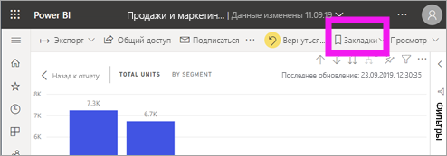
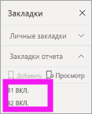
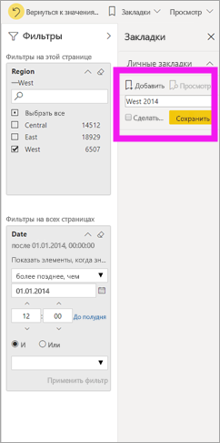
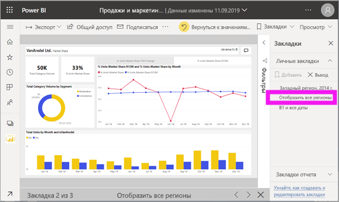

# Что такое закладки?

[!INCLUDE[consumer-appliesto-ynnm](../includes/consumer-appliesto-ynnm.md)]

[!INCLUDE [power-bi-service-new-look-include](../includes/power-bi-service-new-look-include.md)]

Закладки позволяют сохранить текущие настройки представления страницы отчета, включая фильтры, срезы и состояние визуальных элементов. При выборе закладки Power BI возвращает вас в это представление. Существует два типа закладок — созданные вами и *конструкторами* отчетов. Любой пользователь Power BI может создавать персональные закладки. Однако для использования закладок, созданных другими пользователями, нужна лицензия Power BI Pro или Premium. [Какая у меня лицензия?](end-user-license.md)

## Использование закладок для обмена аналитическими сведениями и создания историй в Power BI 
Существует множество вариантов применения закладок. Предположим, вы обнаружили интересные аналитические сведения представления и хотите сохранить их, тогда создайте закладку, чтобы вернуться к ним позже. Если вам нужно отойти и сохранить текущую работу, создайте закладку. Можно даже сделать закладку для представления отчета по умолчанию, чтобы при каждом возврате в систему сначала открывалось это представление страницы отчета. 

Вы также можете создать коллекцию закладок, расположить их в необходимом порядке и последовательно переходить к каждой закладке в презентации, чтобы выделить ряд аналитических сведений, формирующих комплексное представление.  

## Открытие закладок
Чтобы открыть панель закладок, выберите элемент **Закладки** > **Показать еще закладки** в строке меню. Чтобы вернуться в исходное опубликованное представление отчета по умолчанию, выберите команду **Вернуться к значениям по умолчанию**.

### Закладки отчета
Если *конструктор* отчетов включил закладки отчетов, они указаны под заголовком **Закладки отчета**. На этой странице отчета есть две закладки: B1 и B2. 

> [!NOTE]
> Для просмотра общих отчетов нужна лицензия Power BI Pro или Premium. 

Выберите закладку, чтобы перейти в соответствующее представление отчета. 

### Личные закладки

Когда создается закладка, вместе с ней сохраняются следующие элементы:

* текущая страница;
* Фильтры
* срезы, в том числе тип среза (например, раскрывающийся список или список) и состояние среза;
* состояние выбора визуального элемента (например, фильтры перекрестного выделения);
* порядок сортировки;
* расположение при детализации;
* видимость объекта, настраиваемая с помощью панели **выбора**;
* режим фокусировки или режим **В центре внимания** для любого видимого объекта.

Настройте вид страницы отчета для отображения в закладке. Когда вы упорядочите страницу отчета и визуальные элементы нужным образом, на панели **Закладки** щелкните **Добавить**, чтобы добавить закладку. В этом примере мы добавили некоторые фильтры для региона и даты. 

**Power BI** создает персональную закладку с универсальным и указанным вами именем. Вы можете *переименовать*, *удалить* или *обновить* закладку. Для этого щелкните многоточие рядом с ее именем и выберите действие в отобразившемся меню.

Когда закладка будет создана, для ее отображения просто выберите закладку на панели **Закладки**. 

<!--
## Arranging bookmarks
As you create bookmarks, you might find that the order in which you create them isn't necessarily the same order you'd like to present them to your audience. No problem, you can easily rearrange the order of bookmarks.

In the **Bookmarks** pane, simply drag-and-drop bookmarks to change their order, as shown in the following image. The yellow bar between bookmarks designates where the dragged bookmark will be placed.

The order of your bookmarks can become important when you use the **View** feature of bookmarks, as described in the next section. 

-->

## Представление закладок в виде слайд-шоу
Чтобы отобразить или просмотреть закладки по порядку, выберите **Просмотр** в области **Закладки** для запуска слайд-шоу.

При использовании режима **Представление** обратите внимание на несколько возможностей.

- Имя закладки отображается в строке заголовка закладки в нижней части холста.
- В строке заголовка закладки есть кнопки со стрелками для перемещения к следующей или предыдущей закладке.
- Вы можете выйти из режима **Представление**, нажав кнопку **Выход** на панели **Закладки** или щелкнув **X** в строке заголовка закладки.

При работе в режиме **Представление** вы можете закрыть панель **Закладки** (щелкнув X на этой панели), чтобы предоставить дополнительное пространство для презентации. Также в режиме **Представление** все визуальные элементы являются интерактивными и доступными для перекрестного выделения (как и во всех остальных случаях). 

<!--
## Visibility - using the Selection pane
With the release of bookmarks, the new **Selection** pane is also introduced. The **Selection** pane provides a list of all objects on the current page and allows you to select the object and specify whether a given object is visible. 

You can select an object using the **Selection** pane. Also, you can toggle whether the object is currently visible by clicking the eye icon to the right of the visual. 

When a bookmark is added, the visible status of each object is also saved based on its setting in the **Selection** pane. 

It's important to note that **slicers** continue to filter a report page, regardless of whether they are visible. As such, you can create many different bookmarks, with different slicer settings, and make a single report page appear very different (and highlight different insights) in various bookmarks.

## Bookmarks for shapes and images
You can also link shapes and images to bookmarks. With this feature, when you click on an object, it will show the bookmark associated with that object. This can be especially useful when working with buttons; you can learn more by reading the article about [using buttons in Power BI](desktop-buttons.md). 

To assign a bookmark to an object, select the object, then expand the **Action** section from the **Format Shape** pane, as shown in the following image.

Once you turn the **Action** slider to **On** you can select whether the object is a back button, a bookmark, or a Q&A command. If you select bookmark, you can then select which of your bookmarks the object is linked to.

There are all sorts of interesting things you can do with object-linked bookmarking. You can create a visual table of contents on your report page, or you can provide different views (such as visual types) of the same information, just by clicking on an object.

When you are in editing mode you can use ctrl+click to follow the link, and when not in edit mode, simply click the object to follow the link. 

## Bookmark groups

Beginning with the August 2018 release of **Power BI Desktop**, you can create and use bookmark groups. A bookmark group is a collection of bookmarks that you specify, which can be shown and organized as a group. 

To create a bookmark group, hold down the CTRL key and select the bookmarks you want to include in the group, then click the ellipses beside any of the selected bookmarks, and select **Group** from the menu that appears.

**Power BI Desktop** automatically names the group *Group 1*. Fortunately, you can just double-click on the name and rename it to whatever you want.

With any bookmark group, clicking on the bookmark group's name only expands or collapses the group of bookmarks, and does not represent a bookmark by itself. 

When using the **View** feature of bookmarks, the following applies:

* If the selected bookmark is in a group when you select **View** from bookmarks, only the bookmarks *in that group* are shown in the viewing session. 

* If the selected bookmark is not in a group, or is on the top level (such as the name of a bookmark group), then all bookmarks for the entire report are played, including bookmarks in any group. 

To ungroup bookmarks, just select any bookmark in a group, click the ellipses, and then select **Ungroup** from the menu that appears. 

Note that selecting **Ungroup** for any bookmark from a group takes all bookmarks out of the group (it deletes the group, but not the bookmarks themselves). So to remove a single bookmark from a group, you need to **Ungroup** any member from that group, which deletes the grouping, then select the members you want in the new group (using CTRL and clicking each bookmark), and select **Group** again. 
-->

## Рекомендации и ограничения
К этому выпуску функции **Закладки** применяется ряд ограничений и рекомендаций.

* Большинство визуальных элементов Power BI должны нормально работать с использованием закладок. Если у вас возникли трудности при использовании закладок и визуального элемента Power BI, обратитесь к его разработчику с просьбой добавить поддержку закладок в соответствующий визуальный элемент.
* Если на страницу отчета добавить визуальный элемент после создания закладки, он будет отображаться в состоянии по умолчанию. Это также означает, что, если добавить срез на страницу с созданными ранее закладками, срез останется в состоянии по умолчанию.
* Как правило, ваши закладки не затрагиваются, когда *конструктор* отчетов обновляет или повторно публикует отчет. Однако если конструктор вносит в отчет значительные изменения, например, удаляет используемые закладкой поля, то при следующей попытке открыть эту закладку появится сообщение об ошибке. 

<!--
## Next steps
spotlight?
-->
