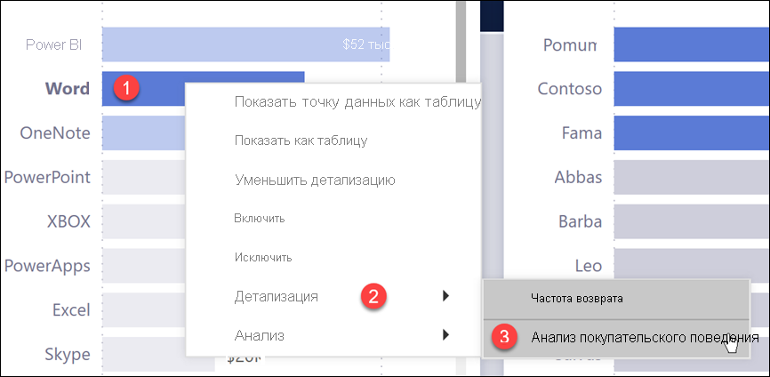
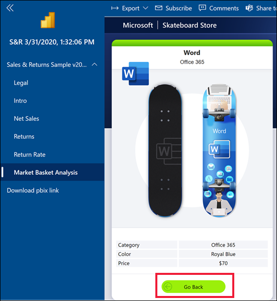
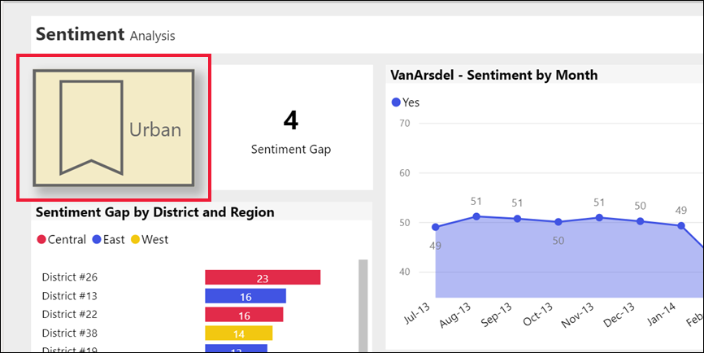
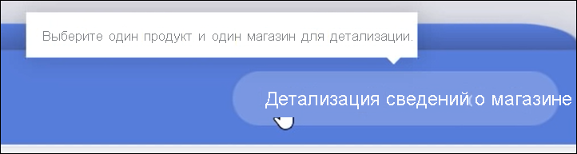
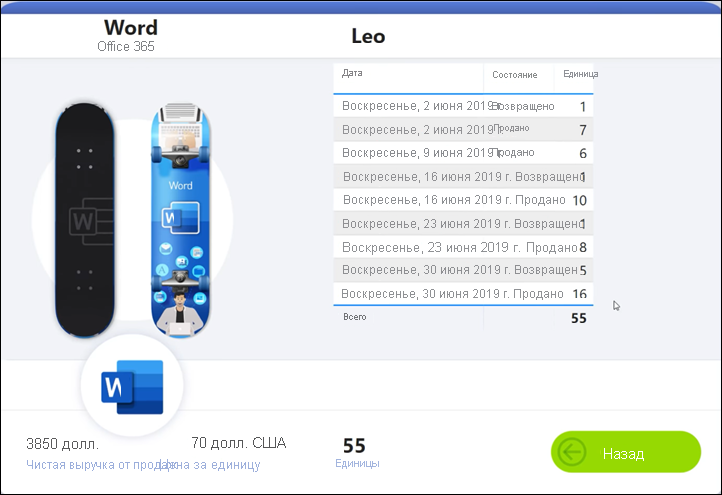
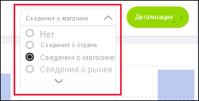
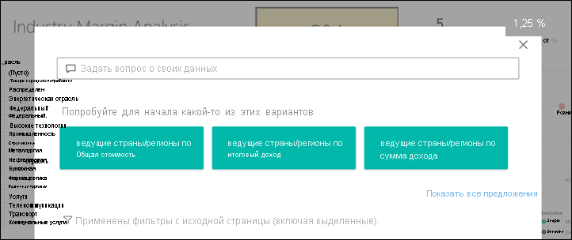
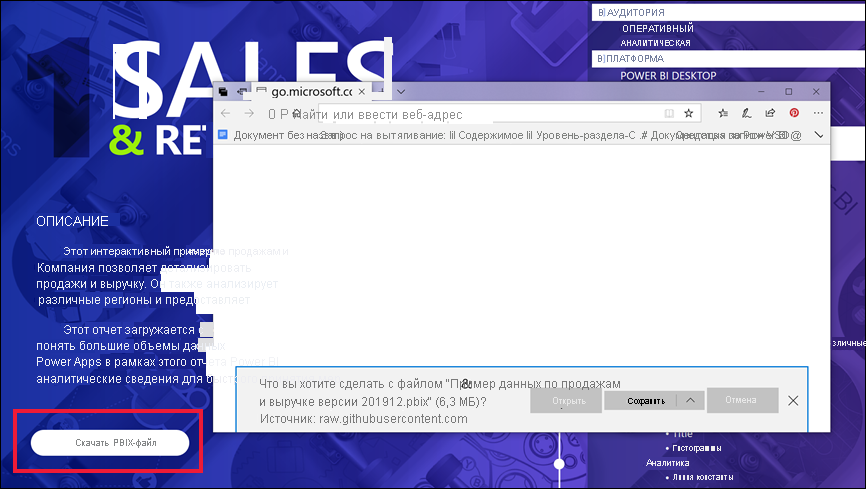

# Кнопки в служба Power BI
Вы могли заметить, что в отчетах, получаемых от коллег, есть кнопки. На некоторых из них есть надписи, на других — стрелки, рисунки или даже раскрывающиеся меню. Из этой статьи вы узнаете, как распознать кнопку и определить ее назначение.

## Распознание кнопки
Кнопки могут выглядеть как фигуры, изображения или значки на странице отчета. Но если при выборе (нажатии) этого элемента происходит действие, скорее всего, это кнопка.

## Типы кнопок
Создатели отчетов добавляют в них кнопки, чтобы упростить навигацию и исследование данных. Вот некоторые типы кнопок: "Назад", "Закладка", "Стрелка", "Вопросы и ответы", "Справка" и пустые кнопки. 

### Кнопки "Назад" 
Кнопка "Назад" может выглядеть как стрелка. При ее нажатии пользователь переходит на предыдущую страницу в Power BI.  Кнопки "Назад" часто используются с детализацией. Ниже приведен пример кнопки "Назад", используемой с детализацией.

1. Пользователь выбирает **Word** на линейчатой диаграмме, чтобы перейти к пункту **Анализ покупательского поведения** .

    

2. При выборе пункта **Анализ покупательского поведения** в Power BI открывается страница отчета *Анализ покупательского поведения* , на которой данные отфильтрованы в соответствии с параметрами, выбранными на исходной странице.

    

    Теперь вы находитесь на странице отчета **Анализ покупательского поведения** с данными для **Word** . Чтобы вернуться на предыдущую страницу, нажмите кнопку **Назад** . 

## Кнопки закладок
*Разработчики* отчетов часто включают в свои отчеты закладки. Чтобы просмотреть список закладок отчета, в правом верхнем углу выберите **Закладки** . Когда разработчик отчета добавляет *кнопку* закладки, это просто альтернативный способ перехода на определенную страницу отчета, связанную с закладкой. На странице будут применены фильтры и параметры, сохраненные с закладкой. [Дополнительные сведения о закладках в Power BI](end-user-bookmarks.md) 

В этом примере кнопка имеет значок закладки и имя закладки *Городские жители* . 

Нажав кнопку закладки, пользователь перейдет в Power BI к расположению и параметрам, определенным для закладки.  В данном случае закладка находится на странице отчета *Возможности роста* , которая перекрестно фильтруется со страницей **Городские жители** .

## Кнопки детализации
В службе Power BI есть два способа детализации. Детализация позволяет перейти на другую страницу отчета, данные на которой представлены в соответствии с фильтрами и параметрами, выбранными на исходной странице.

Один из способов детализации в отчете — щелкнуть правой кнопкой мыши точку данных в визуальном элементе, выбрать пункт **Детализация** , а затем выбрать страницу назначения. Этот метод описан выше в разделе **Кнопка "Назад"** . Однако иногда разработчики отчетов используют вместо этого *кнопку* детализации, чтобы сделать действие более очевидным и привлечь внимание к важным сведениям.  

Кнопки детализации могут иметь несколько необходимых условий. Пока не будут выполнены все условия, кнопка не будет работать. Давайте рассмотрим пример.

Ниже приведена кнопка детализации для перехода на страницу *Сведения о магазине* . При наведении указателя мыши на кнопку появляется подсказка, сообщающая о том, что нужно выбрать как магазин, так и продукт. Пока не будет выбрано и то и другое, кнопка будет неактивна.

После выбора одного продукта ( **Word** ) и одного магазина ( **Leo** ) кнопка изменит цвет. Это значит, что она стала активна.

При нажатии кнопки детализации мы переходим на страницу отчета *Магазин* . Данные на странице *Магазин* отфильтрованы согласно выбранным элементам ( **Word** и **Leo** ).

Кнопки детализации также могут иметь раскрывающиеся меню с вариантами целевых страниц. После выбора параметров на исходной странице отчета выберите целевую страницу для детализации. В приведенном ниже примере мы изменяем целевую страницу для детализации на *Сведения о рынке* . 

## Навигация по страницам

Кнопки навигации по страницам позволяют переходить на другие страницы в том же отчете. Разработчики отчетов часто создают кнопки навигации для представления информации в связной форме или последовательного просмотра аналитических сведений. В приведенном ниже примере разработчик отчета добавил на каждую страницу отчета кнопку для возврата на первую страницу отчета, то есть сводную страницу верхнего уровня. Эта кнопка навигации очень полезна, так как в отчете много страниц.

## Кнопки вопросов и ответов 
При нажатии кнопки вопросов и ответов открывается окно обозревателя вопросов и ответов Power BI. Окно вопросов и ответов отображается в верхней части страницы отчета. Его можно закрыть, щелкнув значок X. [Дополнительные сведения о функции "Вопросы и ответы"](end-user-q-and-a.md)

## URL-адрес
При нажатии кнопки с URL-адресом в Интернете открывается новое окно браузера. Разработчики отчетов могут добавлять такие кнопки для перехода на страницу справки или справочника, корпоративный веб-сайт или даже другой отчет или панель мониторинга. В приведенном ниже примере кнопка URL-адреса в Интернете позволяет скачать исходный файл отчета. 

Так как страница открывается в отдельном окне, закройте его или выберите вкладку Power BI, чтобы вернуться к отчету Power BI.

## Дальнейшие действия
[Закладки](end-user-bookmarks.md)    
[Детализация углублением и обобщением](end-user-drill.md)
