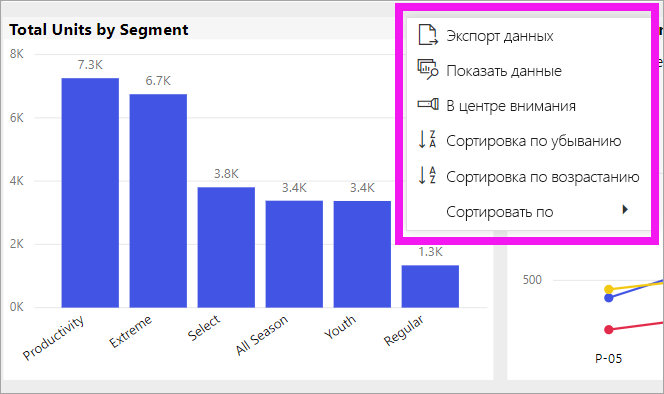
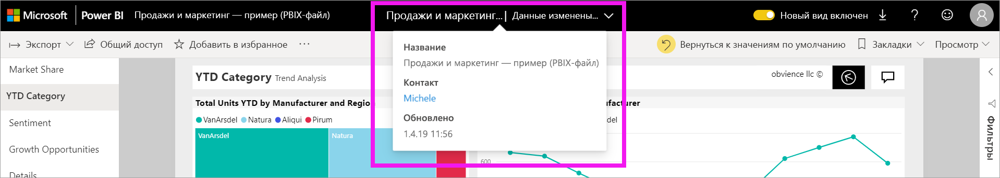

# Изменение порядка сортировки диаграммы в отчете Power BI

[!INCLUDE [power-bi-service-new-look-include](../includes/power-bi-service-new-look-include.md)]

> [!IMPORTANT]
> **Эта статья предназначена для пользователей Power BI, не имеющих разрешений на изменение отчета или набора данных. Подробные инструкции по сортировке см. в статье [Сортировка по столбцу в Power BI Desktop](../desktop-sort-by-column.md)** .

В службе Power BI можно изменять вид визуального элемента, выполнив сортировку по разным полям данных. Изменив порядок сортировки визуального элемента, вы можете выделить информацию, которую необходимо передать.

Визуальные элементы на панели мониторинга невозможно сортировать, но в отчете Power BI можно сортировать большую часть визуализаций. 

Независимо от того, используете ли вы числовые (например, объемы продаж) или текстовые данные (например, названия штатов), визуализации можно сортировать в любом требуемом порядке. Power BI предоставляет гибкие возможности сортировки и меню быстрого доступа. 

## Начало работы

Сначала выберите любой визуальный элемент, а затем щелкните **Дополнительные действия** (...).  Есть три варианта сортировки: **Сортировка по убыванию**, **Сортировка по возрастанию** и **Сортировать по**. 
    

### Сортировка по алфавиту или по числовым значениям

Визуальные элементы можно сортировать в алфавитном порядке по названиям категорий или по числовым значениям в каждой категории. Например, эта диаграмма отсортирована по категории **Name** по оси X в алфавитном порядке.

Вы можете легко использовать для сортировки не категорию (имя хранилища), а значение (продажи на квадратный метр). Щелкните **Дополнительные действия** (…) и выберите пункт **Сортировать по**. Выберите числовое значение, используемое в визуальном элементе.  В этом примере мы выбрали **Sales Per Sq Ft** (Продажи на кв. м).

При необходимости измените порядок сортировки (по возрастанию или убыванию).  Снова щелкните **Дополнительные действия** (...) и выберите пункт **Сортировка по убыванию** или **Сортировка по возрастанию**. Поле, используемое для сортировки, выделено полужирным шрифтом и имеет желтую полосу.

   

> [!NOTE]
> Отсортировать можно не все визуальные элементы. Например, нельзя отсортировать следующие визуальные элементы: диаграмма дерева, карта, картограмма, точечная диаграмма, индикаторная диаграмма, карточка, каскадная диаграмма.

## Сохранение изменений, внесенных в порядок сортировки
В отчетах Power BI сохраняются фильтры, срезы, параметры сортировки и другие изменения, внесенные в представление данных. Поэтому если вы вернетесь к отчету позже, то настройки сортировки сохранятся.  Чтобы восстановить параметры, настроенные создателем отчета, в верхней строке меню выберите команду **Вернуться к значениям по умолчанию**. 

Если кнопка **Вернуться к значениям по умолчанию** неактивна, значит, *создатель* отчета отключил возможность сохранять изменения.

## Рекомендации и устранение неполадок

### Сортировка с использованием других условий
Иногда необходимо отсортировать визуальный элемент с помощью другого поля (не входящего в элемент) или условия.  Например, можно сортировать по месяцу в последовательном порядке (а не по алфавиту) или по всем числам, а не только цифрам (например, 0, 1, 9, 20, а не 0, 1, 20, 9).  Эти изменения может вносить только пользователь, создавший отчет. Контактные данные *автора* можно найти, выбрав имя отчета в строке заголовка.

## Дальнейшие действия
Подробнее о [визуализациях в отчетах Power BI](end-user-visualizations.md).

[Power BI — основные понятия](end-user-basic-concepts.md)
