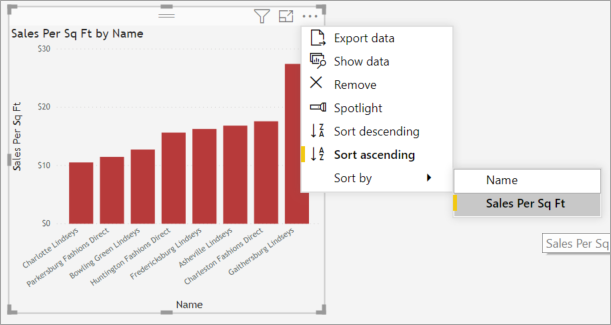

# Изменение порядка сортировки диаграммы в отчете Power BI

[!INCLUDE[consumer-appliesto-ynnn](../includes/consumer-appliesto-ynnn.md)]

> [!IMPORTANT]
> **Эта статья предназначена для пользователей Power BI, которые не имеют разрешения на изменение отчета или набора данных и работают только в онлайн-версии Power BI (службы Power BI). Если вы *создатель*, *администратор* или *владелец* отчетов, то в этой статье могут отсутствовать все необходимые сведения. Вместо этого, подробные сведения см. в статье [Сортировка по столбцу в Power BI Desktop](../create-reports/desktop-sort-by-column.md)** .

В службе Power BI можно изменять вид визуального элемента, выполнив сортировку по разным полям данных. Изменив порядок сортировки визуального элемента, вы можете выделить информацию, которую необходимо передать. Независимо от того, используете ли вы числовые (например, объемы продаж) или текстовые данные (например, названия штатов), визуализации можно сортировать в любом требуемом порядке. Power BI предоставляет гибкие возможности сортировки и меню быстрого доступа. 

Визуальные элементы на панели мониторинга невозможно отсортировать. Но в отчете Power BI большинство визуализаций можно сортировать по одному и иногда по двум полям одновременно. Для некоторых типов визуальных элементов сортировка доступна не полностью: карты дерева, датчики, карты и т. д. 

## Начало работы

Для начала откройте отчет, который вы создали или к которому вам предоставлен общий доступ. Выберите визуальный элемент (который можно отсортировать) и выберите пункт **Другие действия** (...).  Есть три варианта сортировки: **Сортировка по убыванию**, **Сортировка по возрастанию** и **Сортировать по**. 
    

### Сортировка по алфавиту или по числовым значениям

Визуальные элементы можно сортировать в алфавитном порядке по названиям категорий или по числовым значениям в каждой категории. Например, эта диаграмма отсортирована по категории **Name** по оси X в алфавитном порядке.

Чтобы использовать для сортировки не категорию (имя хранилища), а значение (продажи на квадратный метр), выберите элементы **Дополнительные действия** (...) и **Сортировать по**. Выберите числовое значение, используемое в визуальном элементе.  В этом примере мы выбрали **Sales Per Sq Ft** (Продажи на кв. м).

При необходимости измените порядок сортировки (по возрастанию или убыванию).  Снова щелкните **Дополнительные действия** (...) и выберите пункт **Сортировка по убыванию** или **Сортировка по возрастанию**. Поле, используемое для сортировки, выделено полужирным шрифтом и имеет желтую полосу.

   

> [!NOTE]
> Отсортировать можно не все визуальные элементы. Например, нельзя отсортировать следующие визуальные элементы: диаграмма дерева, карта, картограмма, точечная диаграмма, индикаторная диаграмма, карточка, каскадная диаграмма.

## Сортировка по нескольким столбцам
Данные в этой таблице сортируются по **Количеству клиентов**.  Это можно понять по маленькой стрелке под словом *Количество*. Стрелка указывает на то, что столбец отсортирован в порядке *убывания*.

Чтобы добавить дополнительные столбцы в порядок сортировки, щелкните с нажатой клавишей Shift заголовок столбца, который необходимо добавить в порядок сортировки. Например, если щелкнуть столбец **Количество клиентов**, а затем нажать Shift и щелкнуть столбец **Общий доход**, таблица будет отсортирована сначала по клиентам, а затем по доходу. Красный контур показывает области, в которых изменился порядок сортировки.

Если с нажатой клавишей SHIFT щелкнуть второй раз тот же столбец, направление сортировки (по возрастанию или по убыванию) для этого столбца изменится. Более того, если нажать клавишу Shift, а затем щелкнуть столбец, добавленный ранее в порядок сортировки, этот столбец переместится в конец порядка сортировки.

## Сохранение изменений, внесенных в порядок сортировки
В отчетах Power BI сохраняются фильтры, срезы, параметры сортировки и другие изменения, внесенные в представление данных, даже если вы работаете в [режиме чтения](end-user-reading-view.md). Поэтому если вы вернетесь к отчету позже, то настройки сортировки сохранятся.  Чтобы восстановить параметры, настроенные *создателем* отчета, в верхней строке меню выберите команду **Вернуться к значениям по умолчанию**. 

Если кнопка **Вернуться к значениям по умолчанию** неактивна, значит, *создатель* отчета отключил возможность сохранять изменения.

## Рекомендации и устранение неполадок

### Сортировка с использованием других условий
Иногда необходимо отсортировать визуальный элемент с помощью другого поля (не входящего в элемент) или условия.  Например, можно сортировать по месяцу в последовательном порядке (а не по алфавиту) или по всем числам, а не только цифрам (например, 0, 1, 9, 20, а не 0, 1, 20, 9).  

Эти изменения может вносить только пользователь, создавший отчет. Контактные данные *автора* можно найти, выбрав имя отчета в строке заголовка.

Если вы *создатель* и имеете разрешения на изменение содержимого, то дополнительные сведения о том, как обновить набор данных и включить этот тип сортировки см. в статье [Сортировка по столбцу в Power BI Desktop](../create-reports/desktop-sort-by-column.md).

## Дальнейшие действия
Подробнее о [визуализациях в отчетах Power BI](end-user-visualizations.md).

[Power BI — основные понятия](end-user-basic-concepts.md)
