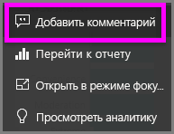
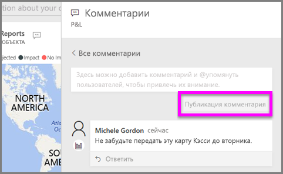
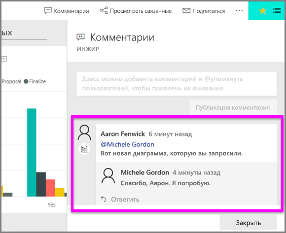

# Добавление комментариев в визуализацию
Добавьте собственный комментарий личным или начните беседу о визуализации со своими коллегами. Функция **comment** — лишь один из способов, которыми *пользователь* может взаимодействовать с визуализацией. 

## Как использовать функцию comment

1. Наведите указатель мыши на визуализацию и нажмите значок многоточия (...).    
2. В раскрывающемся списке выберите **Добавить комментарий**.

      

3.  Напишите комментарий и нажмите **Опубликовать комментарий**. Это комментарий для меня, в комплекте с опечаткой.

      

4. Это беседа, состоявшаяся с *разработчиком* визуализации. Он использовал символ @, чтобы я обязательно увидел комментарий. Я знаю, что этот комментарий для меня. Когда я открываю эту панель мониторинга приложения в Power BI, я выбираю **Комментарии** в заголовке. Появляется панель **Комментарии** с нашей беседой. 

      

5. Нажмите **Закрыть**, чтобы вернуться в панель мониторинга или отчет.

## Дальнейшие действия
Возврат к [визуализациям для пользователей](end-user-visualizations.md)    
<!--[Select a visualization to open a report](end-user-open-report.md)-->